<!-- Javascript code to zoom in and out in the plots. -->
<!-- Code from Radovan Miletić: https://stackoverflow.com/questions/56361986/zoom-function-in-rmarkdown-html-plot -->
<script src = "https://ajax.googleapis.com/ajax/libs/jquery/3.4.1/jquery.min.js"></script>
<script type="text/javascript">
$(document).ready(function() {
    $('body').prepend('<div class=\"zoomDiv\"></div>');
    $('img:not(.zoomImg)').click(function() {
    $('.zoomImg').attr('src', $(this).attr('src')).css({width: '100%'});
    $('.zoomDiv').css({opacity: '1', width: 'auto', border: '1px solid white', borderRadius: '5px', position: 'fixed', top: '50%', left: '50%', marginRight: '-50%', transform: 'translate(-50%, -50%)', boxShadow: '0px 0px 50px #888888', zIndex: '50', overflow: 'auto', maxHeight: '100%'});
    });
    $('img.zoomImg').click(function() {
    $('.zoomDiv').css({opacity: '0', width: '0%'}); 
    });
});
</script>

<style>
/* esmtools default label styles */
.esm-issue{
}

/* Committee-specific callout */
.committee-note {
  background-color: #f0f4ff;
  border-left: 4px solid #4a6fa5;
  border-radius: 4px;
  padding: 8px 12px;
  margin: 8px 0;
  font-size: 0.9em;
  color: #2c3e6b;
}

.committee-note .committee-label {
  font-weight: bold;
  text-transform: uppercase;
  letter-spacing: 0.05em;
  font-size: 0.8em;
  color: #4a6fa5;
  display: block;
  margin-bottom: 2px;
}
/* Section summary callout */
.section-summary {
  background-color: #f8f8f8;
  border-left: 4px solid #aaaaaa;
  border-radius: 4px;
  padding: 8px 12px;
  margin: 16px 0 8px 0;
  font-size: 0.9em;
  color: #333333;
}

.section-summary .summary-label {
  font-weight: bold;
  text-transform: uppercase;
  letter-spacing: 0.05em;
  font-size: 0.8em;
  color: #888888;
  display: block;
  margin-bottom: 2px;
}
</style>


<div class='esmtools-container'>
<button class='esmtools-btn' onclick='esmtools_toggleContent(this)'>Supplementary</button>
<p>
<div style='display:none;'>


<style>
.esmtools-container{
  
}
.esmtools-container-open {
  border: 2px solid #2780e3;
  border-radius: 7px;
  margin: 0 -1em;
  padding: .4em 1em;
}
.esmtools-btn{
  display:inline-block;
  padding:0.35em 1.2em;
  border:0.2em solid #2780e3;
  background-color:#2780e3;
  margin:0 0.3em 0.3em 0;
  border-radius:0.12em;
  box-sizing: border-box;
  text-decoration:none;
  font-family:'Roboto',sans-serif;
  font-weight: bold;
  color:#FFFFFF;
  text-align:center;
  transition: all 0.2s;
  margin: 4px 0px 4px 4px;
}
.esmtools-btn:hover{
  color:#000000;
  background-color:#FFFFFF;
}
/* Highligh issue text */
.esm-issue{
    font-weight: bold;
    color:#e61919;
    text-decoration: underline #e61919 2px;
}

/* Highlight data inspection text */
.esm-inspect{
    font-weight: bold;
    text-decoration: underline 2px;
}

/* Highlight data modification text */
.esm-mod{
    font-weight: bold;
    color:#0088a3;
    text-decoration: underline #0088a3 2px;
}
/* Warning message: hidden content */
.warning_hide{
    font-weight: bold;
    margin: -.4em 0em 1em 2px;
    color: #595959;
}
</style>
<script>
function esmtools_toggleContent(button) {
    var parentDiv = button.parentElement;
    var childNodes = parentDiv.childNodes;
    
    // Toggle the 'esmtools-btn-open' class on the parent div
    parentDiv.classList.toggle("esmtools-container-open");

    for (var i = 2; i < childNodes.length; i++) {
      var node = childNodes[i];
      // if (!node.classList.contains("content-container")){
          if (node.nodeType === Node.ELEMENT_NODE) {
              if (node.style.display === "none") {
                  node.style.display = "block";
                  console.log("ok")
              } else {
                  node.style.display = "none";
              }
          }
      // }
    }
}
</script>

``` r
# Data management
library(dplyr)
library(tidyr)
library(here)
library(htmltools)
library(purrr)

# EMA preprocessing tools
library(esmtools)

# Descriptive statistics
library(skimr)

# Multilevel modeling (for ICC estimation)
library(lme4)

# Missing values
library(naniar)
library(visdat)

# Plotting
library(ggplot2)

# Dates and times
library(lubridate)
library(hms)

# Tables
library(knitr)
library(kableExtra)
```

<style>
.esmtools-container{
  
}
.esmtools-container-open {
  border: 2px solid #2780e3;
  border-radius: 7px;
  margin: 0 -1em;
  padding: .4em 1em;
}
.esmtools-btn{
  display:inline-block;
  padding:0.35em 1.2em;
  border:0.2em solid #2780e3;
  background-color:#2780e3;
  margin:0 0.3em 0.3em 0;
  border-radius:0.12em;
  box-sizing: border-box;
  text-decoration:none;
  font-family:'Roboto',sans-serif;
  font-weight: bold;
  color:#FFFFFF;
  text-align:center;
  transition: all 0.2s;
  margin: 4px 0px 4px 4px;
}
.esmtools-btn:hover{
  color:#000000;
  background-color:#FFFFFF;
}
/* Highligh issue text */
.esm-issue{
    font-weight: bold;
    color:#e61919;
    text-decoration: underline #e61919 2px;
}

/* Highlight data inspection text */
.esm-inspect{
    font-weight: bold;
    text-decoration: underline 2px;
}

/* Highlight data modification text */
.esm-mod{
    font-weight: bold;
    color:#0088a3;
    text-decoration: underline #0088a3 2px;
}
/* Warning message: hidden content */
.warning_hide{
    font-weight: bold;
    margin: -.4em 0em 1em 2px;
    color: #595959;
}
</style>
<script>
function esmtools_toggleContent(button) {
    var parentDiv = button.parentElement;
    var childNodes = parentDiv.childNodes;
    
    // Toggle the 'esmtools-btn-open' class on the parent div
    parentDiv.classList.toggle("esmtools-container-open");

    for (var i = 2; i < childNodes.length; i++) {
      var node = childNodes[i];
      // if (!node.classList.contains("content-container")){
          if (node.nodeType === Node.ELEMENT_NODE) {
              if (node.style.display === "none") {
                  node.style.display = "block";
                  console.log("ok")
              } else {
                  node.style.display = "none";
              }
          }
      // }
    }
}
</script>

<style>
.esmtools-container{
  
}
.esmtools-container-open {
  border: 2px solid #2780e3;
  border-radius: 7px;
  margin: 0 -1em;
  padding: .4em 1em;
}
.esmtools-btn{
  display:inline-block;
  padding:0.35em 1.2em;
  border:0.2em solid #2780e3;
  background-color:#2780e3;
  margin:0 0.3em 0.3em 0;
  border-radius:0.12em;
  box-sizing: border-box;
  text-decoration:none;
  font-family:'Roboto',sans-serif;
  font-weight: bold;
  color:#FFFFFF;
  text-align:center;
  transition: all 0.2s;
  margin: 4px 0px 4px 4px;
}
.esmtools-btn:hover{
  color:#000000;
  background-color:#FFFFFF;
}
/* Highligh issue text */
.esm-issue{
    font-weight: bold;
    color:#e61919;
    text-decoration: underline #e61919 2px;
}

/* Highlight data inspection text */
.esm-inspect{
    font-weight: bold;
    text-decoration: underline 2px;
}

/* Highlight data modification text */
.esm-mod{
    font-weight: bold;
    color:#0088a3;
    text-decoration: underline #0088a3 2px;
}
/* Warning message: hidden content */
.warning_hide{
    font-weight: bold;
    margin: -.4em 0em 1em 2px;
    color: #595959;
}
</style>
<script>
function esmtools_toggleContent(button) {
    var parentDiv = button.parentElement;
    var childNodes = parentDiv.childNodes;
    
    // Toggle the 'esmtools-btn-open' class on the parent div
    parentDiv.classList.toggle("esmtools-container-open");

    for (var i = 2; i < childNodes.length; i++) {
      var node = childNodes[i];
      // if (!node.classList.contains("content-container")){
          if (node.nodeType === Node.ELEMENT_NODE) {
              if (node.style.display === "none") {
                  node.style.display = "block";
                  console.log("ok")
              } else {
                  node.style.display = "none";
              }
          }
      // }
    }
}
</script>

``` r
# Section summary function
section_summary <- function(text) {
  htmltools::HTML(paste0(
    '<div class="section-summary">',
    '<span class="summary-label">Summary</span>',
    text,
    '</div>'
  ))
}

# Committee callout function
committee_note <- function(text) {
  htmltools::HTML(paste0(
    '<div class="committee-note">',
    '<span class="committee-label">Committee</span>',
    text,
    '</div>'
  ))
}

# Validity function (carried over from preprocessing report)
check_validity <- function(df) {
  mood_ok          <- !is.na(df$mood)
  before_survey_ok <- !is.na(df$before_survey)
  smoke_ok         <- !is.na(df$smoke)
  branch_ok        <- !is.na(df$pleasant) | !is.na(df$unpleasant)
  as.integer(mood_ok & before_survey_ok & smoke_ok & branch_ok)
}
```

<style>
.esmtools-container{
  
}
.esmtools-container-open {
  border: 2px solid #2780e3;
  border-radius: 7px;
  margin: 0 -1em;
  padding: .4em 1em;
}
.esmtools-btn{
  display:inline-block;
  padding:0.35em 1.2em;
  border:0.2em solid #2780e3;
  background-color:#2780e3;
  margin:0 0.3em 0.3em 0;
  border-radius:0.12em;
  box-sizing: border-box;
  text-decoration:none;
  font-family:'Roboto',sans-serif;
  font-weight: bold;
  color:#FFFFFF;
  text-align:center;
  transition: all 0.2s;
  margin: 4px 0px 4px 4px;
}
.esmtools-btn:hover{
  color:#000000;
  background-color:#FFFFFF;
}
/* Highligh issue text */
.esm-issue{
    font-weight: bold;
    color:#e61919;
    text-decoration: underline #e61919 2px;
}

/* Highlight data inspection text */
.esm-inspect{
    font-weight: bold;
    text-decoration: underline 2px;
}

/* Highlight data modification text */
.esm-mod{
    font-weight: bold;
    color:#0088a3;
    text-decoration: underline #0088a3 2px;
}
/* Warning message: hidden content */
.warning_hide{
    font-weight: bold;
    margin: -.4em 0em 1em 2px;
    color: #595959;
}
</style>
<script>
function esmtools_toggleContent(button) {
    var parentDiv = button.parentElement;
    var childNodes = parentDiv.childNodes;
    
    // Toggle the 'esmtools-btn-open' class on the parent div
    parentDiv.classList.toggle("esmtools-container-open");

    for (var i = 2; i < childNodes.length; i++) {
      var node = childNodes[i];
      // if (!node.classList.contains("content-container")){
          if (node.nodeType === Node.ELEMENT_NODE) {
              if (node.style.display === "none") {
                  node.style.display = "block";
                  console.log("ok")
              } else {
                  node.style.display = "none";
              }
          }
      // }
    }
}
</script>

``` r
# Load preprocessed dataset from Report 1 output
study_sample <- readRDS(here("output", "cleaned_study_sample.RDS"))

# Part 6 completer IDs (any participant with Part 6 data)
part6_completers <- study_sample %>%
  filter(study_part == 6) %>%
  distinct(participant_id) %>%
  pull(participant_id)

# Valid Part 6 completer IDs (excludes participants with zero valid Part 6 obs,
# e.g., participant 223 who had missing branch variable data throughout Part 6)
valid_completers <- study_sample %>%
  mutate(valid = check_validity(.)) %>%
  filter(valid == 1, study_part == 6) %>%
  distinct(participant_id) %>%
  pull(participant_id)
```

<p>
</div>
</div>
</p>


---

# Overview

This report characterizes the preprocessed EMA dataset for Walter Dyer's dissertation from the DVAL project parent study following Revol et al.'s (2024) data characteristics report guidelines. It describes the quality of the data collection, the properties of the key EMA variables, and selected preliminary analyses. Content flagged with a **Committee** label addresses questions raised during the proposal defense.

The preprocessed dataset was produced by the companion EMA Preprocessing Report and is loaded directly from that report's output. All analyses here are conducted on the fully preprocessed dataset.

**Study summary:** Participants completed EMA surveys 6 times per day within predetermined 2-hour intervals. Part 2 (Days 1--3) was a baseline period during which participants were instructed to smoke at their normal rate. Part 6 (Days 4--10) was an incentivized abstinence period during which participants could earn daily cash bonuses for verified cigarette abstinence. EMA, baseline, and biochemical verification (CO) data are included in the preprocessed dataset.

---

# Variable Descriptions

This section provides an overview of all variables in the preprocessed dataset, including their type, role, and expected range.


<div class='esmtools-container'>
<button class='esmtools-btn' onclick='esmtools_toggleContent(this)'>Description</button>
<p>
<div style='display:none;'>


<style>
.esmtools-container{
  
}
.esmtools-container-open {
  border: 2px solid #2780e3;
  border-radius: 7px;
  margin: 0 -1em;
  padding: .4em 1em;
}
.esmtools-btn{
  display:inline-block;
  padding:0.35em 1.2em;
  border:0.2em solid #2780e3;
  background-color:#2780e3;
  margin:0 0.3em 0.3em 0;
  border-radius:0.12em;
  box-sizing: border-box;
  text-decoration:none;
  font-family:'Roboto',sans-serif;
  font-weight: bold;
  color:#FFFFFF;
  text-align:center;
  transition: all 0.2s;
  margin: 4px 0px 4px 4px;
}
.esmtools-btn:hover{
  color:#000000;
  background-color:#FFFFFF;
}
/* Highligh issue text */
.esm-issue{
    font-weight: bold;
    color:#e61919;
    text-decoration: underline #e61919 2px;
}

/* Highlight data inspection text */
.esm-inspect{
    font-weight: bold;
    text-decoration: underline 2px;
}

/* Highlight data modification text */
.esm-mod{
    font-weight: bold;
    color:#0088a3;
    text-decoration: underline #0088a3 2px;
}
/* Warning message: hidden content */
.warning_hide{
    font-weight: bold;
    margin: -.4em 0em 1em 2px;
    color: #595959;
}
</style>
<script>
function esmtools_toggleContent(button) {
    var parentDiv = button.parentElement;
    var childNodes = parentDiv.childNodes;
    
    // Toggle the 'esmtools-btn-open' class on the parent div
    parentDiv.classList.toggle("esmtools-container-open");

    for (var i = 2; i < childNodes.length; i++) {
      var node = childNodes[i];
      // if (!node.classList.contains("content-container")){
          if (node.nodeType === Node.ELEMENT_NODE) {
              if (node.style.display === "none") {
                  node.style.display = "block";
                  console.log("ok")
              } else {
                  node.style.display = "none";
              }
          }
      // }
    }
}
</script>

``` r
# Overview of variable names and types
glimpse(study_sample)
```

```
## Rows: 4,143
## Columns: 54
## $ mood                     <dbl> 90, 80, 60, 75, 78, 83, 83, 68, 62, 67, NA, 7…
## $ smoke                    <dbl> 19, 54, 39, 22, 30, 12, 59, 45, 53, 10, NA, 7…
## $ before_survey            <chr> "It was generally pleasant", "It was generall…
## $ unpleasant               <dbl> NA, NA, NA, NA, NA, NA, NA, NA, NA, NA, NA, N…
## $ prior_mood               <dbl> 89, 84, 47, 68, 75, 52, 75, 75, 36, 44, NA, 3…
## $ smoked_since_last_survey <dbl> 3, 3, 1, 2, 0, 1, 1, 2, 4, 2, NA, 1, 0, 2, 2,…
## $ pleasant                 <dbl> 84, 84, NA, NA, NA, NA, 83, 94, 86, NA, NA, 6…
## $ participant_id           <dbl> 102, 102, 102, 102, 102, 102, 102, 102, 102, …
## $ session_id               <chr> "5", "7", "8", "10", "11", "12", "15", "16", …
## $ completion_time          <dttm> 2017-06-06 11:20:28, 2017-06-06 13:26:44, 20…
## $ init_time                <dttm> 2017-06-06 11:15:00, 2017-06-06 13:23:01, 20…
## $ study_part               <dbl> 2, 2, 2, 2, 2, 2, 2, 2, 2, 2, 2, 2, 2, 2, 2, …
## $ race                     <dbl> 5, 5, 5, 5, 5, 5, 5, 5, 5, 5, 5, 5, 5, 5, 5, …
## $ age                      <dbl> 40, 40, 40, 40, 40, 40, 40, 40, 40, 40, 40, 4…
## $ gender                   <dbl> 2, 2, 2, 2, 2, 2, 2, 2, 2, 2, 2, 2, 2, 2, 2, …
## $ total_household_income   <dbl> 20091, 20091, 20091, 20091, 20091, 20091, 200…
## $ bank_balance             <dbl> 5060, 5060, 5060, 5060, 5060, 5060, 5060, 506…
## $ ftnd_sum                 <dbl> 3, 3, 3, 3, 3, 3, 3, 3, 3, 3, 3, 3, 3, 3, 3, …
## $ cigsperday               <dbl> 15, 15, 15, 15, 15, 15, 15, 15, 15, 15, 15, 1…
## $ shaps_sim_sum            <dbl> 0, 0, 0, 0, 0, 0, 0, 0, 0, 0, 0, 0, 0, 0, 0, …
## $ panas_pos                <dbl> 36, 36, 36, 36, 36, 36, 36, 36, 36, 36, 36, 3…
## $ panas_neg                <dbl> 18, 18, 18, 18, 18, 18, 18, 18, 18, 18, 18, 1…
## $ q23                      <dbl> 11, 11, 11, 11, 11, 11, 11, 11, 11, 11, 11, 1…
## $ q24                      <dbl> 11, 11, 11, 11, 11, 11, 11, 11, 11, 11, 11, 1…
## $ q25                      <dbl> 11, 11, 11, 11, 11, 11, 11, 11, 11, 11, 11, 1…
## $ q80                      <dbl> 0, 0, 0, 0, 0, 0, 0, 0, 0, 0, 0, 0, 0, 0, 0, …
## $ q71                      <dbl> 0, 0, 0, 0, 0, 0, 0, 0, 0, 0, 0, 0, 0, 0, 0, …
## $ obsno                    <int> 1, 2, 3, 4, 5, 6, 7, 8, 9, 10, 11, 12, 13, 14…
## $ dayno                    <dbl> 1, 1, 1, 1, 1, 1, 2, 2, 2, 2, 2, 2, 3, 3, 3, …
## $ co_date                  <date> 2017-06-06, 2017-06-06, 2017-06-06, 2017-06-…
## $ co_time_recorded         <chr> "1899-12-31 10:25:00", "1899-12-31 10:25:00",…
## $ co_level                 <dbl> 43, 43, 43, 43, 43, 43, 57, 57, 57, 57, 57, 5…
## $ co_state_smoked          <lgl> TRUE, TRUE, TRUE, TRUE, TRUE, TRUE, TRUE, TRU…
## $ co_correct_procedure     <lgl> TRUE, TRUE, TRUE, TRUE, TRUE, TRUE, TRUE, TRU…
## $ co_vid_time              <dttm> 2017-06-06 10:25:00, 2017-06-06 10:25:00, 20…
## $ year                     <dbl> 2017, 2017, 2017, 2017, 2017, 2017, 2017, 201…
## $ month                    <dbl> 6, 6, 6, 6, 6, 6, 6, 6, 6, 6, 6, 6, 6, 6, 6, …
## $ day                      <int> 6, 6, 6, 6, 6, 6, 7, 7, 7, 7, 7, 7, 8, 8, 8, …
## $ hour                     <int> 11, 13, 14, 17, 19, 20, 11, 12, 15, 16, 18, 2…
## $ minute                   <int> 20, 26, 19, 10, 11, 43, 15, 28, 23, 19, 37, 1…
## $ duration                 <dbl> 71, 71, 71, 71, 71, 71, 71, 71, 71, 71, 71, 7…
## $ beepno                   <int> 1, 2, 3, 4, 5, 6, 1, 2, 3, 4, 5, 6, 1, 2, 3, …
## $ valid                    <int> 1, 1, 0, 0, 0, 0, 1, 1, 1, 0, 0, 1, 1, 1, 1, …
## $ daily_end_min            <dbl> 5.466667, 3.716667, 3.050000, 5.616667, 5.833…
## $ mood_pm                  <dbl> 70.5, 70.5, 70.5, 70.5, 70.5, 70.5, 70.5, 70.…
## $ smoke_pm                 <dbl> 29.85714, 29.85714, 29.85714, 29.85714, 29.85…
## $ unpleasant_pm            <dbl> 35, 35, 35, 35, 35, 35, 35, 35, 35, 35, 35, 3…
## $ prior_mood_pm            <dbl> 52.82143, 52.82143, 52.82143, 52.82143, 52.82…
## $ pleasant_pm              <dbl> 70.97436, 70.97436, 70.97436, 70.97436, 70.97…
## $ mood_pmc                 <dbl> 19.5, 9.5, -10.5, 4.5, 7.5, 12.5, 12.5, -2.5,…
## $ smoke_pmc                <dbl> -10.8571429, 24.1428571, 9.1428571, -7.857142…
## $ unpleasant_pmc           <dbl> NA, NA, NA, NA, NA, NA, NA, NA, NA, NA, NA, N…
## $ prior_mood_pmc           <dbl> 36.1785714, 31.1785714, -5.8214286, 15.178571…
## $ pleasant_pmc             <dbl> 13.025641, 13.025641, NA, NA, NA, NA, 12.0256…
```

<style>
.esmtools-container{
  
}
.esmtools-container-open {
  border: 2px solid #2780e3;
  border-radius: 7px;
  margin: 0 -1em;
  padding: .4em 1em;
}
.esmtools-btn{
  display:inline-block;
  padding:0.35em 1.2em;
  border:0.2em solid #2780e3;
  background-color:#2780e3;
  margin:0 0.3em 0.3em 0;
  border-radius:0.12em;
  box-sizing: border-box;
  text-decoration:none;
  font-family:'Roboto',sans-serif;
  font-weight: bold;
  color:#FFFFFF;
  text-align:center;
  transition: all 0.2s;
  margin: 4px 0px 4px 4px;
}
.esmtools-btn:hover{
  color:#000000;
  background-color:#FFFFFF;
}
/* Highligh issue text */
.esm-issue{
    font-weight: bold;
    color:#e61919;
    text-decoration: underline #e61919 2px;
}

/* Highlight data inspection text */
.esm-inspect{
    font-weight: bold;
    text-decoration: underline 2px;
}

/* Highlight data modification text */
.esm-mod{
    font-weight: bold;
    color:#0088a3;
    text-decoration: underline #0088a3 2px;
}
/* Warning message: hidden content */
.warning_hide{
    font-weight: bold;
    margin: -.4em 0em 1em 2px;
    color: #595959;
}
</style>
<script>
function esmtools_toggleContent(button) {
    var parentDiv = button.parentElement;
    var childNodes = parentDiv.childNodes;
    
    // Toggle the 'esmtools-btn-open' class on the parent div
    parentDiv.classList.toggle("esmtools-container-open");

    for (var i = 2; i < childNodes.length; i++) {
      var node = childNodes[i];
      // if (!node.classList.contains("content-container")){
          if (node.nodeType === Node.ELEMENT_NODE) {
              if (node.style.display === "none") {
                  node.style.display = "block";
                  console.log("ok")
              } else {
                  node.style.display = "none";
              }
          }
      // }
    }
}
</script>

``` r
# Summary table of key variables
var_info <- tibble::tribble(
  ~Variable,                  ~Type,          ~Description,                                                                              ~Range_or_Values,
  "participant_id",           "Numeric",       "Identifier",                                                                              "Unique per participant",
  "session_id",               "Numeric",       "Identifier",                                                                              "Unique per beep",
  "study_part",               "Numeric",       "Part 2 vs. Part 6",                                                                       "2 = baseline, 6 = incentive",
  "init_time",                "POSIXct",       "Time beep was opened",                                                                    "Datetime",
  "completion_time",          "POSIXct",       "Time beep was completed",                                                                 "Datetime",
  "obsno",                    "Numeric",       "Beep number across study",                                                                "1-60",
  "dayno",                    "Numeric",       "Day number",                                                                              "1-10",
  "beepno",                   "Numeric",       "Beep number within day",                                                                  "1-6",
  "duration",                 "Numeric",       "Days of participation",                                                                   "1-10",
  "mood",                     "Numeric",       "How would you rate your OVERALL MOOD right now?",                                         "0-100 (0=Extremely negative, 100=Extremely positive)",
  "smoke",                    "Numeric",       "How much do you have the URGE TO SMOKE right now?",                                       "0-100 (0=No urge at all, 100=Strongest urge ever felt)",
  "before_survey",            "Categorical",   "Think about what was occurring when you were beeped. Overall, which of the following best describes what you were doing at the time?", "Pleasant / Unpleasant / Neutral",
  "pleasant",                 "Numeric",       "You indicated that what you were doing when you were beeped was generally pleasant. How pleasant was it?", "0-100 (0=Very slightly, 100=Extremely)",
  "unpleasant",               "Numeric",       "You indicated that what you were doing when you were beeped was generally unpleasant. How unpleasant was it?", "0-100 (0=Very slightly, 100=Extremely)",
  "prior_mood",               "Numeric",       "To what degree do you think your mood right now is due to what you were doing just prior to the survey?", "0-100 (0=Not at all, 100=Extremely)",
  "smoked_since_last_survey", "Numeric",       "Cigarettes smoked since last survey",                                                    "0-6",
  "age",                      "Numeric",       "Participant age",                                                                         "Years",
  "gender",                   "Categorical",   "Participant gender",                                                                      "1=Male, 2=Female",
  "race",                     "Categorical",   "Participant race/ethnicity",                                                              "Categorical (7 levels)",
  "total_household_income",   "Numeric",       "Total household income",                                                                  "Ordinal/categorical",
  "bank_balance",             "Numeric",       "Bank balance at baseline",                                                                "Continuous",
  "ftnd_sum",                 "Numeric",       "Cigarette dependence (FTND)",                                                             "0-10",
  "cigsperday",               "Numeric",       "Cigarettes smoked per day at baseline",                                                   "0-50",
  "shaps_sim_sum",            "Numeric",       "Trait anhedonia (SHAPS)",                                                                 "0-14",
  "panas_pos",                "Numeric",       "Trait positive affect (PANAS)",                                                           "10-50",
  "panas_neg",                "Numeric",       "Trait negative affect (PANAS)",                                                           "10-50",
  "co_level",                 "Numeric",       "Carbon monoxide (CO) level",                                                              "ppm",
  "co_date",                  "Date",          "Date of CO measurement",                                                                  "Date",
  "co_state_smoked",          "Logical",       "Verbal indication of smoking abstinence",                                                 "TRUE/FALSE",
  "co_correct_procedure",     "Logical",       "CO procedure completed correctly",                                                        "TRUE/FALSE",
  "q23",                      "Numeric",       "Age at first puff",                                                                       "Years",
  "q24",                      "Numeric",       "Age at first full cigarette",                                                             "Years",
  "q25",                      "Numeric",       "Age at regular smoking onset",                                                            "Years",
  "q71",                      "Numeric",       "E-cigarette use frequency (past 30 days)",                                                "Times",
  "q80",                      "Numeric",       "Cannabis use frequency (past 30 days)",                                                   "Times"
)

kable(var_info, caption = "Variable descriptions for the preprocessed DVAL EMA dataset") %>%
  kable_styling(bootstrap_options = c("striped", "hover", "condensed"),
                full_width = TRUE) %>%
  column_spec(3, width = "35em") %>%
  column_spec(4, width = "20em")
```

<table class="table table-striped table-hover table-condensed" style="margin-left: auto; margin-right: auto;">
<caption>Variable descriptions for the preprocessed DVAL EMA dataset</caption>
 <thead>
  <tr>
   <th style="text-align:left;"> Variable </th>
   <th style="text-align:left;"> Type </th>
   <th style="text-align:left;"> Description </th>
   <th style="text-align:left;"> Range_or_Values </th>
  </tr>
 </thead>
<tbody>
  <tr>
   <td style="text-align:left;"> participant_id </td>
   <td style="text-align:left;"> Numeric </td>
   <td style="text-align:left;width: 35em; "> Identifier </td>
   <td style="text-align:left;width: 20em; "> Unique per participant </td>
  </tr>
  <tr>
   <td style="text-align:left;"> session_id </td>
   <td style="text-align:left;"> Numeric </td>
   <td style="text-align:left;width: 35em; "> Identifier </td>
   <td style="text-align:left;width: 20em; "> Unique per beep </td>
  </tr>
  <tr>
   <td style="text-align:left;"> study_part </td>
   <td style="text-align:left;"> Numeric </td>
   <td style="text-align:left;width: 35em; "> Part 2 vs. Part 6 </td>
   <td style="text-align:left;width: 20em; "> 2 = baseline, 6 = incentive </td>
  </tr>
  <tr>
   <td style="text-align:left;"> init_time </td>
   <td style="text-align:left;"> POSIXct </td>
   <td style="text-align:left;width: 35em; "> Time beep was opened </td>
   <td style="text-align:left;width: 20em; "> Datetime </td>
  </tr>
  <tr>
   <td style="text-align:left;"> completion_time </td>
   <td style="text-align:left;"> POSIXct </td>
   <td style="text-align:left;width: 35em; "> Time beep was completed </td>
   <td style="text-align:left;width: 20em; "> Datetime </td>
  </tr>
  <tr>
   <td style="text-align:left;"> obsno </td>
   <td style="text-align:left;"> Numeric </td>
   <td style="text-align:left;width: 35em; "> Beep number across study </td>
   <td style="text-align:left;width: 20em; "> 1-60 </td>
  </tr>
  <tr>
   <td style="text-align:left;"> dayno </td>
   <td style="text-align:left;"> Numeric </td>
   <td style="text-align:left;width: 35em; "> Day number </td>
   <td style="text-align:left;width: 20em; "> 1-10 </td>
  </tr>
  <tr>
   <td style="text-align:left;"> beepno </td>
   <td style="text-align:left;"> Numeric </td>
   <td style="text-align:left;width: 35em; "> Beep number within day </td>
   <td style="text-align:left;width: 20em; "> 1-6 </td>
  </tr>
  <tr>
   <td style="text-align:left;"> duration </td>
   <td style="text-align:left;"> Numeric </td>
   <td style="text-align:left;width: 35em; "> Days of participation </td>
   <td style="text-align:left;width: 20em; "> 1-10 </td>
  </tr>
  <tr>
   <td style="text-align:left;"> mood </td>
   <td style="text-align:left;"> Numeric </td>
   <td style="text-align:left;width: 35em; "> How would you rate your OVERALL MOOD right now? </td>
   <td style="text-align:left;width: 20em; "> 0-100 (0=Extremely negative, 100=Extremely positive) </td>
  </tr>
  <tr>
   <td style="text-align:left;"> smoke </td>
   <td style="text-align:left;"> Numeric </td>
   <td style="text-align:left;width: 35em; "> How much do you have the URGE TO SMOKE right now? </td>
   <td style="text-align:left;width: 20em; "> 0-100 (0=No urge at all, 100=Strongest urge ever felt) </td>
  </tr>
  <tr>
   <td style="text-align:left;"> before_survey </td>
   <td style="text-align:left;"> Categorical </td>
   <td style="text-align:left;width: 35em; "> Think about what was occurring when you were beeped. Overall, which of the following best describes what you were doing at the time? </td>
   <td style="text-align:left;width: 20em; "> Pleasant / Unpleasant / Neutral </td>
  </tr>
  <tr>
   <td style="text-align:left;"> pleasant </td>
   <td style="text-align:left;"> Numeric </td>
   <td style="text-align:left;width: 35em; "> You indicated that what you were doing when you were beeped was generally pleasant. How pleasant was it? </td>
   <td style="text-align:left;width: 20em; "> 0-100 (0=Very slightly, 100=Extremely) </td>
  </tr>
  <tr>
   <td style="text-align:left;"> unpleasant </td>
   <td style="text-align:left;"> Numeric </td>
   <td style="text-align:left;width: 35em; "> You indicated that what you were doing when you were beeped was generally unpleasant. How unpleasant was it? </td>
   <td style="text-align:left;width: 20em; "> 0-100 (0=Very slightly, 100=Extremely) </td>
  </tr>
  <tr>
   <td style="text-align:left;"> prior_mood </td>
   <td style="text-align:left;"> Numeric </td>
   <td style="text-align:left;width: 35em; "> To what degree do you think your mood right now is due to what you were doing just prior to the survey? </td>
   <td style="text-align:left;width: 20em; "> 0-100 (0=Not at all, 100=Extremely) </td>
  </tr>
  <tr>
   <td style="text-align:left;"> smoked_since_last_survey </td>
   <td style="text-align:left;"> Numeric </td>
   <td style="text-align:left;width: 35em; "> Cigarettes smoked since last survey </td>
   <td style="text-align:left;width: 20em; "> 0-6 </td>
  </tr>
  <tr>
   <td style="text-align:left;"> age </td>
   <td style="text-align:left;"> Numeric </td>
   <td style="text-align:left;width: 35em; "> Participant age </td>
   <td style="text-align:left;width: 20em; "> Years </td>
  </tr>
  <tr>
   <td style="text-align:left;"> gender </td>
   <td style="text-align:left;"> Categorical </td>
   <td style="text-align:left;width: 35em; "> Participant gender </td>
   <td style="text-align:left;width: 20em; "> 1=Male, 2=Female </td>
  </tr>
  <tr>
   <td style="text-align:left;"> race </td>
   <td style="text-align:left;"> Categorical </td>
   <td style="text-align:left;width: 35em; "> Participant race/ethnicity </td>
   <td style="text-align:left;width: 20em; "> Categorical (7 levels) </td>
  </tr>
  <tr>
   <td style="text-align:left;"> total_household_income </td>
   <td style="text-align:left;"> Numeric </td>
   <td style="text-align:left;width: 35em; "> Total household income </td>
   <td style="text-align:left;width: 20em; "> Ordinal/categorical </td>
  </tr>
  <tr>
   <td style="text-align:left;"> bank_balance </td>
   <td style="text-align:left;"> Numeric </td>
   <td style="text-align:left;width: 35em; "> Bank balance at baseline </td>
   <td style="text-align:left;width: 20em; "> Continuous </td>
  </tr>
  <tr>
   <td style="text-align:left;"> ftnd_sum </td>
   <td style="text-align:left;"> Numeric </td>
   <td style="text-align:left;width: 35em; "> Cigarette dependence (FTND) </td>
   <td style="text-align:left;width: 20em; "> 0-10 </td>
  </tr>
  <tr>
   <td style="text-align:left;"> cigsperday </td>
   <td style="text-align:left;"> Numeric </td>
   <td style="text-align:left;width: 35em; "> Cigarettes smoked per day at baseline </td>
   <td style="text-align:left;width: 20em; "> 0-50 </td>
  </tr>
  <tr>
   <td style="text-align:left;"> shaps_sim_sum </td>
   <td style="text-align:left;"> Numeric </td>
   <td style="text-align:left;width: 35em; "> Trait anhedonia (SHAPS) </td>
   <td style="text-align:left;width: 20em; "> 0-14 </td>
  </tr>
  <tr>
   <td style="text-align:left;"> panas_pos </td>
   <td style="text-align:left;"> Numeric </td>
   <td style="text-align:left;width: 35em; "> Trait positive affect (PANAS) </td>
   <td style="text-align:left;width: 20em; "> 10-50 </td>
  </tr>
  <tr>
   <td style="text-align:left;"> panas_neg </td>
   <td style="text-align:left;"> Numeric </td>
   <td style="text-align:left;width: 35em; "> Trait negative affect (PANAS) </td>
   <td style="text-align:left;width: 20em; "> 10-50 </td>
  </tr>
  <tr>
   <td style="text-align:left;"> co_level </td>
   <td style="text-align:left;"> Numeric </td>
   <td style="text-align:left;width: 35em; "> Carbon monoxide (CO) level </td>
   <td style="text-align:left;width: 20em; "> ppm </td>
  </tr>
  <tr>
   <td style="text-align:left;"> co_date </td>
   <td style="text-align:left;"> Date </td>
   <td style="text-align:left;width: 35em; "> Date of CO measurement </td>
   <td style="text-align:left;width: 20em; "> Date </td>
  </tr>
  <tr>
   <td style="text-align:left;"> co_state_smoked </td>
   <td style="text-align:left;"> Logical </td>
   <td style="text-align:left;width: 35em; "> Verbal indication of smoking abstinence </td>
   <td style="text-align:left;width: 20em; "> TRUE/FALSE </td>
  </tr>
  <tr>
   <td style="text-align:left;"> co_correct_procedure </td>
   <td style="text-align:left;"> Logical </td>
   <td style="text-align:left;width: 35em; "> CO procedure completed correctly </td>
   <td style="text-align:left;width: 20em; "> TRUE/FALSE </td>
  </tr>
  <tr>
   <td style="text-align:left;"> q23 </td>
   <td style="text-align:left;"> Numeric </td>
   <td style="text-align:left;width: 35em; "> Age at first puff </td>
   <td style="text-align:left;width: 20em; "> Years </td>
  </tr>
  <tr>
   <td style="text-align:left;"> q24 </td>
   <td style="text-align:left;"> Numeric </td>
   <td style="text-align:left;width: 35em; "> Age at first full cigarette </td>
   <td style="text-align:left;width: 20em; "> Years </td>
  </tr>
  <tr>
   <td style="text-align:left;"> q25 </td>
   <td style="text-align:left;"> Numeric </td>
   <td style="text-align:left;width: 35em; "> Age at regular smoking onset </td>
   <td style="text-align:left;width: 20em; "> Years </td>
  </tr>
  <tr>
   <td style="text-align:left;"> q71 </td>
   <td style="text-align:left;"> Numeric </td>
   <td style="text-align:left;width: 35em; "> E-cigarette use frequency (past 30 days) </td>
   <td style="text-align:left;width: 20em; "> Times </td>
  </tr>
  <tr>
   <td style="text-align:left;"> q80 </td>
   <td style="text-align:left;"> Numeric </td>
   <td style="text-align:left;width: 35em; "> Cannabis use frequency (past 30 days) </td>
   <td style="text-align:left;width: 20em; "> Times </td>
  </tr>
</tbody>
</table>

<p>
</div>
</div>
</p>


---

# Sample Description

`<div class="committee-note"><span class="committee-label">Committee</span>This section addresses committee questions about the demographic characteristics of the sample and the flow of participants through the study.</div>`{=html}

## Demographics

`<div class="committee-note"><span class="committee-label">Committee</span>The committee requested a description of the demographic characteristics of the sample.</div>`{=html}


<div class='esmtools-container'>
<button class='esmtools-btn' onclick='esmtools_toggleContent(this)'>Description</button>
<p>
<div style='display:none;'>


<style>
.esmtools-container{
  
}
.esmtools-container-open {
  border: 2px solid #2780e3;
  border-radius: 7px;
  margin: 0 -1em;
  padding: .4em 1em;
}
.esmtools-btn{
  display:inline-block;
  padding:0.35em 1.2em;
  border:0.2em solid #2780e3;
  background-color:#2780e3;
  margin:0 0.3em 0.3em 0;
  border-radius:0.12em;
  box-sizing: border-box;
  text-decoration:none;
  font-family:'Roboto',sans-serif;
  font-weight: bold;
  color:#FFFFFF;
  text-align:center;
  transition: all 0.2s;
  margin: 4px 0px 4px 4px;
}
.esmtools-btn:hover{
  color:#000000;
  background-color:#FFFFFF;
}
/* Highligh issue text */
.esm-issue{
    font-weight: bold;
    color:#e61919;
    text-decoration: underline #e61919 2px;
}

/* Highlight data inspection text */
.esm-inspect{
    font-weight: bold;
    text-decoration: underline 2px;
}

/* Highlight data modification text */
.esm-mod{
    font-weight: bold;
    color:#0088a3;
    text-decoration: underline #0088a3 2px;
}
/* Warning message: hidden content */
.warning_hide{
    font-weight: bold;
    margin: -.4em 0em 1em 2px;
    color: #595959;
}
</style>
<script>
function esmtools_toggleContent(button) {
    var parentDiv = button.parentElement;
    var childNodes = parentDiv.childNodes;
    
    // Toggle the 'esmtools-btn-open' class on the parent div
    parentDiv.classList.toggle("esmtools-container-open");

    for (var i = 2; i < childNodes.length; i++) {
      var node = childNodes[i];
      // if (!node.classList.contains("content-container")){
          if (node.nodeType === Node.ELEMENT_NODE) {
              if (node.style.display === "none") {
                  node.style.display = "block";
                  console.log("ok")
              } else {
                  node.style.display = "none";
              }
          }
      // }
    }
}
</script>

``` r
# Pull one row per participant (time-invariant variables)
baseline_chars <- study_sample %>%
  group_by(participant_id) %>%
  slice(1) %>%
  ungroup()

cat("Total participants:", nrow(baseline_chars), "\n")
```

```
## Total participants: 95
```

``` r
# --- Table 1: Continuous variables ---
cont_vars <- tibble::tribble(
  ~Variable,                          ~col,
  "Age (years)",                      "age",
  "Cigarettes per day (baseline)",    "cigsperday",
  "FTND total score",                 "ftnd_sum",
  "SHAPS score",                      "shaps_sim_sum",
  "PANAS positive affect",            "panas_pos",
  "PANAS negative affect",            "panas_neg",
  "Bank balance",                      "bank_balance",
  "Age at first puff",                "q23",
  "Age at first full cigarette",      "q24",
  "Age at regular smoking onset",     "q25",
  "E-cigarette use (past 30 days)",   "q71",
  "Cannabis use (past 30 days)",      "q80"
)

cont_table <- cont_vars %>%
  rowwise() %>%
  mutate(
    n    = sum(!is.na(baseline_chars[[col]])),
    Mean = round(mean(baseline_chars[[col]], na.rm = TRUE), 2),
    SD   = round(sd(baseline_chars[[col]], na.rm = TRUE), 2),
    Min  = round(min(baseline_chars[[col]], na.rm = TRUE), 2),
    Max  = round(max(baseline_chars[[col]], na.rm = TRUE), 2)
  ) %>%
  ungroup() %>%
  select(Variable, n, Mean, SD, Min, Max)

cont_table %>%
  kable(caption = "Descriptive statistics for continuous baseline variables") %>%
  kable_styling(bootstrap_options = c("striped", "hover", "condensed"),
                full_width = FALSE)
```

<table class="table table-striped table-hover table-condensed" style="width: auto !important; margin-left: auto; margin-right: auto;">
<caption>Descriptive statistics for continuous baseline variables</caption>
 <thead>
  <tr>
   <th style="text-align:left;"> Variable </th>
   <th style="text-align:right;"> n </th>
   <th style="text-align:right;"> Mean </th>
   <th style="text-align:right;"> SD </th>
   <th style="text-align:right;"> Min </th>
   <th style="text-align:right;"> Max </th>
  </tr>
 </thead>
<tbody>
  <tr>
   <td style="text-align:left;"> Age (years) </td>
   <td style="text-align:right;"> 94 </td>
   <td style="text-align:right;"> 35.03 </td>
   <td style="text-align:right;"> 11.59 </td>
   <td style="text-align:right;"> 19 </td>
   <td style="text-align:right;"> 54 </td>
  </tr>
  <tr>
   <td style="text-align:left;"> Cigarettes per day (baseline) </td>
   <td style="text-align:right;"> 94 </td>
   <td style="text-align:right;"> 16.05 </td>
   <td style="text-align:right;"> 7.16 </td>
   <td style="text-align:right;"> 6 </td>
   <td style="text-align:right;"> 48 </td>
  </tr>
  <tr>
   <td style="text-align:left;"> FTND total score </td>
   <td style="text-align:right;"> 94 </td>
   <td style="text-align:right;"> 5.98 </td>
   <td style="text-align:right;"> 2.05 </td>
   <td style="text-align:right;"> 1 </td>
   <td style="text-align:right;"> 11 </td>
  </tr>
  <tr>
   <td style="text-align:left;"> SHAPS score </td>
   <td style="text-align:right;"> 94 </td>
   <td style="text-align:right;"> 1.26 </td>
   <td style="text-align:right;"> 1.98 </td>
   <td style="text-align:right;"> 0 </td>
   <td style="text-align:right;"> 14 </td>
  </tr>
  <tr>
   <td style="text-align:left;"> PANAS positive affect </td>
   <td style="text-align:right;"> 93 </td>
   <td style="text-align:right;"> 34.60 </td>
   <td style="text-align:right;"> 7.14 </td>
   <td style="text-align:right;"> 16 </td>
   <td style="text-align:right;"> 50 </td>
  </tr>
  <tr>
   <td style="text-align:left;"> PANAS negative affect </td>
   <td style="text-align:right;"> 93 </td>
   <td style="text-align:right;"> 17.96 </td>
   <td style="text-align:right;"> 6.80 </td>
   <td style="text-align:right;"> 10 </td>
   <td style="text-align:right;"> 46 </td>
  </tr>
  <tr>
   <td style="text-align:left;"> Bank balance </td>
   <td style="text-align:right;"> 91 </td>
   <td style="text-align:right;"> 3188.43 </td>
   <td style="text-align:right;"> 9065.10 </td>
   <td style="text-align:right;"> 0 </td>
   <td style="text-align:right;"> 80000 </td>
  </tr>
  <tr>
   <td style="text-align:left;"> Age at first puff </td>
   <td style="text-align:right;"> 94 </td>
   <td style="text-align:right;"> 14.46 </td>
   <td style="text-align:right;"> 3.02 </td>
   <td style="text-align:right;"> 6 </td>
   <td style="text-align:right;"> 21 </td>
  </tr>
  <tr>
   <td style="text-align:left;"> Age at first full cigarette </td>
   <td style="text-align:right;"> 94 </td>
   <td style="text-align:right;"> 15.43 </td>
   <td style="text-align:right;"> 3.00 </td>
   <td style="text-align:right;"> 6 </td>
   <td style="text-align:right;"> 22 </td>
  </tr>
  <tr>
   <td style="text-align:left;"> Age at regular smoking onset </td>
   <td style="text-align:right;"> 94 </td>
   <td style="text-align:right;"> 17.64 </td>
   <td style="text-align:right;"> 4.27 </td>
   <td style="text-align:right;"> 11 </td>
   <td style="text-align:right;"> 40 </td>
  </tr>
  <tr>
   <td style="text-align:left;"> E-cigarette use (past 30 days) </td>
   <td style="text-align:right;"> 94 </td>
   <td style="text-align:right;"> 0.46 </td>
   <td style="text-align:right;"> 1.66 </td>
   <td style="text-align:right;"> 0 </td>
   <td style="text-align:right;"> 10 </td>
  </tr>
  <tr>
   <td style="text-align:left;"> Cannabis use (past 30 days) </td>
   <td style="text-align:right;"> 94 </td>
   <td style="text-align:right;"> 0.91 </td>
   <td style="text-align:right;"> 2.69 </td>
   <td style="text-align:right;"> 0 </td>
   <td style="text-align:right;"> 20 </td>
  </tr>
</tbody>
</table>

``` r
# --- Table 2: Gender ---
cat("\n")
```

``` r
baseline_chars %>%
  mutate(gender = recode(as.character(gender),
                         "1" = "Male",
                         "2" = "Female")) %>%
  count(gender) %>%
  mutate(pct = round(n / sum(n) * 100, 1)) %>%
  rename(Gender = gender, N = n, `%` = pct) %>%
  kable(caption = "Gender") %>%
  kable_styling(bootstrap_options = c("striped", "hover", "condensed"),
                full_width = FALSE)
```

<table class="table table-striped table-hover table-condensed" style="width: auto !important; margin-left: auto; margin-right: auto;">
<caption>Gender</caption>
 <thead>
  <tr>
   <th style="text-align:left;"> Gender </th>
   <th style="text-align:right;"> N </th>
   <th style="text-align:right;"> % </th>
  </tr>
 </thead>
<tbody>
  <tr>
   <td style="text-align:left;"> Female </td>
   <td style="text-align:right;"> 59 </td>
   <td style="text-align:right;"> 62.1 </td>
  </tr>
  <tr>
   <td style="text-align:left;"> Male </td>
   <td style="text-align:right;"> 35 </td>
   <td style="text-align:right;"> 36.8 </td>
  </tr>
  <tr>
   <td style="text-align:left;"> NA </td>
   <td style="text-align:right;"> 1 </td>
   <td style="text-align:right;"> 1.1 </td>
  </tr>
</tbody>
</table>

``` r
# --- Table 3: Race ---
race_labels <- c(
  "1" = "American Indian or Alaska Native",
  "2" = "Asian",
  "3" = "Black or African-American",
  "4" = "Native Hawaiian or Other Pacific Islander",
  "5" = "White",
  "6" = "More than one race",
  "7" = "Unknown or prefer not to answer"
)

baseline_chars %>%
  mutate(race = recode(as.character(race), !!!race_labels)) %>%
  count(race) %>%
  mutate(pct = round(n / sum(n) * 100, 1)) %>%
  rename(Race = race, N = n, `%` = pct) %>%
  kable(caption = "Race/ethnicity") %>%
  kable_styling(bootstrap_options = c("striped", "hover", "condensed"),
                full_width = FALSE)
```

<table class="table table-striped table-hover table-condensed" style="width: auto !important; margin-left: auto; margin-right: auto;">
<caption>Race/ethnicity</caption>
 <thead>
  <tr>
   <th style="text-align:left;"> Race </th>
   <th style="text-align:right;"> N </th>
   <th style="text-align:right;"> % </th>
  </tr>
 </thead>
<tbody>
  <tr>
   <td style="text-align:left;"> American Indian or Alaska Native </td>
   <td style="text-align:right;"> 1 </td>
   <td style="text-align:right;"> 1.1 </td>
  </tr>
  <tr>
   <td style="text-align:left;"> Asian </td>
   <td style="text-align:right;"> 6 </td>
   <td style="text-align:right;"> 6.3 </td>
  </tr>
  <tr>
   <td style="text-align:left;"> Black or African-American </td>
   <td style="text-align:right;"> 4 </td>
   <td style="text-align:right;"> 4.2 </td>
  </tr>
  <tr>
   <td style="text-align:left;"> More than one race </td>
   <td style="text-align:right;"> 3 </td>
   <td style="text-align:right;"> 3.2 </td>
  </tr>
  <tr>
   <td style="text-align:left;"> Native Hawaiian or Other Pacific Islander </td>
   <td style="text-align:right;"> 1 </td>
   <td style="text-align:right;"> 1.1 </td>
  </tr>
  <tr>
   <td style="text-align:left;"> Unknown or prefer not to answer </td>
   <td style="text-align:right;"> 2 </td>
   <td style="text-align:right;"> 2.1 </td>
  </tr>
  <tr>
   <td style="text-align:left;"> White </td>
   <td style="text-align:right;"> 77 </td>
   <td style="text-align:right;"> 81.1 </td>
  </tr>
  <tr>
   <td style="text-align:left;"> NA </td>
   <td style="text-align:right;"> 1 </td>
   <td style="text-align:right;"> 1.1 </td>
  </tr>
</tbody>
</table>

``` r
# --- Figure: Household income histogram ---
baseline_chars %>%
  filter(!is.na(total_household_income)) %>%
  mutate(income_bin = case_when(
    total_household_income < 20000                              ~ "< $20k",
    total_household_income >= 20000 & total_household_income < 40000  ~ "$20k–$39k",
    total_household_income >= 40000 & total_household_income < 60000  ~ "$40k–$59k",
    total_household_income >= 60000 & total_household_income < 80000  ~ "$60k–$79k",
    total_household_income >= 80000 & total_household_income < 100000 ~ "$80k–$99k",
    total_household_income >= 100000                            ~ "$100k+",
    TRUE ~ "Unknown"
  )) %>%
  mutate(income_bin = factor(income_bin,
                              levels = c("< $20k", "$20k–$39k", "$40k–$59k",
                                         "$60k–$79k", "$80k–$99k", "$100k+"))) %>%
  ggplot(aes(x = income_bin)) +
  geom_bar(fill = "steelblue", color = "white") +
  labs(
    title = "Household income distribution",
    x     = "Annual household income",
    y     = "Number of participants"
  ) +
  theme_minimal() +
  theme(axis.text.x = element_text(angle = 30, hjust = 1))
```

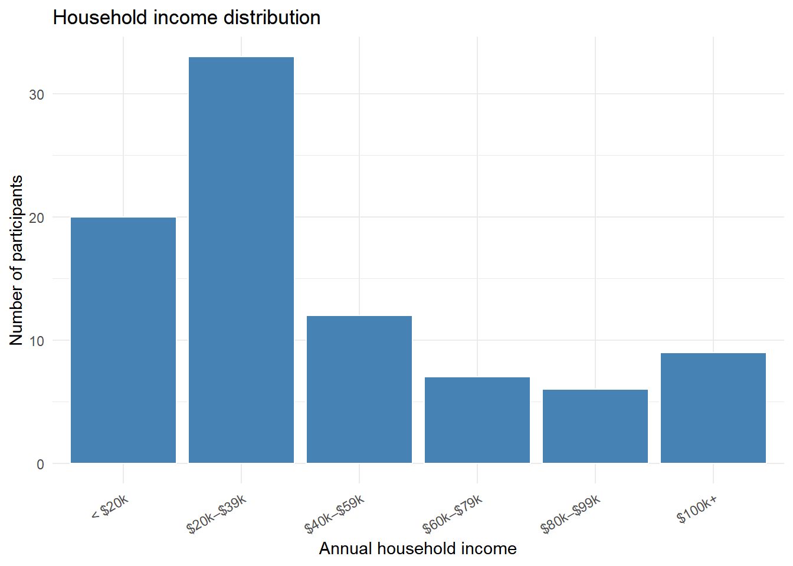

<p>
</div>
</div>
</p>


## CONSORT Diagram

`<div class="committee-note"><span class="committee-label">Committee</span>The committee requested a CONSORT diagram to document participant flow through the study.</div>`{=html}

<style>
.esmtools-container{
  
}
.esmtools-container-open {
  border: 2px solid #2780e3;
  border-radius: 7px;
  margin: 0 -1em;
  padding: .4em 1em;
}
.esmtools-btn{
  display:inline-block;
  padding:0.35em 1.2em;
  border:0.2em solid #2780e3;
  background-color:#2780e3;
  margin:0 0.3em 0.3em 0;
  border-radius:0.12em;
  box-sizing: border-box;
  text-decoration:none;
  font-family:'Roboto',sans-serif;
  font-weight: bold;
  color:#FFFFFF;
  text-align:center;
  transition: all 0.2s;
  margin: 4px 0px 4px 4px;
}
.esmtools-btn:hover{
  color:#000000;
  background-color:#FFFFFF;
}
/* Highligh issue text */
.esm-issue{
    font-weight: bold;
    color:#e61919;
    text-decoration: underline #e61919 2px;
}

/* Highlight data inspection text */
.esm-inspect{
    font-weight: bold;
    text-decoration: underline 2px;
}

/* Highlight data modification text */
.esm-mod{
    font-weight: bold;
    color:#0088a3;
    text-decoration: underline #0088a3 2px;
}
/* Warning message: hidden content */
.warning_hide{
    font-weight: bold;
    margin: -.4em 0em 1em 2px;
    color: #595959;
}
</style>
<script>
function esmtools_toggleContent(button) {
    var parentDiv = button.parentElement;
    var childNodes = parentDiv.childNodes;
    
    // Toggle the 'esmtools-btn-open' class on the parent div
    parentDiv.classList.toggle("esmtools-container-open");

    for (var i = 2; i < childNodes.length; i++) {
      var node = childNodes[i];
      // if (!node.classList.contains("content-container")){
          if (node.nodeType === Node.ELEMENT_NODE) {
              if (node.style.display === "none") {
                  node.style.display = "block";
                  console.log("ok")
              } else {
                  node.style.display = "none";
              }
          }
      // }
    }
}
</script>

``` r
library(DiagrammeR)

# Dynamically computed from study_sample
n_part2 <- study_sample %>%
  filter(study_part == 2) %>%
  distinct(participant_id) %>%
  nrow()

n_part6 <- study_sample %>%
  filter(study_part == 6) %>%
  distinct(participant_id) %>%
  nrow()

n_dropout <- n_part2 - n_part6

grViz(paste0('
digraph consort {

  graph [layout = dot, rankdir = TB, fontname = "Helvetica"]
  node  [shape = rectangle, fontname = "Helvetica", fontsize = 11,
         style = filled, fillcolor = white, margin = "0.2,0.1"]
  edge  [fontname = "Helvetica", fontsize = 10]

  # Main flow nodes
  screened   [label = "Screened via telephone\n(n = 1,187)"]
  consented  [label = "Consented\n(n = 139)"]
  baseline   [label = "Completed baseline laboratory visit\n(n = 118)"]
  part2      [label = "Completed 3-day baseline EMA and\nmet criteria for continuation\n(n = ', n_part2, ')"]
  mock       [label = "Completed mock scanner training visit\n(n = 82)"]
  randomized [label = "Randomized to scan order A (n = 41)\nor scan order B (n = 41)"]
  part6      [label = "Completed 7-day EMA period\nwith incentivized abstinence\n(n = ', n_part6, ')"]

  # Exclusion nodes
  excl1 [label = "Declined to participate (n = 189)\nNot eligible (n = 858)\nUnable to schedule: COVID-19 shutdown (n = 1)",
          shape = rectangle, fillcolor = "#f9f9f9"]
  excl2 [label = "Declined to continue (n = 2)\nScreened out: CPD below cutoff (n = 3)\nScreened out: baseline CO below cutoff (n = 5)\nScreened out: MRI-related exclusion (n = 6)\nScreened out: substance dependence on MINI (n = 5)",
          shape = rectangle, fillcolor = "#f9f9f9"]
  excl3 [label = "Declined to continue (n = 11)\nUnable to continue: COVID-19 shutdown (n = 3)\nWithdrawn: protocol compliance below threshold (n = 9)",
          shape = rectangle, fillcolor = "#f9f9f9"]
  excl4 [label = "Withdrawn: claustrophobia/discomfort (n = 6)\nWithdrawn: experimental CO above cutoff (n = 4)\nWithdrawn: MRI-related exclusion (n = 2)\nWithdrawn: repeated cancellations (n = 1)",
          shape = rectangle, fillcolor = "#f9f9f9"]
  excl5 [label = "Declined to continue (n = 10)\nDied (n = 1)",
          shape = rectangle, fillcolor = "#f9f9f9"]
  excl6 [label = "Dropout between Part 2 and Part 6\n(n = ', n_dropout, ')",
          shape = rectangle, fillcolor = "#f9f9f9"]

  # Main flow edges
  screened   -> consented
  consented  -> baseline
  baseline   -> part2
  part2      -> mock
  mock       -> randomized
  randomized -> part6

  # Exclusion edges
  screened   -> excl1   [arrowhead = none, style = dashed]
  consented  -> excl2   [arrowhead = none, style = dashed]
  baseline   -> excl3   [arrowhead = none, style = dashed]
  part2      -> excl4   [arrowhead = none, style = dashed]
  randomized -> excl5   [arrowhead = none, style = dashed]
  part6      -> excl6   [arrowhead = none, style = dashed]
}
'))
```

```{=html}
<div class="grViz html-widget html-fill-item" id="htmlwidget-471926762a7dfa915b70" style="width:768px;height:1152px;"></div>
<script type="application/json" data-for="htmlwidget-471926762a7dfa915b70">{"x":{"diagram":"\ndigraph consort {\n\n  graph [layout = dot, rankdir = TB, fontname = \"Helvetica\"]\n  node  [shape = rectangle, fontname = \"Helvetica\", fontsize = 11,\n         style = filled, fillcolor = white, margin = \"0.2,0.1\"]\n  edge  [fontname = \"Helvetica\", fontsize = 10]\n\n  # Main flow nodes\n  screened   [label = \"Screened via telephone\n(n = 1,187)\"]\n  consented  [label = \"Consented\n(n = 139)\"]\n  baseline   [label = \"Completed baseline laboratory visit\n(n = 118)\"]\n  part2      [label = \"Completed 3-day baseline EMA and\nmet criteria for continuation\n(n = 95)\"]\n  mock       [label = \"Completed mock scanner training visit\n(n = 82)\"]\n  randomized [label = \"Randomized to scan order A (n = 41)\nor scan order B (n = 41)\"]\n  part6      [label = \"Completed 7-day EMA period\nwith incentivized abstinence\n(n = 59)\"]\n\n  # Exclusion nodes\n  excl1 [label = \"Declined to participate (n = 189)\nNot eligible (n = 858)\nUnable to schedule: COVID-19 shutdown (n = 1)\",\n          shape = rectangle, fillcolor = \"#f9f9f9\"]\n  excl2 [label = \"Declined to continue (n = 2)\nScreened out: CPD below cutoff (n = 3)\nScreened out: baseline CO below cutoff (n = 5)\nScreened out: MRI-related exclusion (n = 6)\nScreened out: substance dependence on MINI (n = 5)\",\n          shape = rectangle, fillcolor = \"#f9f9f9\"]\n  excl3 [label = \"Declined to continue (n = 11)\nUnable to continue: COVID-19 shutdown (n = 3)\nWithdrawn: protocol compliance below threshold (n = 9)\",\n          shape = rectangle, fillcolor = \"#f9f9f9\"]\n  excl4 [label = \"Withdrawn: claustrophobia/discomfort (n = 6)\nWithdrawn: experimental CO above cutoff (n = 4)\nWithdrawn: MRI-related exclusion (n = 2)\nWithdrawn: repeated cancellations (n = 1)\",\n          shape = rectangle, fillcolor = \"#f9f9f9\"]\n  excl5 [label = \"Declined to continue (n = 10)\nDied (n = 1)\",\n          shape = rectangle, fillcolor = \"#f9f9f9\"]\n  excl6 [label = \"Dropout between Part 2 and Part 6\n(n = 36)\",\n          shape = rectangle, fillcolor = \"#f9f9f9\"]\n\n  # Main flow edges\n  screened   -> consented\n  consented  -> baseline\n  baseline   -> part2\n  part2      -> mock\n  mock       -> randomized\n  randomized -> part6\n\n  # Exclusion edges\n  screened   -> excl1   [arrowhead = none, style = dashed]\n  consented  -> excl2   [arrowhead = none, style = dashed]\n  baseline   -> excl3   [arrowhead = none, style = dashed]\n  part2      -> excl4   [arrowhead = none, style = dashed]\n  randomized -> excl5   [arrowhead = none, style = dashed]\n  part6      -> excl6   [arrowhead = none, style = dashed]\n}\n","config":{"engine":"dot","options":null}},"evals":[],"jsHooks":[]}</script>
```

---

`<div class="section-summary"><span class="summary-label">Summary</span>The analytic sample comprises participants from the DVAL parent study who completed the 3-day baseline EMA period (Part 2). A subset of these participants also completed the 7-day incentivized abstinence EMA period (Part 6). Demographic characteristics and participant flow are documented above. See the CONSORT diagram for a full accounting of enrollment, attrition, and study completion.</div>`{=html}

# Response Behavior Quality

This section examines how well participants engaged with the EMA protocol.

## Compliance

<style>
.esmtools-container{
  
}
.esmtools-container-open {
  border: 2px solid #2780e3;
  border-radius: 7px;
  margin: 0 -1em;
  padding: .4em 1em;
}
.esmtools-btn{
  display:inline-block;
  padding:0.35em 1.2em;
  border:0.2em solid #2780e3;
  background-color:#2780e3;
  margin:0 0.3em 0.3em 0;
  border-radius:0.12em;
  box-sizing: border-box;
  text-decoration:none;
  font-family:'Roboto',sans-serif;
  font-weight: bold;
  color:#FFFFFF;
  text-align:center;
  transition: all 0.2s;
  margin: 4px 0px 4px 4px;
}
.esmtools-btn:hover{
  color:#000000;
  background-color:#FFFFFF;
}
/* Highligh issue text */
.esm-issue{
    font-weight: bold;
    color:#e61919;
    text-decoration: underline #e61919 2px;
}

/* Highlight data inspection text */
.esm-inspect{
    font-weight: bold;
    text-decoration: underline 2px;
}

/* Highlight data modification text */
.esm-mod{
    font-weight: bold;
    color:#0088a3;
    text-decoration: underline #0088a3 2px;
}
/* Warning message: hidden content */
.warning_hide{
    font-weight: bold;
    margin: -.4em 0em 1em 2px;
    color: #595959;
}
</style>
<script>
function esmtools_toggleContent(button) {
    var parentDiv = button.parentElement;
    var childNodes = parentDiv.childNodes;
    
    // Toggle the 'esmtools-btn-open' class on the parent div
    parentDiv.classList.toggle("esmtools-container-open");

    for (var i = 2; i < childNodes.length; i++) {
      var node = childNodes[i];
      // if (!node.classList.contains("content-container")){
          if (node.nodeType === Node.ELEMENT_NODE) {
              if (node.style.display === "none") {
                  node.style.display = "block";
                  console.log("ok")
              } else {
                  node.style.display = "none";
              }
          }
      // }
    }
}
</script>

``` r
compliance_df <- study_sample %>%
  mutate(valid = check_validity(.)) %>%
  group_by(participant_id) %>%
  summarise(
    valid_beeps     = sum(valid, na.rm = TRUE),
    max_dayno       = max(dayno, na.rm = TRUE),
    total_possible  = if_else(max_dayno <= 3, 18L, 60L),
    completion_group = if_else(max_dayno <= 3,
                               "Part 2 Only (3 days)",
                               "Parts 2 + 6 (10 days)"),
    compliance      = valid_beeps / total_possible
  ) %>%
  ungroup()

# Summary by group
compliance_df %>%
  group_by(completion_group) %>%
  summarise(
    n                = n(),
    mean_valid_beeps = round(mean(valid_beeps), 1),
    mean_possible    = round(mean(total_possible), 1),
    mean_compliance  = round(mean(compliance), 3),
    min_compliance   = round(min(compliance), 3),
    max_compliance   = round(max(compliance), 3)
  ) %>%
  kable(caption = "Compliance summary by study completion group") %>%
  kable_styling(bootstrap_options = c("striped", "hover", "condensed"),
                full_width = FALSE)
```

<table class="table table-striped table-hover table-condensed" style="width: auto !important; margin-left: auto; margin-right: auto;">
<caption>Compliance summary by study completion group</caption>
 <thead>
  <tr>
   <th style="text-align:left;"> completion_group </th>
   <th style="text-align:right;"> n </th>
   <th style="text-align:right;"> mean_valid_beeps </th>
   <th style="text-align:right;"> mean_possible </th>
   <th style="text-align:right;"> mean_compliance </th>
   <th style="text-align:right;"> min_compliance </th>
   <th style="text-align:right;"> max_compliance </th>
  </tr>
 </thead>
<tbody>
  <tr>
   <td style="text-align:left;"> Part 2 Only (3 days) </td>
   <td style="text-align:right;"> 36 </td>
   <td style="text-align:right;"> 10.4 </td>
   <td style="text-align:right;"> 18 </td>
   <td style="text-align:right;"> 0.580 </td>
   <td style="text-align:right;"> 0.167 </td>
   <td style="text-align:right;"> 1.000 </td>
  </tr>
  <tr>
   <td style="text-align:left;"> Parts 2 + 6 (10 days) </td>
   <td style="text-align:right;"> 59 </td>
   <td style="text-align:right;"> 34.9 </td>
   <td style="text-align:right;"> 60 </td>
   <td style="text-align:right;"> 0.582 </td>
   <td style="text-align:right;"> 0.033 </td>
   <td style="text-align:right;"> 0.983 </td>
  </tr>
</tbody>
</table>

<style>
.esmtools-container{
  
}
.esmtools-container-open {
  border: 2px solid #2780e3;
  border-radius: 7px;
  margin: 0 -1em;
  padding: .4em 1em;
}
.esmtools-btn{
  display:inline-block;
  padding:0.35em 1.2em;
  border:0.2em solid #2780e3;
  background-color:#2780e3;
  margin:0 0.3em 0.3em 0;
  border-radius:0.12em;
  box-sizing: border-box;
  text-decoration:none;
  font-family:'Roboto',sans-serif;
  font-weight: bold;
  color:#FFFFFF;
  text-align:center;
  transition: all 0.2s;
  margin: 4px 0px 4px 4px;
}
.esmtools-btn:hover{
  color:#000000;
  background-color:#FFFFFF;
}
/* Highligh issue text */
.esm-issue{
    font-weight: bold;
    color:#e61919;
    text-decoration: underline #e61919 2px;
}

/* Highlight data inspection text */
.esm-inspect{
    font-weight: bold;
    text-decoration: underline 2px;
}

/* Highlight data modification text */
.esm-mod{
    font-weight: bold;
    color:#0088a3;
    text-decoration: underline #0088a3 2px;
}
/* Warning message: hidden content */
.warning_hide{
    font-weight: bold;
    margin: -.4em 0em 1em 2px;
    color: #595959;
}
</style>
<script>
function esmtools_toggleContent(button) {
    var parentDiv = button.parentElement;
    var childNodes = parentDiv.childNodes;
    
    // Toggle the 'esmtools-btn-open' class on the parent div
    parentDiv.classList.toggle("esmtools-container-open");

    for (var i = 2; i < childNodes.length; i++) {
      var node = childNodes[i];
      // if (!node.classList.contains("content-container")){
          if (node.nodeType === Node.ELEMENT_NODE) {
              if (node.style.display === "none") {
                  node.style.display = "block";
                  console.log("ok")
              } else {
                  node.style.display = "none";
              }
          }
      // }
    }
}
</script>

``` r
ggplot(compliance_df, aes(x = compliance, fill = completion_group)) +
  geom_histogram(binwidth = 0.05, boundary = 0, color = "white") +
  scale_x_continuous(
    limits = c(0, 1),
    breaks = seq(0, 1, by = 0.1),
    labels = scales::percent_format(accuracy = 1)
  ) +
  facet_wrap(~ completion_group, ncol = 1) +
  labs(
    title = "Distribution of participant compliance by study completion group",
    x     = "Compliance (% of possible EMA prompts)",
    y     = "Number of participants"
  ) +
  theme_minimal() +
  theme(legend.position = "none")
```

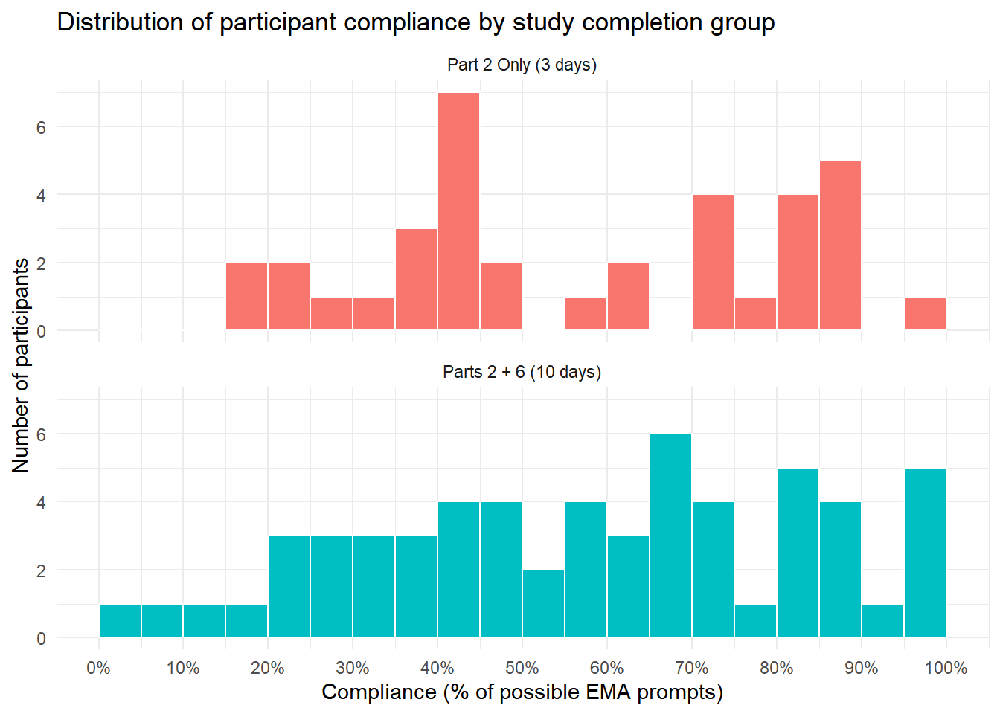

## Compliance Trends and Participant Characteristics

`<div class="committee-note"><span class="committee-label">Committee</span>The committee asked whether there are significant trends in non-compliance that should be accounted for (e.g., participant characteristics).</div>`{=html}

<style>
.esmtools-container{
  
}
.esmtools-container-open {
  border: 2px solid #2780e3;
  border-radius: 7px;
  margin: 0 -1em;
  padding: .4em 1em;
}
.esmtools-btn{
  display:inline-block;
  padding:0.35em 1.2em;
  border:0.2em solid #2780e3;
  background-color:#2780e3;
  margin:0 0.3em 0.3em 0;
  border-radius:0.12em;
  box-sizing: border-box;
  text-decoration:none;
  font-family:'Roboto',sans-serif;
  font-weight: bold;
  color:#FFFFFF;
  text-align:center;
  transition: all 0.2s;
  margin: 4px 0px 4px 4px;
}
.esmtools-btn:hover{
  color:#000000;
  background-color:#FFFFFF;
}
/* Highligh issue text */
.esm-issue{
    font-weight: bold;
    color:#e61919;
    text-decoration: underline #e61919 2px;
}

/* Highlight data inspection text */
.esm-inspect{
    font-weight: bold;
    text-decoration: underline 2px;
}

/* Highlight data modification text */
.esm-mod{
    font-weight: bold;
    color:#0088a3;
    text-decoration: underline #0088a3 2px;
}
/* Warning message: hidden content */
.warning_hide{
    font-weight: bold;
    margin: -.4em 0em 1em 2px;
    color: #595959;
}
</style>
<script>
function esmtools_toggleContent(button) {
    var parentDiv = button.parentElement;
    var childNodes = parentDiv.childNodes;
    
    // Toggle the 'esmtools-btn-open' class on the parent div
    parentDiv.classList.toggle("esmtools-container-open");

    for (var i = 2; i < childNodes.length; i++) {
      var node = childNodes[i];
      // if (!node.classList.contains("content-container")){
          if (node.nodeType === Node.ELEMENT_NODE) {
              if (node.style.display === "none") {
                  node.style.display = "block";
                  console.log("ok")
              } else {
                  node.style.display = "none";
              }
          }
      // }
    }
}
</script>

``` r
# Merge compliance with baseline characteristics
compliance_chars <- compliance_df %>%
  left_join(
    study_sample %>%
      group_by(participant_id) %>%
      slice(1) %>%
      ungroup() %>%
      select(participant_id, age, gender, race,
             ftnd_sum, cigsperday, panas_pos, panas_neg),
    by = "participant_id"
  )

# Correlations between compliance and continuous baseline variables,
# with significance stars
cor_vars <- c("compliance", "age", "ftnd_sum", "cigsperday", "panas_pos", "panas_neg")

cor_data <- compliance_chars %>%
  select(all_of(cor_vars))

n_vars <- length(cor_vars)
r_mat  <- matrix(NA, n_vars, n_vars, dimnames = list(cor_vars, cor_vars))
p_mat  <- matrix(NA, n_vars, n_vars, dimnames = list(cor_vars, cor_vars))

for (i in seq_len(n_vars)) {
  for (j in seq_len(n_vars)) {
    if (i == j) {
      r_mat[i, j] <- 1
      p_mat[i, j] <- NA
    } else {
      test         <- cor.test(cor_data[[i]], cor_data[[j]],
                               use = "pairwise.complete.obs")
      r_mat[i, j] <- round(test$estimate, 3)
      p_mat[i, j] <- test$p.value
    }
  }
}

# Build display matrix with stars appended
sig_stars <- function(p) {
  if (is.na(p)) return("")
  if (p < .001) return("***")
  if (p < .01)  return("**")
  if (p < .05)  return("*")
  if (p < .10)  return(".")
  return("")
}

display_mat <- matrix("", n_vars, n_vars, dimnames = list(cor_vars, cor_vars))
for (i in seq_len(n_vars)) {
  for (j in seq_len(n_vars)) {
    if (i == j) {
      display_mat[i, j] <- "—"
    } else {
      display_mat[i, j] <- paste0(r_mat[i, j], sig_stars(p_mat[i, j]))
    }
  }
}

as.data.frame(display_mat) %>%
  kable(caption = "Correlations between compliance and baseline characteristics. * p < .05, ** p < .01, *** p < .001, . p < .10") %>%
  kable_styling(bootstrap_options = c("striped", "hover", "condensed"),
                full_width = FALSE)
```

<table class="table table-striped table-hover table-condensed" style="width: auto !important; margin-left: auto; margin-right: auto;">
<caption>Correlations between compliance and baseline characteristics. * p &lt; .05, ** p &lt; .01, *** p &lt; .001, . p &lt; .10</caption>
 <thead>
  <tr>
   <th style="text-align:left;">  </th>
   <th style="text-align:left;"> compliance </th>
   <th style="text-align:left;"> age </th>
   <th style="text-align:left;"> ftnd_sum </th>
   <th style="text-align:left;"> cigsperday </th>
   <th style="text-align:left;"> panas_pos </th>
   <th style="text-align:left;"> panas_neg </th>
  </tr>
 </thead>
<tbody>
  <tr>
   <td style="text-align:left;"> compliance </td>
   <td style="text-align:left;"> — </td>
   <td style="text-align:left;"> 0.016 </td>
   <td style="text-align:left;"> -0.017 </td>
   <td style="text-align:left;"> -0.059 </td>
   <td style="text-align:left;"> 0.22* </td>
   <td style="text-align:left;"> -0.177. </td>
  </tr>
  <tr>
   <td style="text-align:left;"> age </td>
   <td style="text-align:left;"> 0.016 </td>
   <td style="text-align:left;"> — </td>
   <td style="text-align:left;"> 0.273** </td>
   <td style="text-align:left;"> 0.364*** </td>
   <td style="text-align:left;"> 0.053 </td>
   <td style="text-align:left;"> -0.001 </td>
  </tr>
  <tr>
   <td style="text-align:left;"> ftnd_sum </td>
   <td style="text-align:left;"> -0.017 </td>
   <td style="text-align:left;"> 0.273** </td>
   <td style="text-align:left;"> — </td>
   <td style="text-align:left;"> 0.678*** </td>
   <td style="text-align:left;"> -0.078 </td>
   <td style="text-align:left;"> -0.024 </td>
  </tr>
  <tr>
   <td style="text-align:left;"> cigsperday </td>
   <td style="text-align:left;"> -0.059 </td>
   <td style="text-align:left;"> 0.364*** </td>
   <td style="text-align:left;"> 0.678*** </td>
   <td style="text-align:left;"> — </td>
   <td style="text-align:left;"> -0.062 </td>
   <td style="text-align:left;"> -0.062 </td>
  </tr>
  <tr>
   <td style="text-align:left;"> panas_pos </td>
   <td style="text-align:left;"> 0.22* </td>
   <td style="text-align:left;"> 0.053 </td>
   <td style="text-align:left;"> -0.078 </td>
   <td style="text-align:left;"> -0.062 </td>
   <td style="text-align:left;"> — </td>
   <td style="text-align:left;"> -0.343*** </td>
  </tr>
  <tr>
   <td style="text-align:left;"> panas_neg </td>
   <td style="text-align:left;"> -0.177. </td>
   <td style="text-align:left;"> -0.001 </td>
   <td style="text-align:left;"> -0.024 </td>
   <td style="text-align:left;"> -0.062 </td>
   <td style="text-align:left;"> -0.343*** </td>
   <td style="text-align:left;"> — </td>
  </tr>
</tbody>
</table>

## Validity Audit

`<div class="committee-note"><span class="committee-label">Committee</span>The committee requested the number of available cases for each Aim.</div>`{=html}

<style>
.esmtools-container{
  
}
.esmtools-container-open {
  border: 2px solid #2780e3;
  border-radius: 7px;
  margin: 0 -1em;
  padding: .4em 1em;
}
.esmtools-btn{
  display:inline-block;
  padding:0.35em 1.2em;
  border:0.2em solid #2780e3;
  background-color:#2780e3;
  margin:0 0.3em 0.3em 0;
  border-radius:0.12em;
  box-sizing: border-box;
  text-decoration:none;
  font-family:'Roboto',sans-serif;
  font-weight: bold;
  color:#FFFFFF;
  text-align:center;
  transition: all 0.2s;
  margin: 4px 0px 4px 4px;
}
.esmtools-btn:hover{
  color:#000000;
  background-color:#FFFFFF;
}
/* Highligh issue text */
.esm-issue{
    font-weight: bold;
    color:#e61919;
    text-decoration: underline #e61919 2px;
}

/* Highlight data inspection text */
.esm-inspect{
    font-weight: bold;
    text-decoration: underline 2px;
}

/* Highlight data modification text */
.esm-mod{
    font-weight: bold;
    color:#0088a3;
    text-decoration: underline #0088a3 2px;
}
/* Warning message: hidden content */
.warning_hide{
    font-weight: bold;
    margin: -.4em 0em 1em 2px;
    color: #595959;
}
</style>
<script>
function esmtools_toggleContent(button) {
    var parentDiv = button.parentElement;
    var childNodes = parentDiv.childNodes;
    
    // Toggle the 'esmtools-btn-open' class on the parent div
    parentDiv.classList.toggle("esmtools-container-open");

    for (var i = 2; i < childNodes.length; i++) {
      var node = childNodes[i];
      // if (!node.classList.contains("content-container")){
          if (node.nodeType === Node.ELEMENT_NODE) {
              if (node.style.display === "none") {
                  node.style.display = "block";
                  console.log("ok")
              } else {
                  node.style.display = "none";
              }
          }
      // }
    }
}
</script>

``` r
# Add valid column to full dataset first
study_sample_v <- study_sample %>%
  mutate(valid = check_validity(.))

# Now summarise per participant per part
validity_audit <- study_sample_v %>%
  group_by(participant_id, study_part) %>%
  summarise(
    n_total     = n(),
    n_mood_ok   = sum(!is.na(mood)),
    n_before_ok = sum(!is.na(before_survey)),
    n_smoke_ok  = sum(!is.na(smoke)),
    n_branch_ok = sum(!is.na(pleasant) | !is.na(unpleasant)),
    n_valid     = sum(valid),
    pct_valid   = round(sum(valid) / n() * 100, 1),
    .groups = "drop"
  ) %>%
  mutate(
    study_part = factor(study_part,
                        levels = c(2, 6),
                        labels = c("Part 2", "Part 6")),
    branch_limiting = n_mood_ok == n_smoke_ok &
                      n_smoke_ok == n_before_ok &
                      n_branch_ok < n_mood_ok
  )

# First table: participants where branch is limiting factor
validity_audit %>%
  filter(branch_limiting) %>%
  select(participant_id, study_part, n_total, n_mood_ok,
         n_branch_ok, n_valid, pct_valid) %>%
  arrange(participant_id, study_part) %>%
  kable(caption = "Participants where branch variable (pleasant/unpleasant) is the limiting validity factor") %>%
  kable_styling(bootstrap_options = c("striped", "hover", "condensed"),
                full_width = FALSE)
```

<table class="table table-striped table-hover table-condensed" style="width: auto !important; margin-left: auto; margin-right: auto;">
<caption>Participants where branch variable (pleasant/unpleasant) is the limiting validity factor</caption>
 <thead>
  <tr>
   <th style="text-align:right;"> participant_id </th>
   <th style="text-align:left;"> study_part </th>
   <th style="text-align:right;"> n_total </th>
   <th style="text-align:right;"> n_mood_ok </th>
   <th style="text-align:right;"> n_branch_ok </th>
   <th style="text-align:right;"> n_valid </th>
   <th style="text-align:right;"> pct_valid </th>
  </tr>
 </thead>
<tbody>
  <tr>
   <td style="text-align:right;"> 102 </td>
   <td style="text-align:left;"> Part 2 </td>
   <td style="text-align:right;"> 18 </td>
   <td style="text-align:right;"> 17 </td>
   <td style="text-align:right;"> 12 </td>
   <td style="text-align:right;"> 12 </td>
   <td style="text-align:right;"> 66.7 </td>
  </tr>
  <tr>
   <td style="text-align:right;"> 102 </td>
   <td style="text-align:left;"> Part 6 </td>
   <td style="text-align:right;"> 42 </td>
   <td style="text-align:right;"> 39 </td>
   <td style="text-align:right;"> 28 </td>
   <td style="text-align:right;"> 28 </td>
   <td style="text-align:right;"> 66.7 </td>
  </tr>
  <tr>
   <td style="text-align:right;"> 104 </td>
   <td style="text-align:left;"> Part 2 </td>
   <td style="text-align:right;"> 18 </td>
   <td style="text-align:right;"> 17 </td>
   <td style="text-align:right;"> 12 </td>
   <td style="text-align:right;"> 12 </td>
   <td style="text-align:right;"> 66.7 </td>
  </tr>
  <tr>
   <td style="text-align:right;"> 104 </td>
   <td style="text-align:left;"> Part 6 </td>
   <td style="text-align:right;"> 41 </td>
   <td style="text-align:right;"> 37 </td>
   <td style="text-align:right;"> 15 </td>
   <td style="text-align:right;"> 15 </td>
   <td style="text-align:right;"> 36.6 </td>
  </tr>
  <tr>
   <td style="text-align:right;"> 112 </td>
   <td style="text-align:left;"> Part 2 </td>
   <td style="text-align:right;"> 18 </td>
   <td style="text-align:right;"> 18 </td>
   <td style="text-align:right;"> 8 </td>
   <td style="text-align:right;"> 8 </td>
   <td style="text-align:right;"> 44.4 </td>
  </tr>
  <tr>
   <td style="text-align:right;"> 112 </td>
   <td style="text-align:left;"> Part 6 </td>
   <td style="text-align:right;"> 42 </td>
   <td style="text-align:right;"> 41 </td>
   <td style="text-align:right;"> 17 </td>
   <td style="text-align:right;"> 17 </td>
   <td style="text-align:right;"> 40.5 </td>
  </tr>
  <tr>
   <td style="text-align:right;"> 113 </td>
   <td style="text-align:left;"> Part 2 </td>
   <td style="text-align:right;"> 18 </td>
   <td style="text-align:right;"> 17 </td>
   <td style="text-align:right;"> 13 </td>
   <td style="text-align:right;"> 13 </td>
   <td style="text-align:right;"> 72.2 </td>
  </tr>
  <tr>
   <td style="text-align:right;"> 115 </td>
   <td style="text-align:left;"> Part 2 </td>
   <td style="text-align:right;"> 18 </td>
   <td style="text-align:right;"> 16 </td>
   <td style="text-align:right;"> 9 </td>
   <td style="text-align:right;"> 9 </td>
   <td style="text-align:right;"> 50.0 </td>
  </tr>
  <tr>
   <td style="text-align:right;"> 116 </td>
   <td style="text-align:left;"> Part 2 </td>
   <td style="text-align:right;"> 18 </td>
   <td style="text-align:right;"> 17 </td>
   <td style="text-align:right;"> 11 </td>
   <td style="text-align:right;"> 11 </td>
   <td style="text-align:right;"> 61.1 </td>
  </tr>
  <tr>
   <td style="text-align:right;"> 116 </td>
   <td style="text-align:left;"> Part 6 </td>
   <td style="text-align:right;"> 42 </td>
   <td style="text-align:right;"> 32 </td>
   <td style="text-align:right;"> 2 </td>
   <td style="text-align:right;"> 2 </td>
   <td style="text-align:right;"> 4.8 </td>
  </tr>
  <tr>
   <td style="text-align:right;"> 124 </td>
   <td style="text-align:left;"> Part 2 </td>
   <td style="text-align:right;"> 18 </td>
   <td style="text-align:right;"> 17 </td>
   <td style="text-align:right;"> 6 </td>
   <td style="text-align:right;"> 6 </td>
   <td style="text-align:right;"> 33.3 </td>
  </tr>
  <tr>
   <td style="text-align:right;"> 124 </td>
   <td style="text-align:left;"> Part 6 </td>
   <td style="text-align:right;"> 41 </td>
   <td style="text-align:right;"> 40 </td>
   <td style="text-align:right;"> 21 </td>
   <td style="text-align:right;"> 21 </td>
   <td style="text-align:right;"> 51.2 </td>
  </tr>
  <tr>
   <td style="text-align:right;"> 125 </td>
   <td style="text-align:left;"> Part 2 </td>
   <td style="text-align:right;"> 18 </td>
   <td style="text-align:right;"> 17 </td>
   <td style="text-align:right;"> 16 </td>
   <td style="text-align:right;"> 16 </td>
   <td style="text-align:right;"> 88.9 </td>
  </tr>
  <tr>
   <td style="text-align:right;"> 125 </td>
   <td style="text-align:left;"> Part 6 </td>
   <td style="text-align:right;"> 42 </td>
   <td style="text-align:right;"> 40 </td>
   <td style="text-align:right;"> 35 </td>
   <td style="text-align:right;"> 35 </td>
   <td style="text-align:right;"> 83.3 </td>
  </tr>
  <tr>
   <td style="text-align:right;"> 126 </td>
   <td style="text-align:left;"> Part 2 </td>
   <td style="text-align:right;"> 18 </td>
   <td style="text-align:right;"> 18 </td>
   <td style="text-align:right;"> 11 </td>
   <td style="text-align:right;"> 11 </td>
   <td style="text-align:right;"> 61.1 </td>
  </tr>
  <tr>
   <td style="text-align:right;"> 126 </td>
   <td style="text-align:left;"> Part 6 </td>
   <td style="text-align:right;"> 42 </td>
   <td style="text-align:right;"> 40 </td>
   <td style="text-align:right;"> 17 </td>
   <td style="text-align:right;"> 17 </td>
   <td style="text-align:right;"> 40.5 </td>
  </tr>
  <tr>
   <td style="text-align:right;"> 127 </td>
   <td style="text-align:left;"> Part 2 </td>
   <td style="text-align:right;"> 17 </td>
   <td style="text-align:right;"> 14 </td>
   <td style="text-align:right;"> 13 </td>
   <td style="text-align:right;"> 13 </td>
   <td style="text-align:right;"> 76.5 </td>
  </tr>
  <tr>
   <td style="text-align:right;"> 128 </td>
   <td style="text-align:left;"> Part 2 </td>
   <td style="text-align:right;"> 18 </td>
   <td style="text-align:right;"> 18 </td>
   <td style="text-align:right;"> 1 </td>
   <td style="text-align:right;"> 1 </td>
   <td style="text-align:right;"> 5.6 </td>
  </tr>
  <tr>
   <td style="text-align:right;"> 128 </td>
   <td style="text-align:left;"> Part 6 </td>
   <td style="text-align:right;"> 42 </td>
   <td style="text-align:right;"> 39 </td>
   <td style="text-align:right;"> 5 </td>
   <td style="text-align:right;"> 5 </td>
   <td style="text-align:right;"> 11.9 </td>
  </tr>
  <tr>
   <td style="text-align:right;"> 141 </td>
   <td style="text-align:left;"> Part 2 </td>
   <td style="text-align:right;"> 17 </td>
   <td style="text-align:right;"> 15 </td>
   <td style="text-align:right;"> 12 </td>
   <td style="text-align:right;"> 12 </td>
   <td style="text-align:right;"> 70.6 </td>
  </tr>
  <tr>
   <td style="text-align:right;"> 141 </td>
   <td style="text-align:left;"> Part 6 </td>
   <td style="text-align:right;"> 42 </td>
   <td style="text-align:right;"> 41 </td>
   <td style="text-align:right;"> 24 </td>
   <td style="text-align:right;"> 24 </td>
   <td style="text-align:right;"> 57.1 </td>
  </tr>
  <tr>
   <td style="text-align:right;"> 150 </td>
   <td style="text-align:left;"> Part 2 </td>
   <td style="text-align:right;"> 18 </td>
   <td style="text-align:right;"> 14 </td>
   <td style="text-align:right;"> 7 </td>
   <td style="text-align:right;"> 7 </td>
   <td style="text-align:right;"> 38.9 </td>
  </tr>
  <tr>
   <td style="text-align:right;"> 151 </td>
   <td style="text-align:left;"> Part 2 </td>
   <td style="text-align:right;"> 18 </td>
   <td style="text-align:right;"> 17 </td>
   <td style="text-align:right;"> 9 </td>
   <td style="text-align:right;"> 9 </td>
   <td style="text-align:right;"> 50.0 </td>
  </tr>
  <tr>
   <td style="text-align:right;"> 151 </td>
   <td style="text-align:left;"> Part 6 </td>
   <td style="text-align:right;"> 41 </td>
   <td style="text-align:right;"> 33 </td>
   <td style="text-align:right;"> 23 </td>
   <td style="text-align:right;"> 23 </td>
   <td style="text-align:right;"> 56.1 </td>
  </tr>
  <tr>
   <td style="text-align:right;"> 154 </td>
   <td style="text-align:left;"> Part 2 </td>
   <td style="text-align:right;"> 18 </td>
   <td style="text-align:right;"> 18 </td>
   <td style="text-align:right;"> 7 </td>
   <td style="text-align:right;"> 7 </td>
   <td style="text-align:right;"> 38.9 </td>
  </tr>
  <tr>
   <td style="text-align:right;"> 154 </td>
   <td style="text-align:left;"> Part 6 </td>
   <td style="text-align:right;"> 42 </td>
   <td style="text-align:right;"> 39 </td>
   <td style="text-align:right;"> 21 </td>
   <td style="text-align:right;"> 21 </td>
   <td style="text-align:right;"> 50.0 </td>
  </tr>
  <tr>
   <td style="text-align:right;"> 159 </td>
   <td style="text-align:left;"> Part 2 </td>
   <td style="text-align:right;"> 18 </td>
   <td style="text-align:right;"> 17 </td>
   <td style="text-align:right;"> 12 </td>
   <td style="text-align:right;"> 12 </td>
   <td style="text-align:right;"> 66.7 </td>
  </tr>
  <tr>
   <td style="text-align:right;"> 159 </td>
   <td style="text-align:left;"> Part 6 </td>
   <td style="text-align:right;"> 41 </td>
   <td style="text-align:right;"> 40 </td>
   <td style="text-align:right;"> 39 </td>
   <td style="text-align:right;"> 39 </td>
   <td style="text-align:right;"> 95.1 </td>
  </tr>
  <tr>
   <td style="text-align:right;"> 163 </td>
   <td style="text-align:left;"> Part 2 </td>
   <td style="text-align:right;"> 18 </td>
   <td style="text-align:right;"> 18 </td>
   <td style="text-align:right;"> 12 </td>
   <td style="text-align:right;"> 12 </td>
   <td style="text-align:right;"> 66.7 </td>
  </tr>
  <tr>
   <td style="text-align:right;"> 163 </td>
   <td style="text-align:left;"> Part 6 </td>
   <td style="text-align:right;"> 42 </td>
   <td style="text-align:right;"> 31 </td>
   <td style="text-align:right;"> 19 </td>
   <td style="text-align:right;"> 19 </td>
   <td style="text-align:right;"> 45.2 </td>
  </tr>
  <tr>
   <td style="text-align:right;"> 164 </td>
   <td style="text-align:left;"> Part 2 </td>
   <td style="text-align:right;"> 18 </td>
   <td style="text-align:right;"> 15 </td>
   <td style="text-align:right;"> 14 </td>
   <td style="text-align:right;"> 14 </td>
   <td style="text-align:right;"> 77.8 </td>
  </tr>
  <tr>
   <td style="text-align:right;"> 164 </td>
   <td style="text-align:left;"> Part 6 </td>
   <td style="text-align:right;"> 40 </td>
   <td style="text-align:right;"> 37 </td>
   <td style="text-align:right;"> 5 </td>
   <td style="text-align:right;"> 5 </td>
   <td style="text-align:right;"> 12.5 </td>
  </tr>
  <tr>
   <td style="text-align:right;"> 166 </td>
   <td style="text-align:left;"> Part 2 </td>
   <td style="text-align:right;"> 18 </td>
   <td style="text-align:right;"> 18 </td>
   <td style="text-align:right;"> 17 </td>
   <td style="text-align:right;"> 17 </td>
   <td style="text-align:right;"> 94.4 </td>
  </tr>
  <tr>
   <td style="text-align:right;"> 166 </td>
   <td style="text-align:left;"> Part 6 </td>
   <td style="text-align:right;"> 41 </td>
   <td style="text-align:right;"> 35 </td>
   <td style="text-align:right;"> 32 </td>
   <td style="text-align:right;"> 32 </td>
   <td style="text-align:right;"> 78.0 </td>
  </tr>
  <tr>
   <td style="text-align:right;"> 169 </td>
   <td style="text-align:left;"> Part 2 </td>
   <td style="text-align:right;"> 18 </td>
   <td style="text-align:right;"> 18 </td>
   <td style="text-align:right;"> 15 </td>
   <td style="text-align:right;"> 15 </td>
   <td style="text-align:right;"> 83.3 </td>
  </tr>
  <tr>
   <td style="text-align:right;"> 169 </td>
   <td style="text-align:left;"> Part 6 </td>
   <td style="text-align:right;"> 42 </td>
   <td style="text-align:right;"> 41 </td>
   <td style="text-align:right;"> 22 </td>
   <td style="text-align:right;"> 22 </td>
   <td style="text-align:right;"> 52.4 </td>
  </tr>
  <tr>
   <td style="text-align:right;"> 175 </td>
   <td style="text-align:left;"> Part 2 </td>
   <td style="text-align:right;"> 18 </td>
   <td style="text-align:right;"> 18 </td>
   <td style="text-align:right;"> 9 </td>
   <td style="text-align:right;"> 9 </td>
   <td style="text-align:right;"> 50.0 </td>
  </tr>
  <tr>
   <td style="text-align:right;"> 175 </td>
   <td style="text-align:left;"> Part 6 </td>
   <td style="text-align:right;"> 42 </td>
   <td style="text-align:right;"> 42 </td>
   <td style="text-align:right;"> 33 </td>
   <td style="text-align:right;"> 33 </td>
   <td style="text-align:right;"> 78.6 </td>
  </tr>
  <tr>
   <td style="text-align:right;"> 180 </td>
   <td style="text-align:left;"> Part 2 </td>
   <td style="text-align:right;"> 18 </td>
   <td style="text-align:right;"> 17 </td>
   <td style="text-align:right;"> 6 </td>
   <td style="text-align:right;"> 6 </td>
   <td style="text-align:right;"> 33.3 </td>
  </tr>
  <tr>
   <td style="text-align:right;"> 180 </td>
   <td style="text-align:left;"> Part 6 </td>
   <td style="text-align:right;"> 42 </td>
   <td style="text-align:right;"> 42 </td>
   <td style="text-align:right;"> 10 </td>
   <td style="text-align:right;"> 10 </td>
   <td style="text-align:right;"> 23.8 </td>
  </tr>
  <tr>
   <td style="text-align:right;"> 186 </td>
   <td style="text-align:left;"> Part 2 </td>
   <td style="text-align:right;"> 18 </td>
   <td style="text-align:right;"> 17 </td>
   <td style="text-align:right;"> 4 </td>
   <td style="text-align:right;"> 4 </td>
   <td style="text-align:right;"> 22.2 </td>
  </tr>
  <tr>
   <td style="text-align:right;"> 188 </td>
   <td style="text-align:left;"> Part 2 </td>
   <td style="text-align:right;"> 18 </td>
   <td style="text-align:right;"> 17 </td>
   <td style="text-align:right;"> 5 </td>
   <td style="text-align:right;"> 5 </td>
   <td style="text-align:right;"> 27.8 </td>
  </tr>
  <tr>
   <td style="text-align:right;"> 192 </td>
   <td style="text-align:left;"> Part 2 </td>
   <td style="text-align:right;"> 18 </td>
   <td style="text-align:right;"> 16 </td>
   <td style="text-align:right;"> 4 </td>
   <td style="text-align:right;"> 4 </td>
   <td style="text-align:right;"> 22.2 </td>
  </tr>
  <tr>
   <td style="text-align:right;"> 192 </td>
   <td style="text-align:left;"> Part 6 </td>
   <td style="text-align:right;"> 42 </td>
   <td style="text-align:right;"> 42 </td>
   <td style="text-align:right;"> 13 </td>
   <td style="text-align:right;"> 13 </td>
   <td style="text-align:right;"> 31.0 </td>
  </tr>
  <tr>
   <td style="text-align:right;"> 195 </td>
   <td style="text-align:left;"> Part 6 </td>
   <td style="text-align:right;"> 42 </td>
   <td style="text-align:right;"> 39 </td>
   <td style="text-align:right;"> 38 </td>
   <td style="text-align:right;"> 38 </td>
   <td style="text-align:right;"> 90.5 </td>
  </tr>
  <tr>
   <td style="text-align:right;"> 196 </td>
   <td style="text-align:left;"> Part 2 </td>
   <td style="text-align:right;"> 18 </td>
   <td style="text-align:right;"> 17 </td>
   <td style="text-align:right;"> 15 </td>
   <td style="text-align:right;"> 15 </td>
   <td style="text-align:right;"> 83.3 </td>
  </tr>
  <tr>
   <td style="text-align:right;"> 197 </td>
   <td style="text-align:left;"> Part 2 </td>
   <td style="text-align:right;"> 18 </td>
   <td style="text-align:right;"> 18 </td>
   <td style="text-align:right;"> 15 </td>
   <td style="text-align:right;"> 15 </td>
   <td style="text-align:right;"> 83.3 </td>
  </tr>
  <tr>
   <td style="text-align:right;"> 198 </td>
   <td style="text-align:left;"> Part 2 </td>
   <td style="text-align:right;"> 18 </td>
   <td style="text-align:right;"> 18 </td>
   <td style="text-align:right;"> 9 </td>
   <td style="text-align:right;"> 9 </td>
   <td style="text-align:right;"> 50.0 </td>
  </tr>
  <tr>
   <td style="text-align:right;"> 198 </td>
   <td style="text-align:left;"> Part 6 </td>
   <td style="text-align:right;"> 42 </td>
   <td style="text-align:right;"> 42 </td>
   <td style="text-align:right;"> 11 </td>
   <td style="text-align:right;"> 11 </td>
   <td style="text-align:right;"> 26.2 </td>
  </tr>
  <tr>
   <td style="text-align:right;"> 199 </td>
   <td style="text-align:left;"> Part 2 </td>
   <td style="text-align:right;"> 18 </td>
   <td style="text-align:right;"> 15 </td>
   <td style="text-align:right;"> 7 </td>
   <td style="text-align:right;"> 7 </td>
   <td style="text-align:right;"> 38.9 </td>
  </tr>
  <tr>
   <td style="text-align:right;"> 202 </td>
   <td style="text-align:left;"> Part 2 </td>
   <td style="text-align:right;"> 18 </td>
   <td style="text-align:right;"> 15 </td>
   <td style="text-align:right;"> 10 </td>
   <td style="text-align:right;"> 10 </td>
   <td style="text-align:right;"> 55.6 </td>
  </tr>
  <tr>
   <td style="text-align:right;"> 206 </td>
   <td style="text-align:left;"> Part 2 </td>
   <td style="text-align:right;"> 18 </td>
   <td style="text-align:right;"> 17 </td>
   <td style="text-align:right;"> 11 </td>
   <td style="text-align:right;"> 11 </td>
   <td style="text-align:right;"> 61.1 </td>
  </tr>
  <tr>
   <td style="text-align:right;"> 206 </td>
   <td style="text-align:left;"> Part 6 </td>
   <td style="text-align:right;"> 42 </td>
   <td style="text-align:right;"> 39 </td>
   <td style="text-align:right;"> 36 </td>
   <td style="text-align:right;"> 36 </td>
   <td style="text-align:right;"> 85.7 </td>
  </tr>
  <tr>
   <td style="text-align:right;"> 209 </td>
   <td style="text-align:left;"> Part 2 </td>
   <td style="text-align:right;"> 18 </td>
   <td style="text-align:right;"> 16 </td>
   <td style="text-align:right;"> 13 </td>
   <td style="text-align:right;"> 13 </td>
   <td style="text-align:right;"> 72.2 </td>
  </tr>
  <tr>
   <td style="text-align:right;"> 210 </td>
   <td style="text-align:left;"> Part 2 </td>
   <td style="text-align:right;"> 18 </td>
   <td style="text-align:right;"> 17 </td>
   <td style="text-align:right;"> 14 </td>
   <td style="text-align:right;"> 14 </td>
   <td style="text-align:right;"> 77.8 </td>
  </tr>
  <tr>
   <td style="text-align:right;"> 210 </td>
   <td style="text-align:left;"> Part 6 </td>
   <td style="text-align:right;"> 42 </td>
   <td style="text-align:right;"> 40 </td>
   <td style="text-align:right;"> 37 </td>
   <td style="text-align:right;"> 37 </td>
   <td style="text-align:right;"> 88.1 </td>
  </tr>
  <tr>
   <td style="text-align:right;"> 213 </td>
   <td style="text-align:left;"> Part 2 </td>
   <td style="text-align:right;"> 18 </td>
   <td style="text-align:right;"> 17 </td>
   <td style="text-align:right;"> 12 </td>
   <td style="text-align:right;"> 12 </td>
   <td style="text-align:right;"> 66.7 </td>
  </tr>
  <tr>
   <td style="text-align:right;"> 213 </td>
   <td style="text-align:left;"> Part 6 </td>
   <td style="text-align:right;"> 42 </td>
   <td style="text-align:right;"> 40 </td>
   <td style="text-align:right;"> 13 </td>
   <td style="text-align:right;"> 13 </td>
   <td style="text-align:right;"> 31.0 </td>
  </tr>
  <tr>
   <td style="text-align:right;"> 214 </td>
   <td style="text-align:left;"> Part 2 </td>
   <td style="text-align:right;"> 18 </td>
   <td style="text-align:right;"> 14 </td>
   <td style="text-align:right;"> 3 </td>
   <td style="text-align:right;"> 3 </td>
   <td style="text-align:right;"> 16.7 </td>
  </tr>
  <tr>
   <td style="text-align:right;"> 216 </td>
   <td style="text-align:left;"> Part 2 </td>
   <td style="text-align:right;"> 18 </td>
   <td style="text-align:right;"> 18 </td>
   <td style="text-align:right;"> 9 </td>
   <td style="text-align:right;"> 9 </td>
   <td style="text-align:right;"> 50.0 </td>
  </tr>
  <tr>
   <td style="text-align:right;"> 218 </td>
   <td style="text-align:left;"> Part 2 </td>
   <td style="text-align:right;"> 18 </td>
   <td style="text-align:right;"> 18 </td>
   <td style="text-align:right;"> 17 </td>
   <td style="text-align:right;"> 17 </td>
   <td style="text-align:right;"> 94.4 </td>
  </tr>
  <tr>
   <td style="text-align:right;"> 218 </td>
   <td style="text-align:left;"> Part 6 </td>
   <td style="text-align:right;"> 42 </td>
   <td style="text-align:right;"> 42 </td>
   <td style="text-align:right;"> 41 </td>
   <td style="text-align:right;"> 41 </td>
   <td style="text-align:right;"> 97.6 </td>
  </tr>
  <tr>
   <td style="text-align:right;"> 221 </td>
   <td style="text-align:left;"> Part 2 </td>
   <td style="text-align:right;"> 18 </td>
   <td style="text-align:right;"> 18 </td>
   <td style="text-align:right;"> 11 </td>
   <td style="text-align:right;"> 11 </td>
   <td style="text-align:right;"> 61.1 </td>
  </tr>
  <tr>
   <td style="text-align:right;"> 222 </td>
   <td style="text-align:left;"> Part 2 </td>
   <td style="text-align:right;"> 18 </td>
   <td style="text-align:right;"> 17 </td>
   <td style="text-align:right;"> 16 </td>
   <td style="text-align:right;"> 16 </td>
   <td style="text-align:right;"> 88.9 </td>
  </tr>
  <tr>
   <td style="text-align:right;"> 222 </td>
   <td style="text-align:left;"> Part 6 </td>
   <td style="text-align:right;"> 42 </td>
   <td style="text-align:right;"> 40 </td>
   <td style="text-align:right;"> 34 </td>
   <td style="text-align:right;"> 34 </td>
   <td style="text-align:right;"> 81.0 </td>
  </tr>
  <tr>
   <td style="text-align:right;"> 223 </td>
   <td style="text-align:left;"> Part 2 </td>
   <td style="text-align:right;"> 18 </td>
   <td style="text-align:right;"> 14 </td>
   <td style="text-align:right;"> 2 </td>
   <td style="text-align:right;"> 2 </td>
   <td style="text-align:right;"> 11.1 </td>
  </tr>
  <tr>
   <td style="text-align:right;"> 223 </td>
   <td style="text-align:left;"> Part 6 </td>
   <td style="text-align:right;"> 42 </td>
   <td style="text-align:right;"> 29 </td>
   <td style="text-align:right;"> 0 </td>
   <td style="text-align:right;"> 0 </td>
   <td style="text-align:right;"> 0.0 </td>
  </tr>
  <tr>
   <td style="text-align:right;"> 233 </td>
   <td style="text-align:left;"> Part 2 </td>
   <td style="text-align:right;"> 16 </td>
   <td style="text-align:right;"> 15 </td>
   <td style="text-align:right;"> 14 </td>
   <td style="text-align:right;"> 14 </td>
   <td style="text-align:right;"> 87.5 </td>
  </tr>
  <tr>
   <td style="text-align:right;"> 233 </td>
   <td style="text-align:left;"> Part 6 </td>
   <td style="text-align:right;"> 42 </td>
   <td style="text-align:right;"> 37 </td>
   <td style="text-align:right;"> 31 </td>
   <td style="text-align:right;"> 31 </td>
   <td style="text-align:right;"> 73.8 </td>
  </tr>
  <tr>
   <td style="text-align:right;"> 238 </td>
   <td style="text-align:left;"> Part 2 </td>
   <td style="text-align:right;"> 17 </td>
   <td style="text-align:right;"> 10 </td>
   <td style="text-align:right;"> 1 </td>
   <td style="text-align:right;"> 1 </td>
   <td style="text-align:right;"> 5.9 </td>
  </tr>
  <tr>
   <td style="text-align:right;"> 238 </td>
   <td style="text-align:left;"> Part 6 </td>
   <td style="text-align:right;"> 37 </td>
   <td style="text-align:right;"> 29 </td>
   <td style="text-align:right;"> 8 </td>
   <td style="text-align:right;"> 8 </td>
   <td style="text-align:right;"> 21.6 </td>
  </tr>
  <tr>
   <td style="text-align:right;"> 240 </td>
   <td style="text-align:left;"> Part 2 </td>
   <td style="text-align:right;"> 18 </td>
   <td style="text-align:right;"> 18 </td>
   <td style="text-align:right;"> 8 </td>
   <td style="text-align:right;"> 8 </td>
   <td style="text-align:right;"> 44.4 </td>
  </tr>
  <tr>
   <td style="text-align:right;"> 246 </td>
   <td style="text-align:left;"> Part 2 </td>
   <td style="text-align:right;"> 18 </td>
   <td style="text-align:right;"> 16 </td>
   <td style="text-align:right;"> 9 </td>
   <td style="text-align:right;"> 9 </td>
   <td style="text-align:right;"> 50.0 </td>
  </tr>
  <tr>
   <td style="text-align:right;"> 246 </td>
   <td style="text-align:left;"> Part 6 </td>
   <td style="text-align:right;"> 42 </td>
   <td style="text-align:right;"> 40 </td>
   <td style="text-align:right;"> 31 </td>
   <td style="text-align:right;"> 31 </td>
   <td style="text-align:right;"> 73.8 </td>
  </tr>
  <tr>
   <td style="text-align:right;"> 252 </td>
   <td style="text-align:left;"> Part 2 </td>
   <td style="text-align:right;"> 18 </td>
   <td style="text-align:right;"> 18 </td>
   <td style="text-align:right;"> 7 </td>
   <td style="text-align:right;"> 7 </td>
   <td style="text-align:right;"> 38.9 </td>
  </tr>
  <tr>
   <td style="text-align:right;"> 257 </td>
   <td style="text-align:left;"> Part 2 </td>
   <td style="text-align:right;"> 18 </td>
   <td style="text-align:right;"> 17 </td>
   <td style="text-align:right;"> 13 </td>
   <td style="text-align:right;"> 13 </td>
   <td style="text-align:right;"> 72.2 </td>
  </tr>
  <tr>
   <td style="text-align:right;"> 257 </td>
   <td style="text-align:left;"> Part 6 </td>
   <td style="text-align:right;"> 42 </td>
   <td style="text-align:right;"> 42 </td>
   <td style="text-align:right;"> 22 </td>
   <td style="text-align:right;"> 22 </td>
   <td style="text-align:right;"> 52.4 </td>
  </tr>
  <tr>
   <td style="text-align:right;"> 262 </td>
   <td style="text-align:left;"> Part 2 </td>
   <td style="text-align:right;"> 18 </td>
   <td style="text-align:right;"> 18 </td>
   <td style="text-align:right;"> 13 </td>
   <td style="text-align:right;"> 13 </td>
   <td style="text-align:right;"> 72.2 </td>
  </tr>
  <tr>
   <td style="text-align:right;"> 262 </td>
   <td style="text-align:left;"> Part 6 </td>
   <td style="text-align:right;"> 42 </td>
   <td style="text-align:right;"> 40 </td>
   <td style="text-align:right;"> 25 </td>
   <td style="text-align:right;"> 25 </td>
   <td style="text-align:right;"> 59.5 </td>
  </tr>
  <tr>
   <td style="text-align:right;"> 268 </td>
   <td style="text-align:left;"> Part 2 </td>
   <td style="text-align:right;"> 18 </td>
   <td style="text-align:right;"> 17 </td>
   <td style="text-align:right;"> 15 </td>
   <td style="text-align:right;"> 15 </td>
   <td style="text-align:right;"> 83.3 </td>
  </tr>
  <tr>
   <td style="text-align:right;"> 273 </td>
   <td style="text-align:left;"> Part 6 </td>
   <td style="text-align:right;"> 42 </td>
   <td style="text-align:right;"> 40 </td>
   <td style="text-align:right;"> 38 </td>
   <td style="text-align:right;"> 38 </td>
   <td style="text-align:right;"> 90.5 </td>
  </tr>
  <tr>
   <td style="text-align:right;"> 274 </td>
   <td style="text-align:left;"> Part 2 </td>
   <td style="text-align:right;"> 18 </td>
   <td style="text-align:right;"> 18 </td>
   <td style="text-align:right;"> 2 </td>
   <td style="text-align:right;"> 2 </td>
   <td style="text-align:right;"> 11.1 </td>
  </tr>
  <tr>
   <td style="text-align:right;"> 274 </td>
   <td style="text-align:left;"> Part 6 </td>
   <td style="text-align:right;"> 42 </td>
   <td style="text-align:right;"> 42 </td>
   <td style="text-align:right;"> 19 </td>
   <td style="text-align:right;"> 19 </td>
   <td style="text-align:right;"> 45.2 </td>
  </tr>
  <tr>
   <td style="text-align:right;"> 278 </td>
   <td style="text-align:left;"> Part 2 </td>
   <td style="text-align:right;"> 18 </td>
   <td style="text-align:right;"> 18 </td>
   <td style="text-align:right;"> 13 </td>
   <td style="text-align:right;"> 13 </td>
   <td style="text-align:right;"> 72.2 </td>
  </tr>
  <tr>
   <td style="text-align:right;"> 278 </td>
   <td style="text-align:left;"> Part 6 </td>
   <td style="text-align:right;"> 42 </td>
   <td style="text-align:right;"> 41 </td>
   <td style="text-align:right;"> 15 </td>
   <td style="text-align:right;"> 15 </td>
   <td style="text-align:right;"> 35.7 </td>
  </tr>
  <tr>
   <td style="text-align:right;"> 281 </td>
   <td style="text-align:left;"> Part 2 </td>
   <td style="text-align:right;"> 18 </td>
   <td style="text-align:right;"> 17 </td>
   <td style="text-align:right;"> 11 </td>
   <td style="text-align:right;"> 11 </td>
   <td style="text-align:right;"> 61.1 </td>
  </tr>
  <tr>
   <td style="text-align:right;"> 282 </td>
   <td style="text-align:left;"> Part 2 </td>
   <td style="text-align:right;"> 18 </td>
   <td style="text-align:right;"> 18 </td>
   <td style="text-align:right;"> 17 </td>
   <td style="text-align:right;"> 17 </td>
   <td style="text-align:right;"> 94.4 </td>
  </tr>
  <tr>
   <td style="text-align:right;"> 286 </td>
   <td style="text-align:left;"> Part 2 </td>
   <td style="text-align:right;"> 18 </td>
   <td style="text-align:right;"> 14 </td>
   <td style="text-align:right;"> 13 </td>
   <td style="text-align:right;"> 13 </td>
   <td style="text-align:right;"> 72.2 </td>
  </tr>
  <tr>
   <td style="text-align:right;"> 286 </td>
   <td style="text-align:left;"> Part 6 </td>
   <td style="text-align:right;"> 42 </td>
   <td style="text-align:right;"> 40 </td>
   <td style="text-align:right;"> 30 </td>
   <td style="text-align:right;"> 30 </td>
   <td style="text-align:right;"> 71.4 </td>
  </tr>
  <tr>
   <td style="text-align:right;"> 287 </td>
   <td style="text-align:left;"> Part 2 </td>
   <td style="text-align:right;"> 18 </td>
   <td style="text-align:right;"> 18 </td>
   <td style="text-align:right;"> 7 </td>
   <td style="text-align:right;"> 7 </td>
   <td style="text-align:right;"> 38.9 </td>
  </tr>
  <tr>
   <td style="text-align:right;"> 287 </td>
   <td style="text-align:left;"> Part 6 </td>
   <td style="text-align:right;"> 42 </td>
   <td style="text-align:right;"> 40 </td>
   <td style="text-align:right;"> 16 </td>
   <td style="text-align:right;"> 16 </td>
   <td style="text-align:right;"> 38.1 </td>
  </tr>
  <tr>
   <td style="text-align:right;"> 290 </td>
   <td style="text-align:left;"> Part 2 </td>
   <td style="text-align:right;"> 18 </td>
   <td style="text-align:right;"> 18 </td>
   <td style="text-align:right;"> 8 </td>
   <td style="text-align:right;"> 8 </td>
   <td style="text-align:right;"> 44.4 </td>
  </tr>
  <tr>
   <td style="text-align:right;"> 290 </td>
   <td style="text-align:left;"> Part 6 </td>
   <td style="text-align:right;"> 42 </td>
   <td style="text-align:right;"> 37 </td>
   <td style="text-align:right;"> 21 </td>
   <td style="text-align:right;"> 21 </td>
   <td style="text-align:right;"> 50.0 </td>
  </tr>
  <tr>
   <td style="text-align:right;"> 291 </td>
   <td style="text-align:left;"> Part 2 </td>
   <td style="text-align:right;"> 18 </td>
   <td style="text-align:right;"> 18 </td>
   <td style="text-align:right;"> 16 </td>
   <td style="text-align:right;"> 16 </td>
   <td style="text-align:right;"> 88.9 </td>
  </tr>
  <tr>
   <td style="text-align:right;"> 295 </td>
   <td style="text-align:left;"> Part 2 </td>
   <td style="text-align:right;"> 18 </td>
   <td style="text-align:right;"> 18 </td>
   <td style="text-align:right;"> 15 </td>
   <td style="text-align:right;"> 15 </td>
   <td style="text-align:right;"> 83.3 </td>
  </tr>
  <tr>
   <td style="text-align:right;"> 295 </td>
   <td style="text-align:left;"> Part 6 </td>
   <td style="text-align:right;"> 40 </td>
   <td style="text-align:right;"> 36 </td>
   <td style="text-align:right;"> 28 </td>
   <td style="text-align:right;"> 28 </td>
   <td style="text-align:right;"> 70.0 </td>
  </tr>
  <tr>
   <td style="text-align:right;"> 297 </td>
   <td style="text-align:left;"> Part 2 </td>
   <td style="text-align:right;"> 18 </td>
   <td style="text-align:right;"> 18 </td>
   <td style="text-align:right;"> 3 </td>
   <td style="text-align:right;"> 3 </td>
   <td style="text-align:right;"> 16.7 </td>
  </tr>
  <tr>
   <td style="text-align:right;"> 300 </td>
   <td style="text-align:left;"> Part 2 </td>
   <td style="text-align:right;"> 18 </td>
   <td style="text-align:right;"> 17 </td>
   <td style="text-align:right;"> 16 </td>
   <td style="text-align:right;"> 16 </td>
   <td style="text-align:right;"> 88.9 </td>
  </tr>
  <tr>
   <td style="text-align:right;"> 301 </td>
   <td style="text-align:left;"> Part 2 </td>
   <td style="text-align:right;"> 18 </td>
   <td style="text-align:right;"> 15 </td>
   <td style="text-align:right;"> 8 </td>
   <td style="text-align:right;"> 8 </td>
   <td style="text-align:right;"> 44.4 </td>
  </tr>
  <tr>
   <td style="text-align:right;"> 304 </td>
   <td style="text-align:left;"> Part 2 </td>
   <td style="text-align:right;"> 18 </td>
   <td style="text-align:right;"> 15 </td>
   <td style="text-align:right;"> 8 </td>
   <td style="text-align:right;"> 8 </td>
   <td style="text-align:right;"> 44.4 </td>
  </tr>
  <tr>
   <td style="text-align:right;"> 310 </td>
   <td style="text-align:left;"> Part 2 </td>
   <td style="text-align:right;"> 17 </td>
   <td style="text-align:right;"> 17 </td>
   <td style="text-align:right;"> 16 </td>
   <td style="text-align:right;"> 16 </td>
   <td style="text-align:right;"> 94.1 </td>
  </tr>
  <tr>
   <td style="text-align:right;"> 310 </td>
   <td style="text-align:left;"> Part 6 </td>
   <td style="text-align:right;"> 42 </td>
   <td style="text-align:right;"> 40 </td>
   <td style="text-align:right;"> 37 </td>
   <td style="text-align:right;"> 37 </td>
   <td style="text-align:right;"> 88.1 </td>
  </tr>
  <tr>
   <td style="text-align:right;"> 314 </td>
   <td style="text-align:left;"> Part 2 </td>
   <td style="text-align:right;"> 18 </td>
   <td style="text-align:right;"> 18 </td>
   <td style="text-align:right;"> 11 </td>
   <td style="text-align:right;"> 11 </td>
   <td style="text-align:right;"> 61.1 </td>
  </tr>
  <tr>
   <td style="text-align:right;"> 314 </td>
   <td style="text-align:left;"> Part 6 </td>
   <td style="text-align:right;"> 42 </td>
   <td style="text-align:right;"> 40 </td>
   <td style="text-align:right;"> 28 </td>
   <td style="text-align:right;"> 28 </td>
   <td style="text-align:right;"> 66.7 </td>
  </tr>
  <tr>
   <td style="text-align:right;"> 320 </td>
   <td style="text-align:left;"> Part 2 </td>
   <td style="text-align:right;"> 18 </td>
   <td style="text-align:right;"> 17 </td>
   <td style="text-align:right;"> 12 </td>
   <td style="text-align:right;"> 12 </td>
   <td style="text-align:right;"> 66.7 </td>
  </tr>
  <tr>
   <td style="text-align:right;"> 320 </td>
   <td style="text-align:left;"> Part 6 </td>
   <td style="text-align:right;"> 41 </td>
   <td style="text-align:right;"> 37 </td>
   <td style="text-align:right;"> 11 </td>
   <td style="text-align:right;"> 11 </td>
   <td style="text-align:right;"> 26.8 </td>
  </tr>
  <tr>
   <td style="text-align:right;"> 321 </td>
   <td style="text-align:left;"> Part 2 </td>
   <td style="text-align:right;"> 18 </td>
   <td style="text-align:right;"> 17 </td>
   <td style="text-align:right;"> 14 </td>
   <td style="text-align:right;"> 14 </td>
   <td style="text-align:right;"> 77.8 </td>
  </tr>
  <tr>
   <td style="text-align:right;"> 329 </td>
   <td style="text-align:left;"> Part 2 </td>
   <td style="text-align:right;"> 18 </td>
   <td style="text-align:right;"> 18 </td>
   <td style="text-align:right;"> 17 </td>
   <td style="text-align:right;"> 17 </td>
   <td style="text-align:right;"> 94.4 </td>
  </tr>
  <tr>
   <td style="text-align:right;"> 332 </td>
   <td style="text-align:left;"> Part 2 </td>
   <td style="text-align:right;"> 18 </td>
   <td style="text-align:right;"> 18 </td>
   <td style="text-align:right;"> 15 </td>
   <td style="text-align:right;"> 15 </td>
   <td style="text-align:right;"> 83.3 </td>
  </tr>
  <tr>
   <td style="text-align:right;"> 341 </td>
   <td style="text-align:left;"> Part 2 </td>
   <td style="text-align:right;"> 18 </td>
   <td style="text-align:right;"> 13 </td>
   <td style="text-align:right;"> 8 </td>
   <td style="text-align:right;"> 8 </td>
   <td style="text-align:right;"> 44.4 </td>
  </tr>
  <tr>
   <td style="text-align:right;"> 342 </td>
   <td style="text-align:left;"> Part 2 </td>
   <td style="text-align:right;"> 16 </td>
   <td style="text-align:right;"> 16 </td>
   <td style="text-align:right;"> 8 </td>
   <td style="text-align:right;"> 8 </td>
   <td style="text-align:right;"> 50.0 </td>
  </tr>
  <tr>
   <td style="text-align:right;"> 344 </td>
   <td style="text-align:left;"> Part 2 </td>
   <td style="text-align:right;"> 18 </td>
   <td style="text-align:right;"> 18 </td>
   <td style="text-align:right;"> 8 </td>
   <td style="text-align:right;"> 8 </td>
   <td style="text-align:right;"> 44.4 </td>
  </tr>
  <tr>
   <td style="text-align:right;"> 344 </td>
   <td style="text-align:left;"> Part 6 </td>
   <td style="text-align:right;"> 42 </td>
   <td style="text-align:right;"> 41 </td>
   <td style="text-align:right;"> 26 </td>
   <td style="text-align:right;"> 26 </td>
   <td style="text-align:right;"> 61.9 </td>
  </tr>
  <tr>
   <td style="text-align:right;"> 346 </td>
   <td style="text-align:left;"> Part 2 </td>
   <td style="text-align:right;"> 18 </td>
   <td style="text-align:right;"> 17 </td>
   <td style="text-align:right;"> 14 </td>
   <td style="text-align:right;"> 14 </td>
   <td style="text-align:right;"> 77.8 </td>
  </tr>
  <tr>
   <td style="text-align:right;"> 346 </td>
   <td style="text-align:left;"> Part 6 </td>
   <td style="text-align:right;"> 40 </td>
   <td style="text-align:right;"> 39 </td>
   <td style="text-align:right;"> 10 </td>
   <td style="text-align:right;"> 10 </td>
   <td style="text-align:right;"> 25.0 </td>
  </tr>
  <tr>
   <td style="text-align:right;"> 349 </td>
   <td style="text-align:left;"> Part 2 </td>
   <td style="text-align:right;"> 18 </td>
   <td style="text-align:right;"> 18 </td>
   <td style="text-align:right;"> 11 </td>
   <td style="text-align:right;"> 11 </td>
   <td style="text-align:right;"> 61.1 </td>
  </tr>
  <tr>
   <td style="text-align:right;"> 349 </td>
   <td style="text-align:left;"> Part 6 </td>
   <td style="text-align:right;"> 42 </td>
   <td style="text-align:right;"> 13 </td>
   <td style="text-align:right;"> 3 </td>
   <td style="text-align:right;"> 3 </td>
   <td style="text-align:right;"> 7.1 </td>
  </tr>
  <tr>
   <td style="text-align:right;"> 356 </td>
   <td style="text-align:left;"> Part 2 </td>
   <td style="text-align:right;"> 18 </td>
   <td style="text-align:right;"> 18 </td>
   <td style="text-align:right;"> 6 </td>
   <td style="text-align:right;"> 6 </td>
   <td style="text-align:right;"> 33.3 </td>
  </tr>
  <tr>
   <td style="text-align:right;"> 362 </td>
   <td style="text-align:left;"> Part 2 </td>
   <td style="text-align:right;"> 18 </td>
   <td style="text-align:right;"> 18 </td>
   <td style="text-align:right;"> 16 </td>
   <td style="text-align:right;"> 16 </td>
   <td style="text-align:right;"> 88.9 </td>
  </tr>
  <tr>
   <td style="text-align:right;"> 363 </td>
   <td style="text-align:left;"> Part 2 </td>
   <td style="text-align:right;"> 12 </td>
   <td style="text-align:right;"> 12 </td>
   <td style="text-align:right;"> 4 </td>
   <td style="text-align:right;"> 4 </td>
   <td style="text-align:right;"> 33.3 </td>
  </tr>
  <tr>
   <td style="text-align:right;"> 369 </td>
   <td style="text-align:left;"> Part 2 </td>
   <td style="text-align:right;"> 18 </td>
   <td style="text-align:right;"> 18 </td>
   <td style="text-align:right;"> 11 </td>
   <td style="text-align:right;"> 11 </td>
   <td style="text-align:right;"> 61.1 </td>
  </tr>
  <tr>
   <td style="text-align:right;"> 369 </td>
   <td style="text-align:left;"> Part 6 </td>
   <td style="text-align:right;"> 42 </td>
   <td style="text-align:right;"> 42 </td>
   <td style="text-align:right;"> 25 </td>
   <td style="text-align:right;"> 25 </td>
   <td style="text-align:right;"> 59.5 </td>
  </tr>
  <tr>
   <td style="text-align:right;"> 370 </td>
   <td style="text-align:left;"> Part 2 </td>
   <td style="text-align:right;"> 18 </td>
   <td style="text-align:right;"> 17 </td>
   <td style="text-align:right;"> 12 </td>
   <td style="text-align:right;"> 12 </td>
   <td style="text-align:right;"> 66.7 </td>
  </tr>
  <tr>
   <td style="text-align:right;"> 370 </td>
   <td style="text-align:left;"> Part 6 </td>
   <td style="text-align:right;"> 42 </td>
   <td style="text-align:right;"> 41 </td>
   <td style="text-align:right;"> 30 </td>
   <td style="text-align:right;"> 30 </td>
   <td style="text-align:right;"> 71.4 </td>
  </tr>
  <tr>
   <td style="text-align:right;"> 372 </td>
   <td style="text-align:left;"> Part 2 </td>
   <td style="text-align:right;"> 18 </td>
   <td style="text-align:right;"> 16 </td>
   <td style="text-align:right;"> 13 </td>
   <td style="text-align:right;"> 13 </td>
   <td style="text-align:right;"> 72.2 </td>
  </tr>
  <tr>
   <td style="text-align:right;"> 372 </td>
   <td style="text-align:left;"> Part 6 </td>
   <td style="text-align:right;"> 42 </td>
   <td style="text-align:right;"> 37 </td>
   <td style="text-align:right;"> 27 </td>
   <td style="text-align:right;"> 27 </td>
   <td style="text-align:right;"> 64.3 </td>
  </tr>
  <tr>
   <td style="text-align:right;"> 393 </td>
   <td style="text-align:left;"> Part 2 </td>
   <td style="text-align:right;"> 18 </td>
   <td style="text-align:right;"> 18 </td>
   <td style="text-align:right;"> 16 </td>
   <td style="text-align:right;"> 16 </td>
   <td style="text-align:right;"> 88.9 </td>
  </tr>
  <tr>
   <td style="text-align:right;"> 394 </td>
   <td style="text-align:left;"> Part 2 </td>
   <td style="text-align:right;"> 18 </td>
   <td style="text-align:right;"> 18 </td>
   <td style="text-align:right;"> 8 </td>
   <td style="text-align:right;"> 8 </td>
   <td style="text-align:right;"> 44.4 </td>
  </tr>
  <tr>
   <td style="text-align:right;"> 399 </td>
   <td style="text-align:left;"> Part 2 </td>
   <td style="text-align:right;"> 18 </td>
   <td style="text-align:right;"> 18 </td>
   <td style="text-align:right;"> 16 </td>
   <td style="text-align:right;"> 16 </td>
   <td style="text-align:right;"> 88.9 </td>
  </tr>
  <tr>
   <td style="text-align:right;"> 416 </td>
   <td style="text-align:left;"> Part 2 </td>
   <td style="text-align:right;"> 18 </td>
   <td style="text-align:right;"> 17 </td>
   <td style="text-align:right;"> 8 </td>
   <td style="text-align:right;"> 8 </td>
   <td style="text-align:right;"> 44.4 </td>
  </tr>
  <tr>
   <td style="text-align:right;"> 423 </td>
   <td style="text-align:left;"> Part 2 </td>
   <td style="text-align:right;"> 18 </td>
   <td style="text-align:right;"> 16 </td>
   <td style="text-align:right;"> 9 </td>
   <td style="text-align:right;"> 9 </td>
   <td style="text-align:right;"> 50.0 </td>
  </tr>
  <tr>
   <td style="text-align:right;"> 423 </td>
   <td style="text-align:left;"> Part 6 </td>
   <td style="text-align:right;"> 42 </td>
   <td style="text-align:right;"> 39 </td>
   <td style="text-align:right;"> 8 </td>
   <td style="text-align:right;"> 8 </td>
   <td style="text-align:right;"> 19.0 </td>
  </tr>
  <tr>
   <td style="text-align:right;"> 428 </td>
   <td style="text-align:left;"> Part 2 </td>
   <td style="text-align:right;"> 18 </td>
   <td style="text-align:right;"> 16 </td>
   <td style="text-align:right;"> 13 </td>
   <td style="text-align:right;"> 13 </td>
   <td style="text-align:right;"> 72.2 </td>
  </tr>
  <tr>
   <td style="text-align:right;"> 430 </td>
   <td style="text-align:left;"> Part 2 </td>
   <td style="text-align:right;"> 18 </td>
   <td style="text-align:right;"> 18 </td>
   <td style="text-align:right;"> 4 </td>
   <td style="text-align:right;"> 4 </td>
   <td style="text-align:right;"> 22.2 </td>
  </tr>
  <tr>
   <td style="text-align:right;"> 430 </td>
   <td style="text-align:left;"> Part 6 </td>
   <td style="text-align:right;"> 42 </td>
   <td style="text-align:right;"> 41 </td>
   <td style="text-align:right;"> 9 </td>
   <td style="text-align:right;"> 9 </td>
   <td style="text-align:right;"> 21.4 </td>
  </tr>
</tbody>
</table>

``` r
# Wide format: drop branch_limiting before pivoting
validity_wide <- validity_audit %>%
  select(-branch_limiting) %>%
  pivot_wider(
    id_cols     = participant_id,
    names_from  = study_part,
    values_from = c(n_total, n_mood_ok, n_before_ok,
                    n_smoke_ok, n_branch_ok, n_valid, pct_valid),
    names_glue  = "{study_part}_{.value}"
  )

# Reattach branch_limiting flags per part after widening
branch_flags <- validity_audit %>%
  select(participant_id, study_part, branch_limiting) %>%
  pivot_wider(
    id_cols     = participant_id,
    names_from  = study_part,
    values_from = branch_limiting,
    names_glue  = "{study_part}_branch_limiting"
  )

validity_wide <- validity_wide %>%
  left_join(branch_flags, by = "participant_id")

# Full audit table
validity_wide %>%
  arrange(participant_id) %>%
  kable(caption = "Participant-level validity audit by study part. n_branch_ok = observations with at least one non-missing pleasant/unpleasant value.") %>%
  kable_styling(bootstrap_options = c("striped", "hover", "condensed"),
                full_width = FALSE) %>%
  scroll_box(height = "400px")
```

<div style="border: 1px solid #ddd; padding: 0px; overflow-y: scroll; height:400px; "><table class="table table-striped table-hover table-condensed" style="width: auto !important; margin-left: auto; margin-right: auto;">
<caption>Participant-level validity audit by study part. n_branch_ok = observations with at least one non-missing pleasant/unpleasant value.</caption>
 <thead>
  <tr>
   <th style="text-align:right;position: sticky; top:0; background-color: #FFFFFF;"> participant_id </th>
   <th style="text-align:right;position: sticky; top:0; background-color: #FFFFFF;"> Part 2_n_total </th>
   <th style="text-align:right;position: sticky; top:0; background-color: #FFFFFF;"> Part 6_n_total </th>
   <th style="text-align:right;position: sticky; top:0; background-color: #FFFFFF;"> Part 2_n_mood_ok </th>
   <th style="text-align:right;position: sticky; top:0; background-color: #FFFFFF;"> Part 6_n_mood_ok </th>
   <th style="text-align:right;position: sticky; top:0; background-color: #FFFFFF;"> Part 2_n_before_ok </th>
   <th style="text-align:right;position: sticky; top:0; background-color: #FFFFFF;"> Part 6_n_before_ok </th>
   <th style="text-align:right;position: sticky; top:0; background-color: #FFFFFF;"> Part 2_n_smoke_ok </th>
   <th style="text-align:right;position: sticky; top:0; background-color: #FFFFFF;"> Part 6_n_smoke_ok </th>
   <th style="text-align:right;position: sticky; top:0; background-color: #FFFFFF;"> Part 2_n_branch_ok </th>
   <th style="text-align:right;position: sticky; top:0; background-color: #FFFFFF;"> Part 6_n_branch_ok </th>
   <th style="text-align:right;position: sticky; top:0; background-color: #FFFFFF;"> Part 2_n_valid </th>
   <th style="text-align:right;position: sticky; top:0; background-color: #FFFFFF;"> Part 6_n_valid </th>
   <th style="text-align:right;position: sticky; top:0; background-color: #FFFFFF;"> Part 2_pct_valid </th>
   <th style="text-align:right;position: sticky; top:0; background-color: #FFFFFF;"> Part 6_pct_valid </th>
   <th style="text-align:left;position: sticky; top:0; background-color: #FFFFFF;"> Part 2_branch_limiting </th>
   <th style="text-align:left;position: sticky; top:0; background-color: #FFFFFF;"> Part 6_branch_limiting </th>
  </tr>
 </thead>
<tbody>
  <tr>
   <td style="text-align:right;"> 102 </td>
   <td style="text-align:right;"> 18 </td>
   <td style="text-align:right;"> 42 </td>
   <td style="text-align:right;"> 17 </td>
   <td style="text-align:right;"> 39 </td>
   <td style="text-align:right;"> 17 </td>
   <td style="text-align:right;"> 39 </td>
   <td style="text-align:right;"> 17 </td>
   <td style="text-align:right;"> 39 </td>
   <td style="text-align:right;"> 12 </td>
   <td style="text-align:right;"> 28 </td>
   <td style="text-align:right;"> 12 </td>
   <td style="text-align:right;"> 28 </td>
   <td style="text-align:right;"> 66.7 </td>
   <td style="text-align:right;"> 66.7 </td>
   <td style="text-align:left;"> TRUE </td>
   <td style="text-align:left;"> TRUE </td>
  </tr>
  <tr>
   <td style="text-align:right;"> 104 </td>
   <td style="text-align:right;"> 18 </td>
   <td style="text-align:right;"> 41 </td>
   <td style="text-align:right;"> 17 </td>
   <td style="text-align:right;"> 37 </td>
   <td style="text-align:right;"> 17 </td>
   <td style="text-align:right;"> 37 </td>
   <td style="text-align:right;"> 17 </td>
   <td style="text-align:right;"> 37 </td>
   <td style="text-align:right;"> 12 </td>
   <td style="text-align:right;"> 15 </td>
   <td style="text-align:right;"> 12 </td>
   <td style="text-align:right;"> 15 </td>
   <td style="text-align:right;"> 66.7 </td>
   <td style="text-align:right;"> 36.6 </td>
   <td style="text-align:left;"> TRUE </td>
   <td style="text-align:left;"> TRUE </td>
  </tr>
  <tr>
   <td style="text-align:right;"> 107 </td>
   <td style="text-align:right;"> 18 </td>
   <td style="text-align:right;"> 41 </td>
   <td style="text-align:right;"> 17 </td>
   <td style="text-align:right;"> 36 </td>
   <td style="text-align:right;"> 16 </td>
   <td style="text-align:right;"> 35 </td>
   <td style="text-align:right;"> 17 </td>
   <td style="text-align:right;"> 36 </td>
   <td style="text-align:right;"> 5 </td>
   <td style="text-align:right;"> 6 </td>
   <td style="text-align:right;"> 5 </td>
   <td style="text-align:right;"> 6 </td>
   <td style="text-align:right;"> 27.8 </td>
   <td style="text-align:right;"> 14.6 </td>
   <td style="text-align:left;"> FALSE </td>
   <td style="text-align:left;"> FALSE </td>
  </tr>
  <tr>
   <td style="text-align:right;"> 112 </td>
   <td style="text-align:right;"> 18 </td>
   <td style="text-align:right;"> 42 </td>
   <td style="text-align:right;"> 18 </td>
   <td style="text-align:right;"> 41 </td>
   <td style="text-align:right;"> 18 </td>
   <td style="text-align:right;"> 41 </td>
   <td style="text-align:right;"> 18 </td>
   <td style="text-align:right;"> 41 </td>
   <td style="text-align:right;"> 8 </td>
   <td style="text-align:right;"> 17 </td>
   <td style="text-align:right;"> 8 </td>
   <td style="text-align:right;"> 17 </td>
   <td style="text-align:right;"> 44.4 </td>
   <td style="text-align:right;"> 40.5 </td>
   <td style="text-align:left;"> TRUE </td>
   <td style="text-align:left;"> TRUE </td>
  </tr>
  <tr>
   <td style="text-align:right;"> 113 </td>
   <td style="text-align:right;"> 18 </td>
   <td style="text-align:right;"> NA </td>
   <td style="text-align:right;"> 17 </td>
   <td style="text-align:right;"> NA </td>
   <td style="text-align:right;"> 17 </td>
   <td style="text-align:right;"> NA </td>
   <td style="text-align:right;"> 17 </td>
   <td style="text-align:right;"> NA </td>
   <td style="text-align:right;"> 13 </td>
   <td style="text-align:right;"> NA </td>
   <td style="text-align:right;"> 13 </td>
   <td style="text-align:right;"> NA </td>
   <td style="text-align:right;"> 72.2 </td>
   <td style="text-align:right;"> NA </td>
   <td style="text-align:left;"> TRUE </td>
   <td style="text-align:left;"> NA </td>
  </tr>
  <tr>
   <td style="text-align:right;"> 115 </td>
   <td style="text-align:right;"> 18 </td>
   <td style="text-align:right;"> NA </td>
   <td style="text-align:right;"> 16 </td>
   <td style="text-align:right;"> NA </td>
   <td style="text-align:right;"> 16 </td>
   <td style="text-align:right;"> NA </td>
   <td style="text-align:right;"> 16 </td>
   <td style="text-align:right;"> NA </td>
   <td style="text-align:right;"> 9 </td>
   <td style="text-align:right;"> NA </td>
   <td style="text-align:right;"> 9 </td>
   <td style="text-align:right;"> NA </td>
   <td style="text-align:right;"> 50.0 </td>
   <td style="text-align:right;"> NA </td>
   <td style="text-align:left;"> TRUE </td>
   <td style="text-align:left;"> NA </td>
  </tr>
  <tr>
   <td style="text-align:right;"> 116 </td>
   <td style="text-align:right;"> 18 </td>
   <td style="text-align:right;"> 42 </td>
   <td style="text-align:right;"> 17 </td>
   <td style="text-align:right;"> 32 </td>
   <td style="text-align:right;"> 17 </td>
   <td style="text-align:right;"> 32 </td>
   <td style="text-align:right;"> 17 </td>
   <td style="text-align:right;"> 32 </td>
   <td style="text-align:right;"> 11 </td>
   <td style="text-align:right;"> 2 </td>
   <td style="text-align:right;"> 11 </td>
   <td style="text-align:right;"> 2 </td>
   <td style="text-align:right;"> 61.1 </td>
   <td style="text-align:right;"> 4.8 </td>
   <td style="text-align:left;"> TRUE </td>
   <td style="text-align:left;"> TRUE </td>
  </tr>
  <tr>
   <td style="text-align:right;"> 124 </td>
   <td style="text-align:right;"> 18 </td>
   <td style="text-align:right;"> 41 </td>
   <td style="text-align:right;"> 17 </td>
   <td style="text-align:right;"> 40 </td>
   <td style="text-align:right;"> 17 </td>
   <td style="text-align:right;"> 40 </td>
   <td style="text-align:right;"> 17 </td>
   <td style="text-align:right;"> 40 </td>
   <td style="text-align:right;"> 6 </td>
   <td style="text-align:right;"> 21 </td>
   <td style="text-align:right;"> 6 </td>
   <td style="text-align:right;"> 21 </td>
   <td style="text-align:right;"> 33.3 </td>
   <td style="text-align:right;"> 51.2 </td>
   <td style="text-align:left;"> TRUE </td>
   <td style="text-align:left;"> TRUE </td>
  </tr>
  <tr>
   <td style="text-align:right;"> 125 </td>
   <td style="text-align:right;"> 18 </td>
   <td style="text-align:right;"> 42 </td>
   <td style="text-align:right;"> 17 </td>
   <td style="text-align:right;"> 40 </td>
   <td style="text-align:right;"> 17 </td>
   <td style="text-align:right;"> 40 </td>
   <td style="text-align:right;"> 17 </td>
   <td style="text-align:right;"> 40 </td>
   <td style="text-align:right;"> 16 </td>
   <td style="text-align:right;"> 35 </td>
   <td style="text-align:right;"> 16 </td>
   <td style="text-align:right;"> 35 </td>
   <td style="text-align:right;"> 88.9 </td>
   <td style="text-align:right;"> 83.3 </td>
   <td style="text-align:left;"> TRUE </td>
   <td style="text-align:left;"> TRUE </td>
  </tr>
  <tr>
   <td style="text-align:right;"> 126 </td>
   <td style="text-align:right;"> 18 </td>
   <td style="text-align:right;"> 42 </td>
   <td style="text-align:right;"> 18 </td>
   <td style="text-align:right;"> 40 </td>
   <td style="text-align:right;"> 18 </td>
   <td style="text-align:right;"> 40 </td>
   <td style="text-align:right;"> 18 </td>
   <td style="text-align:right;"> 40 </td>
   <td style="text-align:right;"> 11 </td>
   <td style="text-align:right;"> 17 </td>
   <td style="text-align:right;"> 11 </td>
   <td style="text-align:right;"> 17 </td>
   <td style="text-align:right;"> 61.1 </td>
   <td style="text-align:right;"> 40.5 </td>
   <td style="text-align:left;"> TRUE </td>
   <td style="text-align:left;"> TRUE </td>
  </tr>
  <tr>
   <td style="text-align:right;"> 127 </td>
   <td style="text-align:right;"> 17 </td>
   <td style="text-align:right;"> NA </td>
   <td style="text-align:right;"> 14 </td>
   <td style="text-align:right;"> NA </td>
   <td style="text-align:right;"> 14 </td>
   <td style="text-align:right;"> NA </td>
   <td style="text-align:right;"> 14 </td>
   <td style="text-align:right;"> NA </td>
   <td style="text-align:right;"> 13 </td>
   <td style="text-align:right;"> NA </td>
   <td style="text-align:right;"> 13 </td>
   <td style="text-align:right;"> NA </td>
   <td style="text-align:right;"> 76.5 </td>
   <td style="text-align:right;"> NA </td>
   <td style="text-align:left;"> TRUE </td>
   <td style="text-align:left;"> NA </td>
  </tr>
  <tr>
   <td style="text-align:right;"> 128 </td>
   <td style="text-align:right;"> 18 </td>
   <td style="text-align:right;"> 42 </td>
   <td style="text-align:right;"> 18 </td>
   <td style="text-align:right;"> 39 </td>
   <td style="text-align:right;"> 18 </td>
   <td style="text-align:right;"> 39 </td>
   <td style="text-align:right;"> 18 </td>
   <td style="text-align:right;"> 39 </td>
   <td style="text-align:right;"> 1 </td>
   <td style="text-align:right;"> 5 </td>
   <td style="text-align:right;"> 1 </td>
   <td style="text-align:right;"> 5 </td>
   <td style="text-align:right;"> 5.6 </td>
   <td style="text-align:right;"> 11.9 </td>
   <td style="text-align:left;"> TRUE </td>
   <td style="text-align:left;"> TRUE </td>
  </tr>
  <tr>
   <td style="text-align:right;"> 133 </td>
   <td style="text-align:right;"> 18 </td>
   <td style="text-align:right;"> NA </td>
   <td style="text-align:right;"> 18 </td>
   <td style="text-align:right;"> NA </td>
   <td style="text-align:right;"> 18 </td>
   <td style="text-align:right;"> NA </td>
   <td style="text-align:right;"> 18 </td>
   <td style="text-align:right;"> NA </td>
   <td style="text-align:right;"> 18 </td>
   <td style="text-align:right;"> NA </td>
   <td style="text-align:right;"> 18 </td>
   <td style="text-align:right;"> NA </td>
   <td style="text-align:right;"> 100.0 </td>
   <td style="text-align:right;"> NA </td>
   <td style="text-align:left;"> FALSE </td>
   <td style="text-align:left;"> NA </td>
  </tr>
  <tr>
   <td style="text-align:right;"> 141 </td>
   <td style="text-align:right;"> 17 </td>
   <td style="text-align:right;"> 42 </td>
   <td style="text-align:right;"> 15 </td>
   <td style="text-align:right;"> 41 </td>
   <td style="text-align:right;"> 15 </td>
   <td style="text-align:right;"> 41 </td>
   <td style="text-align:right;"> 15 </td>
   <td style="text-align:right;"> 41 </td>
   <td style="text-align:right;"> 12 </td>
   <td style="text-align:right;"> 24 </td>
   <td style="text-align:right;"> 12 </td>
   <td style="text-align:right;"> 24 </td>
   <td style="text-align:right;"> 70.6 </td>
   <td style="text-align:right;"> 57.1 </td>
   <td style="text-align:left;"> TRUE </td>
   <td style="text-align:left;"> TRUE </td>
  </tr>
  <tr>
   <td style="text-align:right;"> 150 </td>
   <td style="text-align:right;"> 18 </td>
   <td style="text-align:right;"> NA </td>
   <td style="text-align:right;"> 14 </td>
   <td style="text-align:right;"> NA </td>
   <td style="text-align:right;"> 14 </td>
   <td style="text-align:right;"> NA </td>
   <td style="text-align:right;"> 14 </td>
   <td style="text-align:right;"> NA </td>
   <td style="text-align:right;"> 7 </td>
   <td style="text-align:right;"> NA </td>
   <td style="text-align:right;"> 7 </td>
   <td style="text-align:right;"> NA </td>
   <td style="text-align:right;"> 38.9 </td>
   <td style="text-align:right;"> NA </td>
   <td style="text-align:left;"> TRUE </td>
   <td style="text-align:left;"> NA </td>
  </tr>
  <tr>
   <td style="text-align:right;"> 151 </td>
   <td style="text-align:right;"> 18 </td>
   <td style="text-align:right;"> 41 </td>
   <td style="text-align:right;"> 17 </td>
   <td style="text-align:right;"> 33 </td>
   <td style="text-align:right;"> 17 </td>
   <td style="text-align:right;"> 33 </td>
   <td style="text-align:right;"> 17 </td>
   <td style="text-align:right;"> 33 </td>
   <td style="text-align:right;"> 9 </td>
   <td style="text-align:right;"> 23 </td>
   <td style="text-align:right;"> 9 </td>
   <td style="text-align:right;"> 23 </td>
   <td style="text-align:right;"> 50.0 </td>
   <td style="text-align:right;"> 56.1 </td>
   <td style="text-align:left;"> TRUE </td>
   <td style="text-align:left;"> TRUE </td>
  </tr>
  <tr>
   <td style="text-align:right;"> 154 </td>
   <td style="text-align:right;"> 18 </td>
   <td style="text-align:right;"> 42 </td>
   <td style="text-align:right;"> 18 </td>
   <td style="text-align:right;"> 39 </td>
   <td style="text-align:right;"> 18 </td>
   <td style="text-align:right;"> 39 </td>
   <td style="text-align:right;"> 18 </td>
   <td style="text-align:right;"> 39 </td>
   <td style="text-align:right;"> 7 </td>
   <td style="text-align:right;"> 21 </td>
   <td style="text-align:right;"> 7 </td>
   <td style="text-align:right;"> 21 </td>
   <td style="text-align:right;"> 38.9 </td>
   <td style="text-align:right;"> 50.0 </td>
   <td style="text-align:left;"> TRUE </td>
   <td style="text-align:left;"> TRUE </td>
  </tr>
  <tr>
   <td style="text-align:right;"> 159 </td>
   <td style="text-align:right;"> 18 </td>
   <td style="text-align:right;"> 41 </td>
   <td style="text-align:right;"> 17 </td>
   <td style="text-align:right;"> 40 </td>
   <td style="text-align:right;"> 17 </td>
   <td style="text-align:right;"> 40 </td>
   <td style="text-align:right;"> 17 </td>
   <td style="text-align:right;"> 40 </td>
   <td style="text-align:right;"> 12 </td>
   <td style="text-align:right;"> 39 </td>
   <td style="text-align:right;"> 12 </td>
   <td style="text-align:right;"> 39 </td>
   <td style="text-align:right;"> 66.7 </td>
   <td style="text-align:right;"> 95.1 </td>
   <td style="text-align:left;"> TRUE </td>
   <td style="text-align:left;"> TRUE </td>
  </tr>
  <tr>
   <td style="text-align:right;"> 163 </td>
   <td style="text-align:right;"> 18 </td>
   <td style="text-align:right;"> 42 </td>
   <td style="text-align:right;"> 18 </td>
   <td style="text-align:right;"> 31 </td>
   <td style="text-align:right;"> 18 </td>
   <td style="text-align:right;"> 31 </td>
   <td style="text-align:right;"> 18 </td>
   <td style="text-align:right;"> 31 </td>
   <td style="text-align:right;"> 12 </td>
   <td style="text-align:right;"> 19 </td>
   <td style="text-align:right;"> 12 </td>
   <td style="text-align:right;"> 19 </td>
   <td style="text-align:right;"> 66.7 </td>
   <td style="text-align:right;"> 45.2 </td>
   <td style="text-align:left;"> TRUE </td>
   <td style="text-align:left;"> TRUE </td>
  </tr>
  <tr>
   <td style="text-align:right;"> 164 </td>
   <td style="text-align:right;"> 18 </td>
   <td style="text-align:right;"> 40 </td>
   <td style="text-align:right;"> 15 </td>
   <td style="text-align:right;"> 37 </td>
   <td style="text-align:right;"> 15 </td>
   <td style="text-align:right;"> 37 </td>
   <td style="text-align:right;"> 15 </td>
   <td style="text-align:right;"> 37 </td>
   <td style="text-align:right;"> 14 </td>
   <td style="text-align:right;"> 5 </td>
   <td style="text-align:right;"> 14 </td>
   <td style="text-align:right;"> 5 </td>
   <td style="text-align:right;"> 77.8 </td>
   <td style="text-align:right;"> 12.5 </td>
   <td style="text-align:left;"> TRUE </td>
   <td style="text-align:left;"> TRUE </td>
  </tr>
  <tr>
   <td style="text-align:right;"> 166 </td>
   <td style="text-align:right;"> 18 </td>
   <td style="text-align:right;"> 41 </td>
   <td style="text-align:right;"> 18 </td>
   <td style="text-align:right;"> 35 </td>
   <td style="text-align:right;"> 18 </td>
   <td style="text-align:right;"> 35 </td>
   <td style="text-align:right;"> 18 </td>
   <td style="text-align:right;"> 35 </td>
   <td style="text-align:right;"> 17 </td>
   <td style="text-align:right;"> 32 </td>
   <td style="text-align:right;"> 17 </td>
   <td style="text-align:right;"> 32 </td>
   <td style="text-align:right;"> 94.4 </td>
   <td style="text-align:right;"> 78.0 </td>
   <td style="text-align:left;"> TRUE </td>
   <td style="text-align:left;"> TRUE </td>
  </tr>
  <tr>
   <td style="text-align:right;"> 169 </td>
   <td style="text-align:right;"> 18 </td>
   <td style="text-align:right;"> 42 </td>
   <td style="text-align:right;"> 18 </td>
   <td style="text-align:right;"> 41 </td>
   <td style="text-align:right;"> 18 </td>
   <td style="text-align:right;"> 41 </td>
   <td style="text-align:right;"> 18 </td>
   <td style="text-align:right;"> 41 </td>
   <td style="text-align:right;"> 15 </td>
   <td style="text-align:right;"> 22 </td>
   <td style="text-align:right;"> 15 </td>
   <td style="text-align:right;"> 22 </td>
   <td style="text-align:right;"> 83.3 </td>
   <td style="text-align:right;"> 52.4 </td>
   <td style="text-align:left;"> TRUE </td>
   <td style="text-align:left;"> TRUE </td>
  </tr>
  <tr>
   <td style="text-align:right;"> 175 </td>
   <td style="text-align:right;"> 18 </td>
   <td style="text-align:right;"> 42 </td>
   <td style="text-align:right;"> 18 </td>
   <td style="text-align:right;"> 42 </td>
   <td style="text-align:right;"> 18 </td>
   <td style="text-align:right;"> 42 </td>
   <td style="text-align:right;"> 18 </td>
   <td style="text-align:right;"> 42 </td>
   <td style="text-align:right;"> 9 </td>
   <td style="text-align:right;"> 33 </td>
   <td style="text-align:right;"> 9 </td>
   <td style="text-align:right;"> 33 </td>
   <td style="text-align:right;"> 50.0 </td>
   <td style="text-align:right;"> 78.6 </td>
   <td style="text-align:left;"> TRUE </td>
   <td style="text-align:left;"> TRUE </td>
  </tr>
  <tr>
   <td style="text-align:right;"> 177 </td>
   <td style="text-align:right;"> 18 </td>
   <td style="text-align:right;"> 41 </td>
   <td style="text-align:right;"> 18 </td>
   <td style="text-align:right;"> 41 </td>
   <td style="text-align:right;"> 18 </td>
   <td style="text-align:right;"> 40 </td>
   <td style="text-align:right;"> 18 </td>
   <td style="text-align:right;"> 41 </td>
   <td style="text-align:right;"> 18 </td>
   <td style="text-align:right;"> 40 </td>
   <td style="text-align:right;"> 18 </td>
   <td style="text-align:right;"> 40 </td>
   <td style="text-align:right;"> 100.0 </td>
   <td style="text-align:right;"> 97.6 </td>
   <td style="text-align:left;"> FALSE </td>
   <td style="text-align:left;"> FALSE </td>
  </tr>
  <tr>
   <td style="text-align:right;"> 180 </td>
   <td style="text-align:right;"> 18 </td>
   <td style="text-align:right;"> 42 </td>
   <td style="text-align:right;"> 17 </td>
   <td style="text-align:right;"> 42 </td>
   <td style="text-align:right;"> 17 </td>
   <td style="text-align:right;"> 42 </td>
   <td style="text-align:right;"> 17 </td>
   <td style="text-align:right;"> 42 </td>
   <td style="text-align:right;"> 6 </td>
   <td style="text-align:right;"> 10 </td>
   <td style="text-align:right;"> 6 </td>
   <td style="text-align:right;"> 10 </td>
   <td style="text-align:right;"> 33.3 </td>
   <td style="text-align:right;"> 23.8 </td>
   <td style="text-align:left;"> TRUE </td>
   <td style="text-align:left;"> TRUE </td>
  </tr>
  <tr>
   <td style="text-align:right;"> 186 </td>
   <td style="text-align:right;"> 18 </td>
   <td style="text-align:right;"> NA </td>
   <td style="text-align:right;"> 17 </td>
   <td style="text-align:right;"> NA </td>
   <td style="text-align:right;"> 17 </td>
   <td style="text-align:right;"> NA </td>
   <td style="text-align:right;"> 17 </td>
   <td style="text-align:right;"> NA </td>
   <td style="text-align:right;"> 4 </td>
   <td style="text-align:right;"> NA </td>
   <td style="text-align:right;"> 4 </td>
   <td style="text-align:right;"> NA </td>
   <td style="text-align:right;"> 22.2 </td>
   <td style="text-align:right;"> NA </td>
   <td style="text-align:left;"> TRUE </td>
   <td style="text-align:left;"> NA </td>
  </tr>
  <tr>
   <td style="text-align:right;"> 188 </td>
   <td style="text-align:right;"> 18 </td>
   <td style="text-align:right;"> NA </td>
   <td style="text-align:right;"> 17 </td>
   <td style="text-align:right;"> NA </td>
   <td style="text-align:right;"> 17 </td>
   <td style="text-align:right;"> NA </td>
   <td style="text-align:right;"> 17 </td>
   <td style="text-align:right;"> NA </td>
   <td style="text-align:right;"> 5 </td>
   <td style="text-align:right;"> NA </td>
   <td style="text-align:right;"> 5 </td>
   <td style="text-align:right;"> NA </td>
   <td style="text-align:right;"> 27.8 </td>
   <td style="text-align:right;"> NA </td>
   <td style="text-align:left;"> TRUE </td>
   <td style="text-align:left;"> NA </td>
  </tr>
  <tr>
   <td style="text-align:right;"> 192 </td>
   <td style="text-align:right;"> 18 </td>
   <td style="text-align:right;"> 42 </td>
   <td style="text-align:right;"> 16 </td>
   <td style="text-align:right;"> 42 </td>
   <td style="text-align:right;"> 16 </td>
   <td style="text-align:right;"> 42 </td>
   <td style="text-align:right;"> 16 </td>
   <td style="text-align:right;"> 42 </td>
   <td style="text-align:right;"> 4 </td>
   <td style="text-align:right;"> 13 </td>
   <td style="text-align:right;"> 4 </td>
   <td style="text-align:right;"> 13 </td>
   <td style="text-align:right;"> 22.2 </td>
   <td style="text-align:right;"> 31.0 </td>
   <td style="text-align:left;"> TRUE </td>
   <td style="text-align:left;"> TRUE </td>
  </tr>
  <tr>
   <td style="text-align:right;"> 195 </td>
   <td style="text-align:right;"> 18 </td>
   <td style="text-align:right;"> 42 </td>
   <td style="text-align:right;"> 16 </td>
   <td style="text-align:right;"> 39 </td>
   <td style="text-align:right;"> 16 </td>
   <td style="text-align:right;"> 39 </td>
   <td style="text-align:right;"> 16 </td>
   <td style="text-align:right;"> 39 </td>
   <td style="text-align:right;"> 16 </td>
   <td style="text-align:right;"> 38 </td>
   <td style="text-align:right;"> 16 </td>
   <td style="text-align:right;"> 38 </td>
   <td style="text-align:right;"> 88.9 </td>
   <td style="text-align:right;"> 90.5 </td>
   <td style="text-align:left;"> FALSE </td>
   <td style="text-align:left;"> TRUE </td>
  </tr>
  <tr>
   <td style="text-align:right;"> 196 </td>
   <td style="text-align:right;"> 18 </td>
   <td style="text-align:right;"> NA </td>
   <td style="text-align:right;"> 17 </td>
   <td style="text-align:right;"> NA </td>
   <td style="text-align:right;"> 17 </td>
   <td style="text-align:right;"> NA </td>
   <td style="text-align:right;"> 17 </td>
   <td style="text-align:right;"> NA </td>
   <td style="text-align:right;"> 15 </td>
   <td style="text-align:right;"> NA </td>
   <td style="text-align:right;"> 15 </td>
   <td style="text-align:right;"> NA </td>
   <td style="text-align:right;"> 83.3 </td>
   <td style="text-align:right;"> NA </td>
   <td style="text-align:left;"> TRUE </td>
   <td style="text-align:left;"> NA </td>
  </tr>
  <tr>
   <td style="text-align:right;"> 197 </td>
   <td style="text-align:right;"> 18 </td>
   <td style="text-align:right;"> NA </td>
   <td style="text-align:right;"> 18 </td>
   <td style="text-align:right;"> NA </td>
   <td style="text-align:right;"> 18 </td>
   <td style="text-align:right;"> NA </td>
   <td style="text-align:right;"> 18 </td>
   <td style="text-align:right;"> NA </td>
   <td style="text-align:right;"> 15 </td>
   <td style="text-align:right;"> NA </td>
   <td style="text-align:right;"> 15 </td>
   <td style="text-align:right;"> NA </td>
   <td style="text-align:right;"> 83.3 </td>
   <td style="text-align:right;"> NA </td>
   <td style="text-align:left;"> TRUE </td>
   <td style="text-align:left;"> NA </td>
  </tr>
  <tr>
   <td style="text-align:right;"> 198 </td>
   <td style="text-align:right;"> 18 </td>
   <td style="text-align:right;"> 42 </td>
   <td style="text-align:right;"> 18 </td>
   <td style="text-align:right;"> 42 </td>
   <td style="text-align:right;"> 18 </td>
   <td style="text-align:right;"> 42 </td>
   <td style="text-align:right;"> 18 </td>
   <td style="text-align:right;"> 42 </td>
   <td style="text-align:right;"> 9 </td>
   <td style="text-align:right;"> 11 </td>
   <td style="text-align:right;"> 9 </td>
   <td style="text-align:right;"> 11 </td>
   <td style="text-align:right;"> 50.0 </td>
   <td style="text-align:right;"> 26.2 </td>
   <td style="text-align:left;"> TRUE </td>
   <td style="text-align:left;"> TRUE </td>
  </tr>
  <tr>
   <td style="text-align:right;"> 199 </td>
   <td style="text-align:right;"> 18 </td>
   <td style="text-align:right;"> NA </td>
   <td style="text-align:right;"> 15 </td>
   <td style="text-align:right;"> NA </td>
   <td style="text-align:right;"> 15 </td>
   <td style="text-align:right;"> NA </td>
   <td style="text-align:right;"> 15 </td>
   <td style="text-align:right;"> NA </td>
   <td style="text-align:right;"> 7 </td>
   <td style="text-align:right;"> NA </td>
   <td style="text-align:right;"> 7 </td>
   <td style="text-align:right;"> NA </td>
   <td style="text-align:right;"> 38.9 </td>
   <td style="text-align:right;"> NA </td>
   <td style="text-align:left;"> TRUE </td>
   <td style="text-align:left;"> NA </td>
  </tr>
  <tr>
   <td style="text-align:right;"> 202 </td>
   <td style="text-align:right;"> 18 </td>
   <td style="text-align:right;"> NA </td>
   <td style="text-align:right;"> 15 </td>
   <td style="text-align:right;"> NA </td>
   <td style="text-align:right;"> 15 </td>
   <td style="text-align:right;"> NA </td>
   <td style="text-align:right;"> 15 </td>
   <td style="text-align:right;"> NA </td>
   <td style="text-align:right;"> 10 </td>
   <td style="text-align:right;"> NA </td>
   <td style="text-align:right;"> 10 </td>
   <td style="text-align:right;"> NA </td>
   <td style="text-align:right;"> 55.6 </td>
   <td style="text-align:right;"> NA </td>
   <td style="text-align:left;"> TRUE </td>
   <td style="text-align:left;"> NA </td>
  </tr>
  <tr>
   <td style="text-align:right;"> 206 </td>
   <td style="text-align:right;"> 18 </td>
   <td style="text-align:right;"> 42 </td>
   <td style="text-align:right;"> 17 </td>
   <td style="text-align:right;"> 39 </td>
   <td style="text-align:right;"> 17 </td>
   <td style="text-align:right;"> 39 </td>
   <td style="text-align:right;"> 17 </td>
   <td style="text-align:right;"> 39 </td>
   <td style="text-align:right;"> 11 </td>
   <td style="text-align:right;"> 36 </td>
   <td style="text-align:right;"> 11 </td>
   <td style="text-align:right;"> 36 </td>
   <td style="text-align:right;"> 61.1 </td>
   <td style="text-align:right;"> 85.7 </td>
   <td style="text-align:left;"> TRUE </td>
   <td style="text-align:left;"> TRUE </td>
  </tr>
  <tr>
   <td style="text-align:right;"> 209 </td>
   <td style="text-align:right;"> 18 </td>
   <td style="text-align:right;"> NA </td>
   <td style="text-align:right;"> 16 </td>
   <td style="text-align:right;"> NA </td>
   <td style="text-align:right;"> 16 </td>
   <td style="text-align:right;"> NA </td>
   <td style="text-align:right;"> 16 </td>
   <td style="text-align:right;"> NA </td>
   <td style="text-align:right;"> 13 </td>
   <td style="text-align:right;"> NA </td>
   <td style="text-align:right;"> 13 </td>
   <td style="text-align:right;"> NA </td>
   <td style="text-align:right;"> 72.2 </td>
   <td style="text-align:right;"> NA </td>
   <td style="text-align:left;"> TRUE </td>
   <td style="text-align:left;"> NA </td>
  </tr>
  <tr>
   <td style="text-align:right;"> 210 </td>
   <td style="text-align:right;"> 18 </td>
   <td style="text-align:right;"> 42 </td>
   <td style="text-align:right;"> 17 </td>
   <td style="text-align:right;"> 40 </td>
   <td style="text-align:right;"> 17 </td>
   <td style="text-align:right;"> 40 </td>
   <td style="text-align:right;"> 17 </td>
   <td style="text-align:right;"> 40 </td>
   <td style="text-align:right;"> 14 </td>
   <td style="text-align:right;"> 37 </td>
   <td style="text-align:right;"> 14 </td>
   <td style="text-align:right;"> 37 </td>
   <td style="text-align:right;"> 77.8 </td>
   <td style="text-align:right;"> 88.1 </td>
   <td style="text-align:left;"> TRUE </td>
   <td style="text-align:left;"> TRUE </td>
  </tr>
  <tr>
   <td style="text-align:right;"> 213 </td>
   <td style="text-align:right;"> 18 </td>
   <td style="text-align:right;"> 42 </td>
   <td style="text-align:right;"> 17 </td>
   <td style="text-align:right;"> 40 </td>
   <td style="text-align:right;"> 17 </td>
   <td style="text-align:right;"> 40 </td>
   <td style="text-align:right;"> 17 </td>
   <td style="text-align:right;"> 40 </td>
   <td style="text-align:right;"> 12 </td>
   <td style="text-align:right;"> 13 </td>
   <td style="text-align:right;"> 12 </td>
   <td style="text-align:right;"> 13 </td>
   <td style="text-align:right;"> 66.7 </td>
   <td style="text-align:right;"> 31.0 </td>
   <td style="text-align:left;"> TRUE </td>
   <td style="text-align:left;"> TRUE </td>
  </tr>
  <tr>
   <td style="text-align:right;"> 214 </td>
   <td style="text-align:right;"> 18 </td>
   <td style="text-align:right;"> NA </td>
   <td style="text-align:right;"> 14 </td>
   <td style="text-align:right;"> NA </td>
   <td style="text-align:right;"> 14 </td>
   <td style="text-align:right;"> NA </td>
   <td style="text-align:right;"> 14 </td>
   <td style="text-align:right;"> NA </td>
   <td style="text-align:right;"> 3 </td>
   <td style="text-align:right;"> NA </td>
   <td style="text-align:right;"> 3 </td>
   <td style="text-align:right;"> NA </td>
   <td style="text-align:right;"> 16.7 </td>
   <td style="text-align:right;"> NA </td>
   <td style="text-align:left;"> TRUE </td>
   <td style="text-align:left;"> NA </td>
  </tr>
  <tr>
   <td style="text-align:right;"> 216 </td>
   <td style="text-align:right;"> 18 </td>
   <td style="text-align:right;"> NA </td>
   <td style="text-align:right;"> 18 </td>
   <td style="text-align:right;"> NA </td>
   <td style="text-align:right;"> 18 </td>
   <td style="text-align:right;"> NA </td>
   <td style="text-align:right;"> 18 </td>
   <td style="text-align:right;"> NA </td>
   <td style="text-align:right;"> 9 </td>
   <td style="text-align:right;"> NA </td>
   <td style="text-align:right;"> 9 </td>
   <td style="text-align:right;"> NA </td>
   <td style="text-align:right;"> 50.0 </td>
   <td style="text-align:right;"> NA </td>
   <td style="text-align:left;"> TRUE </td>
   <td style="text-align:left;"> NA </td>
  </tr>
  <tr>
   <td style="text-align:right;"> 218 </td>
   <td style="text-align:right;"> 18 </td>
   <td style="text-align:right;"> 42 </td>
   <td style="text-align:right;"> 18 </td>
   <td style="text-align:right;"> 42 </td>
   <td style="text-align:right;"> 18 </td>
   <td style="text-align:right;"> 42 </td>
   <td style="text-align:right;"> 18 </td>
   <td style="text-align:right;"> 42 </td>
   <td style="text-align:right;"> 17 </td>
   <td style="text-align:right;"> 41 </td>
   <td style="text-align:right;"> 17 </td>
   <td style="text-align:right;"> 41 </td>
   <td style="text-align:right;"> 94.4 </td>
   <td style="text-align:right;"> 97.6 </td>
   <td style="text-align:left;"> TRUE </td>
   <td style="text-align:left;"> TRUE </td>
  </tr>
  <tr>
   <td style="text-align:right;"> 221 </td>
   <td style="text-align:right;"> 18 </td>
   <td style="text-align:right;"> NA </td>
   <td style="text-align:right;"> 18 </td>
   <td style="text-align:right;"> NA </td>
   <td style="text-align:right;"> 18 </td>
   <td style="text-align:right;"> NA </td>
   <td style="text-align:right;"> 18 </td>
   <td style="text-align:right;"> NA </td>
   <td style="text-align:right;"> 11 </td>
   <td style="text-align:right;"> NA </td>
   <td style="text-align:right;"> 11 </td>
   <td style="text-align:right;"> NA </td>
   <td style="text-align:right;"> 61.1 </td>
   <td style="text-align:right;"> NA </td>
   <td style="text-align:left;"> TRUE </td>
   <td style="text-align:left;"> NA </td>
  </tr>
  <tr>
   <td style="text-align:right;"> 222 </td>
   <td style="text-align:right;"> 18 </td>
   <td style="text-align:right;"> 42 </td>
   <td style="text-align:right;"> 17 </td>
   <td style="text-align:right;"> 40 </td>
   <td style="text-align:right;"> 17 </td>
   <td style="text-align:right;"> 40 </td>
   <td style="text-align:right;"> 17 </td>
   <td style="text-align:right;"> 40 </td>
   <td style="text-align:right;"> 16 </td>
   <td style="text-align:right;"> 34 </td>
   <td style="text-align:right;"> 16 </td>
   <td style="text-align:right;"> 34 </td>
   <td style="text-align:right;"> 88.9 </td>
   <td style="text-align:right;"> 81.0 </td>
   <td style="text-align:left;"> TRUE </td>
   <td style="text-align:left;"> TRUE </td>
  </tr>
  <tr>
   <td style="text-align:right;"> 223 </td>
   <td style="text-align:right;"> 18 </td>
   <td style="text-align:right;"> 42 </td>
   <td style="text-align:right;"> 14 </td>
   <td style="text-align:right;"> 29 </td>
   <td style="text-align:right;"> 14 </td>
   <td style="text-align:right;"> 29 </td>
   <td style="text-align:right;"> 14 </td>
   <td style="text-align:right;"> 29 </td>
   <td style="text-align:right;"> 2 </td>
   <td style="text-align:right;"> 0 </td>
   <td style="text-align:right;"> 2 </td>
   <td style="text-align:right;"> 0 </td>
   <td style="text-align:right;"> 11.1 </td>
   <td style="text-align:right;"> 0.0 </td>
   <td style="text-align:left;"> TRUE </td>
   <td style="text-align:left;"> TRUE </td>
  </tr>
  <tr>
   <td style="text-align:right;"> 233 </td>
   <td style="text-align:right;"> 16 </td>
   <td style="text-align:right;"> 42 </td>
   <td style="text-align:right;"> 15 </td>
   <td style="text-align:right;"> 37 </td>
   <td style="text-align:right;"> 15 </td>
   <td style="text-align:right;"> 37 </td>
   <td style="text-align:right;"> 15 </td>
   <td style="text-align:right;"> 37 </td>
   <td style="text-align:right;"> 14 </td>
   <td style="text-align:right;"> 31 </td>
   <td style="text-align:right;"> 14 </td>
   <td style="text-align:right;"> 31 </td>
   <td style="text-align:right;"> 87.5 </td>
   <td style="text-align:right;"> 73.8 </td>
   <td style="text-align:left;"> TRUE </td>
   <td style="text-align:left;"> TRUE </td>
  </tr>
  <tr>
   <td style="text-align:right;"> 238 </td>
   <td style="text-align:right;"> 17 </td>
   <td style="text-align:right;"> 37 </td>
   <td style="text-align:right;"> 10 </td>
   <td style="text-align:right;"> 29 </td>
   <td style="text-align:right;"> 10 </td>
   <td style="text-align:right;"> 29 </td>
   <td style="text-align:right;"> 10 </td>
   <td style="text-align:right;"> 29 </td>
   <td style="text-align:right;"> 1 </td>
   <td style="text-align:right;"> 8 </td>
   <td style="text-align:right;"> 1 </td>
   <td style="text-align:right;"> 8 </td>
   <td style="text-align:right;"> 5.9 </td>
   <td style="text-align:right;"> 21.6 </td>
   <td style="text-align:left;"> TRUE </td>
   <td style="text-align:left;"> TRUE </td>
  </tr>
  <tr>
   <td style="text-align:right;"> 240 </td>
   <td style="text-align:right;"> 18 </td>
   <td style="text-align:right;"> NA </td>
   <td style="text-align:right;"> 18 </td>
   <td style="text-align:right;"> NA </td>
   <td style="text-align:right;"> 18 </td>
   <td style="text-align:right;"> NA </td>
   <td style="text-align:right;"> 18 </td>
   <td style="text-align:right;"> NA </td>
   <td style="text-align:right;"> 8 </td>
   <td style="text-align:right;"> NA </td>
   <td style="text-align:right;"> 8 </td>
   <td style="text-align:right;"> NA </td>
   <td style="text-align:right;"> 44.4 </td>
   <td style="text-align:right;"> NA </td>
   <td style="text-align:left;"> TRUE </td>
   <td style="text-align:left;"> NA </td>
  </tr>
  <tr>
   <td style="text-align:right;"> 246 </td>
   <td style="text-align:right;"> 18 </td>
   <td style="text-align:right;"> 42 </td>
   <td style="text-align:right;"> 16 </td>
   <td style="text-align:right;"> 40 </td>
   <td style="text-align:right;"> 16 </td>
   <td style="text-align:right;"> 40 </td>
   <td style="text-align:right;"> 16 </td>
   <td style="text-align:right;"> 40 </td>
   <td style="text-align:right;"> 9 </td>
   <td style="text-align:right;"> 31 </td>
   <td style="text-align:right;"> 9 </td>
   <td style="text-align:right;"> 31 </td>
   <td style="text-align:right;"> 50.0 </td>
   <td style="text-align:right;"> 73.8 </td>
   <td style="text-align:left;"> TRUE </td>
   <td style="text-align:left;"> TRUE </td>
  </tr>
  <tr>
   <td style="text-align:right;"> 252 </td>
   <td style="text-align:right;"> 18 </td>
   <td style="text-align:right;"> NA </td>
   <td style="text-align:right;"> 18 </td>
   <td style="text-align:right;"> NA </td>
   <td style="text-align:right;"> 18 </td>
   <td style="text-align:right;"> NA </td>
   <td style="text-align:right;"> 18 </td>
   <td style="text-align:right;"> NA </td>
   <td style="text-align:right;"> 7 </td>
   <td style="text-align:right;"> NA </td>
   <td style="text-align:right;"> 7 </td>
   <td style="text-align:right;"> NA </td>
   <td style="text-align:right;"> 38.9 </td>
   <td style="text-align:right;"> NA </td>
   <td style="text-align:left;"> TRUE </td>
   <td style="text-align:left;"> NA </td>
  </tr>
  <tr>
   <td style="text-align:right;"> 257 </td>
   <td style="text-align:right;"> 18 </td>
   <td style="text-align:right;"> 42 </td>
   <td style="text-align:right;"> 17 </td>
   <td style="text-align:right;"> 42 </td>
   <td style="text-align:right;"> 17 </td>
   <td style="text-align:right;"> 42 </td>
   <td style="text-align:right;"> 17 </td>
   <td style="text-align:right;"> 42 </td>
   <td style="text-align:right;"> 13 </td>
   <td style="text-align:right;"> 22 </td>
   <td style="text-align:right;"> 13 </td>
   <td style="text-align:right;"> 22 </td>
   <td style="text-align:right;"> 72.2 </td>
   <td style="text-align:right;"> 52.4 </td>
   <td style="text-align:left;"> TRUE </td>
   <td style="text-align:left;"> TRUE </td>
  </tr>
  <tr>
   <td style="text-align:right;"> 262 </td>
   <td style="text-align:right;"> 18 </td>
   <td style="text-align:right;"> 42 </td>
   <td style="text-align:right;"> 18 </td>
   <td style="text-align:right;"> 40 </td>
   <td style="text-align:right;"> 18 </td>
   <td style="text-align:right;"> 40 </td>
   <td style="text-align:right;"> 18 </td>
   <td style="text-align:right;"> 40 </td>
   <td style="text-align:right;"> 13 </td>
   <td style="text-align:right;"> 25 </td>
   <td style="text-align:right;"> 13 </td>
   <td style="text-align:right;"> 25 </td>
   <td style="text-align:right;"> 72.2 </td>
   <td style="text-align:right;"> 59.5 </td>
   <td style="text-align:left;"> TRUE </td>
   <td style="text-align:left;"> TRUE </td>
  </tr>
  <tr>
   <td style="text-align:right;"> 268 </td>
   <td style="text-align:right;"> 18 </td>
   <td style="text-align:right;"> NA </td>
   <td style="text-align:right;"> 17 </td>
   <td style="text-align:right;"> NA </td>
   <td style="text-align:right;"> 17 </td>
   <td style="text-align:right;"> NA </td>
   <td style="text-align:right;"> 17 </td>
   <td style="text-align:right;"> NA </td>
   <td style="text-align:right;"> 15 </td>
   <td style="text-align:right;"> NA </td>
   <td style="text-align:right;"> 15 </td>
   <td style="text-align:right;"> NA </td>
   <td style="text-align:right;"> 83.3 </td>
   <td style="text-align:right;"> NA </td>
   <td style="text-align:left;"> TRUE </td>
   <td style="text-align:left;"> NA </td>
  </tr>
  <tr>
   <td style="text-align:right;"> 273 </td>
   <td style="text-align:right;"> 18 </td>
   <td style="text-align:right;"> 42 </td>
   <td style="text-align:right;"> 18 </td>
   <td style="text-align:right;"> 40 </td>
   <td style="text-align:right;"> 17 </td>
   <td style="text-align:right;"> 40 </td>
   <td style="text-align:right;"> 18 </td>
   <td style="text-align:right;"> 40 </td>
   <td style="text-align:right;"> 14 </td>
   <td style="text-align:right;"> 38 </td>
   <td style="text-align:right;"> 14 </td>
   <td style="text-align:right;"> 38 </td>
   <td style="text-align:right;"> 77.8 </td>
   <td style="text-align:right;"> 90.5 </td>
   <td style="text-align:left;"> FALSE </td>
   <td style="text-align:left;"> TRUE </td>
  </tr>
  <tr>
   <td style="text-align:right;"> 274 </td>
   <td style="text-align:right;"> 18 </td>
   <td style="text-align:right;"> 42 </td>
   <td style="text-align:right;"> 18 </td>
   <td style="text-align:right;"> 42 </td>
   <td style="text-align:right;"> 18 </td>
   <td style="text-align:right;"> 42 </td>
   <td style="text-align:right;"> 18 </td>
   <td style="text-align:right;"> 42 </td>
   <td style="text-align:right;"> 2 </td>
   <td style="text-align:right;"> 19 </td>
   <td style="text-align:right;"> 2 </td>
   <td style="text-align:right;"> 19 </td>
   <td style="text-align:right;"> 11.1 </td>
   <td style="text-align:right;"> 45.2 </td>
   <td style="text-align:left;"> TRUE </td>
   <td style="text-align:left;"> TRUE </td>
  </tr>
  <tr>
   <td style="text-align:right;"> 278 </td>
   <td style="text-align:right;"> 18 </td>
   <td style="text-align:right;"> 42 </td>
   <td style="text-align:right;"> 18 </td>
   <td style="text-align:right;"> 41 </td>
   <td style="text-align:right;"> 18 </td>
   <td style="text-align:right;"> 41 </td>
   <td style="text-align:right;"> 18 </td>
   <td style="text-align:right;"> 41 </td>
   <td style="text-align:right;"> 13 </td>
   <td style="text-align:right;"> 15 </td>
   <td style="text-align:right;"> 13 </td>
   <td style="text-align:right;"> 15 </td>
   <td style="text-align:right;"> 72.2 </td>
   <td style="text-align:right;"> 35.7 </td>
   <td style="text-align:left;"> TRUE </td>
   <td style="text-align:left;"> TRUE </td>
  </tr>
  <tr>
   <td style="text-align:right;"> 281 </td>
   <td style="text-align:right;"> 18 </td>
   <td style="text-align:right;"> NA </td>
   <td style="text-align:right;"> 17 </td>
   <td style="text-align:right;"> NA </td>
   <td style="text-align:right;"> 17 </td>
   <td style="text-align:right;"> NA </td>
   <td style="text-align:right;"> 17 </td>
   <td style="text-align:right;"> NA </td>
   <td style="text-align:right;"> 11 </td>
   <td style="text-align:right;"> NA </td>
   <td style="text-align:right;"> 11 </td>
   <td style="text-align:right;"> NA </td>
   <td style="text-align:right;"> 61.1 </td>
   <td style="text-align:right;"> NA </td>
   <td style="text-align:left;"> TRUE </td>
   <td style="text-align:left;"> NA </td>
  </tr>
  <tr>
   <td style="text-align:right;"> 282 </td>
   <td style="text-align:right;"> 18 </td>
   <td style="text-align:right;"> 42 </td>
   <td style="text-align:right;"> 18 </td>
   <td style="text-align:right;"> 41 </td>
   <td style="text-align:right;"> 18 </td>
   <td style="text-align:right;"> 41 </td>
   <td style="text-align:right;"> 18 </td>
   <td style="text-align:right;"> 41 </td>
   <td style="text-align:right;"> 17 </td>
   <td style="text-align:right;"> 41 </td>
   <td style="text-align:right;"> 17 </td>
   <td style="text-align:right;"> 41 </td>
   <td style="text-align:right;"> 94.4 </td>
   <td style="text-align:right;"> 97.6 </td>
   <td style="text-align:left;"> TRUE </td>
   <td style="text-align:left;"> FALSE </td>
  </tr>
  <tr>
   <td style="text-align:right;"> 286 </td>
   <td style="text-align:right;"> 18 </td>
   <td style="text-align:right;"> 42 </td>
   <td style="text-align:right;"> 14 </td>
   <td style="text-align:right;"> 40 </td>
   <td style="text-align:right;"> 14 </td>
   <td style="text-align:right;"> 40 </td>
   <td style="text-align:right;"> 14 </td>
   <td style="text-align:right;"> 40 </td>
   <td style="text-align:right;"> 13 </td>
   <td style="text-align:right;"> 30 </td>
   <td style="text-align:right;"> 13 </td>
   <td style="text-align:right;"> 30 </td>
   <td style="text-align:right;"> 72.2 </td>
   <td style="text-align:right;"> 71.4 </td>
   <td style="text-align:left;"> TRUE </td>
   <td style="text-align:left;"> TRUE </td>
  </tr>
  <tr>
   <td style="text-align:right;"> 287 </td>
   <td style="text-align:right;"> 18 </td>
   <td style="text-align:right;"> 42 </td>
   <td style="text-align:right;"> 18 </td>
   <td style="text-align:right;"> 40 </td>
   <td style="text-align:right;"> 18 </td>
   <td style="text-align:right;"> 40 </td>
   <td style="text-align:right;"> 18 </td>
   <td style="text-align:right;"> 40 </td>
   <td style="text-align:right;"> 7 </td>
   <td style="text-align:right;"> 16 </td>
   <td style="text-align:right;"> 7 </td>
   <td style="text-align:right;"> 16 </td>
   <td style="text-align:right;"> 38.9 </td>
   <td style="text-align:right;"> 38.1 </td>
   <td style="text-align:left;"> TRUE </td>
   <td style="text-align:left;"> TRUE </td>
  </tr>
  <tr>
   <td style="text-align:right;"> 290 </td>
   <td style="text-align:right;"> 18 </td>
   <td style="text-align:right;"> 42 </td>
   <td style="text-align:right;"> 18 </td>
   <td style="text-align:right;"> 37 </td>
   <td style="text-align:right;"> 18 </td>
   <td style="text-align:right;"> 37 </td>
   <td style="text-align:right;"> 18 </td>
   <td style="text-align:right;"> 37 </td>
   <td style="text-align:right;"> 8 </td>
   <td style="text-align:right;"> 21 </td>
   <td style="text-align:right;"> 8 </td>
   <td style="text-align:right;"> 21 </td>
   <td style="text-align:right;"> 44.4 </td>
   <td style="text-align:right;"> 50.0 </td>
   <td style="text-align:left;"> TRUE </td>
   <td style="text-align:left;"> TRUE </td>
  </tr>
  <tr>
   <td style="text-align:right;"> 291 </td>
   <td style="text-align:right;"> 18 </td>
   <td style="text-align:right;"> 42 </td>
   <td style="text-align:right;"> 18 </td>
   <td style="text-align:right;"> 42 </td>
   <td style="text-align:right;"> 18 </td>
   <td style="text-align:right;"> 42 </td>
   <td style="text-align:right;"> 18 </td>
   <td style="text-align:right;"> 42 </td>
   <td style="text-align:right;"> 16 </td>
   <td style="text-align:right;"> 42 </td>
   <td style="text-align:right;"> 16 </td>
   <td style="text-align:right;"> 42 </td>
   <td style="text-align:right;"> 88.9 </td>
   <td style="text-align:right;"> 100.0 </td>
   <td style="text-align:left;"> TRUE </td>
   <td style="text-align:left;"> FALSE </td>
  </tr>
  <tr>
   <td style="text-align:right;"> 295 </td>
   <td style="text-align:right;"> 18 </td>
   <td style="text-align:right;"> 40 </td>
   <td style="text-align:right;"> 18 </td>
   <td style="text-align:right;"> 36 </td>
   <td style="text-align:right;"> 18 </td>
   <td style="text-align:right;"> 36 </td>
   <td style="text-align:right;"> 18 </td>
   <td style="text-align:right;"> 36 </td>
   <td style="text-align:right;"> 15 </td>
   <td style="text-align:right;"> 28 </td>
   <td style="text-align:right;"> 15 </td>
   <td style="text-align:right;"> 28 </td>
   <td style="text-align:right;"> 83.3 </td>
   <td style="text-align:right;"> 70.0 </td>
   <td style="text-align:left;"> TRUE </td>
   <td style="text-align:left;"> TRUE </td>
  </tr>
  <tr>
   <td style="text-align:right;"> 297 </td>
   <td style="text-align:right;"> 18 </td>
   <td style="text-align:right;"> NA </td>
   <td style="text-align:right;"> 18 </td>
   <td style="text-align:right;"> NA </td>
   <td style="text-align:right;"> 18 </td>
   <td style="text-align:right;"> NA </td>
   <td style="text-align:right;"> 18 </td>
   <td style="text-align:right;"> NA </td>
   <td style="text-align:right;"> 3 </td>
   <td style="text-align:right;"> NA </td>
   <td style="text-align:right;"> 3 </td>
   <td style="text-align:right;"> NA </td>
   <td style="text-align:right;"> 16.7 </td>
   <td style="text-align:right;"> NA </td>
   <td style="text-align:left;"> TRUE </td>
   <td style="text-align:left;"> NA </td>
  </tr>
  <tr>
   <td style="text-align:right;"> 300 </td>
   <td style="text-align:right;"> 18 </td>
   <td style="text-align:right;"> NA </td>
   <td style="text-align:right;"> 17 </td>
   <td style="text-align:right;"> NA </td>
   <td style="text-align:right;"> 17 </td>
   <td style="text-align:right;"> NA </td>
   <td style="text-align:right;"> 17 </td>
   <td style="text-align:right;"> NA </td>
   <td style="text-align:right;"> 16 </td>
   <td style="text-align:right;"> NA </td>
   <td style="text-align:right;"> 16 </td>
   <td style="text-align:right;"> NA </td>
   <td style="text-align:right;"> 88.9 </td>
   <td style="text-align:right;"> NA </td>
   <td style="text-align:left;"> TRUE </td>
   <td style="text-align:left;"> NA </td>
  </tr>
  <tr>
   <td style="text-align:right;"> 301 </td>
   <td style="text-align:right;"> 18 </td>
   <td style="text-align:right;"> NA </td>
   <td style="text-align:right;"> 15 </td>
   <td style="text-align:right;"> NA </td>
   <td style="text-align:right;"> 15 </td>
   <td style="text-align:right;"> NA </td>
   <td style="text-align:right;"> 15 </td>
   <td style="text-align:right;"> NA </td>
   <td style="text-align:right;"> 8 </td>
   <td style="text-align:right;"> NA </td>
   <td style="text-align:right;"> 8 </td>
   <td style="text-align:right;"> NA </td>
   <td style="text-align:right;"> 44.4 </td>
   <td style="text-align:right;"> NA </td>
   <td style="text-align:left;"> TRUE </td>
   <td style="text-align:left;"> NA </td>
  </tr>
  <tr>
   <td style="text-align:right;"> 304 </td>
   <td style="text-align:right;"> 18 </td>
   <td style="text-align:right;"> NA </td>
   <td style="text-align:right;"> 15 </td>
   <td style="text-align:right;"> NA </td>
   <td style="text-align:right;"> 15 </td>
   <td style="text-align:right;"> NA </td>
   <td style="text-align:right;"> 15 </td>
   <td style="text-align:right;"> NA </td>
   <td style="text-align:right;"> 8 </td>
   <td style="text-align:right;"> NA </td>
   <td style="text-align:right;"> 8 </td>
   <td style="text-align:right;"> NA </td>
   <td style="text-align:right;"> 44.4 </td>
   <td style="text-align:right;"> NA </td>
   <td style="text-align:left;"> TRUE </td>
   <td style="text-align:left;"> NA </td>
  </tr>
  <tr>
   <td style="text-align:right;"> 310 </td>
   <td style="text-align:right;"> 17 </td>
   <td style="text-align:right;"> 42 </td>
   <td style="text-align:right;"> 17 </td>
   <td style="text-align:right;"> 40 </td>
   <td style="text-align:right;"> 17 </td>
   <td style="text-align:right;"> 40 </td>
   <td style="text-align:right;"> 17 </td>
   <td style="text-align:right;"> 40 </td>
   <td style="text-align:right;"> 16 </td>
   <td style="text-align:right;"> 37 </td>
   <td style="text-align:right;"> 16 </td>
   <td style="text-align:right;"> 37 </td>
   <td style="text-align:right;"> 94.1 </td>
   <td style="text-align:right;"> 88.1 </td>
   <td style="text-align:left;"> TRUE </td>
   <td style="text-align:left;"> TRUE </td>
  </tr>
  <tr>
   <td style="text-align:right;"> 314 </td>
   <td style="text-align:right;"> 18 </td>
   <td style="text-align:right;"> 42 </td>
   <td style="text-align:right;"> 18 </td>
   <td style="text-align:right;"> 40 </td>
   <td style="text-align:right;"> 18 </td>
   <td style="text-align:right;"> 40 </td>
   <td style="text-align:right;"> 18 </td>
   <td style="text-align:right;"> 40 </td>
   <td style="text-align:right;"> 11 </td>
   <td style="text-align:right;"> 28 </td>
   <td style="text-align:right;"> 11 </td>
   <td style="text-align:right;"> 28 </td>
   <td style="text-align:right;"> 61.1 </td>
   <td style="text-align:right;"> 66.7 </td>
   <td style="text-align:left;"> TRUE </td>
   <td style="text-align:left;"> TRUE </td>
  </tr>
  <tr>
   <td style="text-align:right;"> 320 </td>
   <td style="text-align:right;"> 18 </td>
   <td style="text-align:right;"> 41 </td>
   <td style="text-align:right;"> 17 </td>
   <td style="text-align:right;"> 37 </td>
   <td style="text-align:right;"> 17 </td>
   <td style="text-align:right;"> 37 </td>
   <td style="text-align:right;"> 17 </td>
   <td style="text-align:right;"> 37 </td>
   <td style="text-align:right;"> 12 </td>
   <td style="text-align:right;"> 11 </td>
   <td style="text-align:right;"> 12 </td>
   <td style="text-align:right;"> 11 </td>
   <td style="text-align:right;"> 66.7 </td>
   <td style="text-align:right;"> 26.8 </td>
   <td style="text-align:left;"> TRUE </td>
   <td style="text-align:left;"> TRUE </td>
  </tr>
  <tr>
   <td style="text-align:right;"> 321 </td>
   <td style="text-align:right;"> 18 </td>
   <td style="text-align:right;"> NA </td>
   <td style="text-align:right;"> 17 </td>
   <td style="text-align:right;"> NA </td>
   <td style="text-align:right;"> 17 </td>
   <td style="text-align:right;"> NA </td>
   <td style="text-align:right;"> 17 </td>
   <td style="text-align:right;"> NA </td>
   <td style="text-align:right;"> 14 </td>
   <td style="text-align:right;"> NA </td>
   <td style="text-align:right;"> 14 </td>
   <td style="text-align:right;"> NA </td>
   <td style="text-align:right;"> 77.8 </td>
   <td style="text-align:right;"> NA </td>
   <td style="text-align:left;"> TRUE </td>
   <td style="text-align:left;"> NA </td>
  </tr>
  <tr>
   <td style="text-align:right;"> 329 </td>
   <td style="text-align:right;"> 18 </td>
   <td style="text-align:right;"> 42 </td>
   <td style="text-align:right;"> 18 </td>
   <td style="text-align:right;"> 42 </td>
   <td style="text-align:right;"> 18 </td>
   <td style="text-align:right;"> 42 </td>
   <td style="text-align:right;"> 18 </td>
   <td style="text-align:right;"> 42 </td>
   <td style="text-align:right;"> 17 </td>
   <td style="text-align:right;"> 42 </td>
   <td style="text-align:right;"> 17 </td>
   <td style="text-align:right;"> 42 </td>
   <td style="text-align:right;"> 94.4 </td>
   <td style="text-align:right;"> 100.0 </td>
   <td style="text-align:left;"> TRUE </td>
   <td style="text-align:left;"> FALSE </td>
  </tr>
  <tr>
   <td style="text-align:right;"> 332 </td>
   <td style="text-align:right;"> 18 </td>
   <td style="text-align:right;"> 42 </td>
   <td style="text-align:right;"> 18 </td>
   <td style="text-align:right;"> 41 </td>
   <td style="text-align:right;"> 18 </td>
   <td style="text-align:right;"> 40 </td>
   <td style="text-align:right;"> 18 </td>
   <td style="text-align:right;"> 41 </td>
   <td style="text-align:right;"> 15 </td>
   <td style="text-align:right;"> 39 </td>
   <td style="text-align:right;"> 15 </td>
   <td style="text-align:right;"> 39 </td>
   <td style="text-align:right;"> 83.3 </td>
   <td style="text-align:right;"> 92.9 </td>
   <td style="text-align:left;"> TRUE </td>
   <td style="text-align:left;"> FALSE </td>
  </tr>
  <tr>
   <td style="text-align:right;"> 340 </td>
   <td style="text-align:right;"> 15 </td>
   <td style="text-align:right;"> 34 </td>
   <td style="text-align:right;"> 15 </td>
   <td style="text-align:right;"> 26 </td>
   <td style="text-align:right;"> 15 </td>
   <td style="text-align:right;"> 26 </td>
   <td style="text-align:right;"> 15 </td>
   <td style="text-align:right;"> 26 </td>
   <td style="text-align:right;"> 15 </td>
   <td style="text-align:right;"> 26 </td>
   <td style="text-align:right;"> 15 </td>
   <td style="text-align:right;"> 26 </td>
   <td style="text-align:right;"> 100.0 </td>
   <td style="text-align:right;"> 76.5 </td>
   <td style="text-align:left;"> FALSE </td>
   <td style="text-align:left;"> FALSE </td>
  </tr>
  <tr>
   <td style="text-align:right;"> 341 </td>
   <td style="text-align:right;"> 18 </td>
   <td style="text-align:right;"> NA </td>
   <td style="text-align:right;"> 13 </td>
   <td style="text-align:right;"> NA </td>
   <td style="text-align:right;"> 13 </td>
   <td style="text-align:right;"> NA </td>
   <td style="text-align:right;"> 13 </td>
   <td style="text-align:right;"> NA </td>
   <td style="text-align:right;"> 8 </td>
   <td style="text-align:right;"> NA </td>
   <td style="text-align:right;"> 8 </td>
   <td style="text-align:right;"> NA </td>
   <td style="text-align:right;"> 44.4 </td>
   <td style="text-align:right;"> NA </td>
   <td style="text-align:left;"> TRUE </td>
   <td style="text-align:left;"> NA </td>
  </tr>
  <tr>
   <td style="text-align:right;"> 342 </td>
   <td style="text-align:right;"> 16 </td>
   <td style="text-align:right;"> NA </td>
   <td style="text-align:right;"> 16 </td>
   <td style="text-align:right;"> NA </td>
   <td style="text-align:right;"> 16 </td>
   <td style="text-align:right;"> NA </td>
   <td style="text-align:right;"> 16 </td>
   <td style="text-align:right;"> NA </td>
   <td style="text-align:right;"> 8 </td>
   <td style="text-align:right;"> NA </td>
   <td style="text-align:right;"> 8 </td>
   <td style="text-align:right;"> NA </td>
   <td style="text-align:right;"> 50.0 </td>
   <td style="text-align:right;"> NA </td>
   <td style="text-align:left;"> TRUE </td>
   <td style="text-align:left;"> NA </td>
  </tr>
  <tr>
   <td style="text-align:right;"> 344 </td>
   <td style="text-align:right;"> 18 </td>
   <td style="text-align:right;"> 42 </td>
   <td style="text-align:right;"> 18 </td>
   <td style="text-align:right;"> 41 </td>
   <td style="text-align:right;"> 18 </td>
   <td style="text-align:right;"> 41 </td>
   <td style="text-align:right;"> 18 </td>
   <td style="text-align:right;"> 41 </td>
   <td style="text-align:right;"> 8 </td>
   <td style="text-align:right;"> 26 </td>
   <td style="text-align:right;"> 8 </td>
   <td style="text-align:right;"> 26 </td>
   <td style="text-align:right;"> 44.4 </td>
   <td style="text-align:right;"> 61.9 </td>
   <td style="text-align:left;"> TRUE </td>
   <td style="text-align:left;"> TRUE </td>
  </tr>
  <tr>
   <td style="text-align:right;"> 346 </td>
   <td style="text-align:right;"> 18 </td>
   <td style="text-align:right;"> 40 </td>
   <td style="text-align:right;"> 17 </td>
   <td style="text-align:right;"> 39 </td>
   <td style="text-align:right;"> 17 </td>
   <td style="text-align:right;"> 39 </td>
   <td style="text-align:right;"> 17 </td>
   <td style="text-align:right;"> 39 </td>
   <td style="text-align:right;"> 14 </td>
   <td style="text-align:right;"> 10 </td>
   <td style="text-align:right;"> 14 </td>
   <td style="text-align:right;"> 10 </td>
   <td style="text-align:right;"> 77.8 </td>
   <td style="text-align:right;"> 25.0 </td>
   <td style="text-align:left;"> TRUE </td>
   <td style="text-align:left;"> TRUE </td>
  </tr>
  <tr>
   <td style="text-align:right;"> 349 </td>
   <td style="text-align:right;"> 18 </td>
   <td style="text-align:right;"> 42 </td>
   <td style="text-align:right;"> 18 </td>
   <td style="text-align:right;"> 13 </td>
   <td style="text-align:right;"> 18 </td>
   <td style="text-align:right;"> 13 </td>
   <td style="text-align:right;"> 18 </td>
   <td style="text-align:right;"> 13 </td>
   <td style="text-align:right;"> 11 </td>
   <td style="text-align:right;"> 3 </td>
   <td style="text-align:right;"> 11 </td>
   <td style="text-align:right;"> 3 </td>
   <td style="text-align:right;"> 61.1 </td>
   <td style="text-align:right;"> 7.1 </td>
   <td style="text-align:left;"> TRUE </td>
   <td style="text-align:left;"> TRUE </td>
  </tr>
  <tr>
   <td style="text-align:right;"> 351 </td>
   <td style="text-align:right;"> 18 </td>
   <td style="text-align:right;"> NA </td>
   <td style="text-align:right;"> 15 </td>
   <td style="text-align:right;"> NA </td>
   <td style="text-align:right;"> 15 </td>
   <td style="text-align:right;"> NA </td>
   <td style="text-align:right;"> 15 </td>
   <td style="text-align:right;"> NA </td>
   <td style="text-align:right;"> 15 </td>
   <td style="text-align:right;"> NA </td>
   <td style="text-align:right;"> 15 </td>
   <td style="text-align:right;"> NA </td>
   <td style="text-align:right;"> 83.3 </td>
   <td style="text-align:right;"> NA </td>
   <td style="text-align:left;"> FALSE </td>
   <td style="text-align:left;"> NA </td>
  </tr>
  <tr>
   <td style="text-align:right;"> 356 </td>
   <td style="text-align:right;"> 18 </td>
   <td style="text-align:right;"> NA </td>
   <td style="text-align:right;"> 18 </td>
   <td style="text-align:right;"> NA </td>
   <td style="text-align:right;"> 18 </td>
   <td style="text-align:right;"> NA </td>
   <td style="text-align:right;"> 18 </td>
   <td style="text-align:right;"> NA </td>
   <td style="text-align:right;"> 6 </td>
   <td style="text-align:right;"> NA </td>
   <td style="text-align:right;"> 6 </td>
   <td style="text-align:right;"> NA </td>
   <td style="text-align:right;"> 33.3 </td>
   <td style="text-align:right;"> NA </td>
   <td style="text-align:left;"> TRUE </td>
   <td style="text-align:left;"> NA </td>
  </tr>
  <tr>
   <td style="text-align:right;"> 362 </td>
   <td style="text-align:right;"> 18 </td>
   <td style="text-align:right;"> NA </td>
   <td style="text-align:right;"> 18 </td>
   <td style="text-align:right;"> NA </td>
   <td style="text-align:right;"> 18 </td>
   <td style="text-align:right;"> NA </td>
   <td style="text-align:right;"> 18 </td>
   <td style="text-align:right;"> NA </td>
   <td style="text-align:right;"> 16 </td>
   <td style="text-align:right;"> NA </td>
   <td style="text-align:right;"> 16 </td>
   <td style="text-align:right;"> NA </td>
   <td style="text-align:right;"> 88.9 </td>
   <td style="text-align:right;"> NA </td>
   <td style="text-align:left;"> TRUE </td>
   <td style="text-align:left;"> NA </td>
  </tr>
  <tr>
   <td style="text-align:right;"> 363 </td>
   <td style="text-align:right;"> 12 </td>
   <td style="text-align:right;"> NA </td>
   <td style="text-align:right;"> 12 </td>
   <td style="text-align:right;"> NA </td>
   <td style="text-align:right;"> 12 </td>
   <td style="text-align:right;"> NA </td>
   <td style="text-align:right;"> 12 </td>
   <td style="text-align:right;"> NA </td>
   <td style="text-align:right;"> 4 </td>
   <td style="text-align:right;"> NA </td>
   <td style="text-align:right;"> 4 </td>
   <td style="text-align:right;"> NA </td>
   <td style="text-align:right;"> 33.3 </td>
   <td style="text-align:right;"> NA </td>
   <td style="text-align:left;"> TRUE </td>
   <td style="text-align:left;"> NA </td>
  </tr>
  <tr>
   <td style="text-align:right;"> 369 </td>
   <td style="text-align:right;"> 18 </td>
   <td style="text-align:right;"> 42 </td>
   <td style="text-align:right;"> 18 </td>
   <td style="text-align:right;"> 42 </td>
   <td style="text-align:right;"> 18 </td>
   <td style="text-align:right;"> 42 </td>
   <td style="text-align:right;"> 18 </td>
   <td style="text-align:right;"> 42 </td>
   <td style="text-align:right;"> 11 </td>
   <td style="text-align:right;"> 25 </td>
   <td style="text-align:right;"> 11 </td>
   <td style="text-align:right;"> 25 </td>
   <td style="text-align:right;"> 61.1 </td>
   <td style="text-align:right;"> 59.5 </td>
   <td style="text-align:left;"> TRUE </td>
   <td style="text-align:left;"> TRUE </td>
  </tr>
  <tr>
   <td style="text-align:right;"> 370 </td>
   <td style="text-align:right;"> 18 </td>
   <td style="text-align:right;"> 42 </td>
   <td style="text-align:right;"> 17 </td>
   <td style="text-align:right;"> 41 </td>
   <td style="text-align:right;"> 17 </td>
   <td style="text-align:right;"> 41 </td>
   <td style="text-align:right;"> 17 </td>
   <td style="text-align:right;"> 41 </td>
   <td style="text-align:right;"> 12 </td>
   <td style="text-align:right;"> 30 </td>
   <td style="text-align:right;"> 12 </td>
   <td style="text-align:right;"> 30 </td>
   <td style="text-align:right;"> 66.7 </td>
   <td style="text-align:right;"> 71.4 </td>
   <td style="text-align:left;"> TRUE </td>
   <td style="text-align:left;"> TRUE </td>
  </tr>
  <tr>
   <td style="text-align:right;"> 372 </td>
   <td style="text-align:right;"> 18 </td>
   <td style="text-align:right;"> 42 </td>
   <td style="text-align:right;"> 16 </td>
   <td style="text-align:right;"> 37 </td>
   <td style="text-align:right;"> 16 </td>
   <td style="text-align:right;"> 37 </td>
   <td style="text-align:right;"> 16 </td>
   <td style="text-align:right;"> 37 </td>
   <td style="text-align:right;"> 13 </td>
   <td style="text-align:right;"> 27 </td>
   <td style="text-align:right;"> 13 </td>
   <td style="text-align:right;"> 27 </td>
   <td style="text-align:right;"> 72.2 </td>
   <td style="text-align:right;"> 64.3 </td>
   <td style="text-align:left;"> TRUE </td>
   <td style="text-align:left;"> TRUE </td>
  </tr>
  <tr>
   <td style="text-align:right;"> 381 </td>
   <td style="text-align:right;"> 18 </td>
   <td style="text-align:right;"> 41 </td>
   <td style="text-align:right;"> 18 </td>
   <td style="text-align:right;"> 37 </td>
   <td style="text-align:right;"> 18 </td>
   <td style="text-align:right;"> 37 </td>
   <td style="text-align:right;"> 18 </td>
   <td style="text-align:right;"> 37 </td>
   <td style="text-align:right;"> 18 </td>
   <td style="text-align:right;"> 37 </td>
   <td style="text-align:right;"> 18 </td>
   <td style="text-align:right;"> 37 </td>
   <td style="text-align:right;"> 100.0 </td>
   <td style="text-align:right;"> 90.2 </td>
   <td style="text-align:left;"> FALSE </td>
   <td style="text-align:left;"> FALSE </td>
  </tr>
  <tr>
   <td style="text-align:right;"> 383 </td>
   <td style="text-align:right;"> 18 </td>
   <td style="text-align:right;"> 42 </td>
   <td style="text-align:right;"> 17 </td>
   <td style="text-align:right;"> 40 </td>
   <td style="text-align:right;"> 16 </td>
   <td style="text-align:right;"> 39 </td>
   <td style="text-align:right;"> 16 </td>
   <td style="text-align:right;"> 39 </td>
   <td style="text-align:right;"> 13 </td>
   <td style="text-align:right;"> 31 </td>
   <td style="text-align:right;"> 13 </td>
   <td style="text-align:right;"> 31 </td>
   <td style="text-align:right;"> 72.2 </td>
   <td style="text-align:right;"> 73.8 </td>
   <td style="text-align:left;"> FALSE </td>
   <td style="text-align:left;"> FALSE </td>
  </tr>
  <tr>
   <td style="text-align:right;"> 393 </td>
   <td style="text-align:right;"> 18 </td>
   <td style="text-align:right;"> NA </td>
   <td style="text-align:right;"> 18 </td>
   <td style="text-align:right;"> NA </td>
   <td style="text-align:right;"> 18 </td>
   <td style="text-align:right;"> NA </td>
   <td style="text-align:right;"> 18 </td>
   <td style="text-align:right;"> NA </td>
   <td style="text-align:right;"> 16 </td>
   <td style="text-align:right;"> NA </td>
   <td style="text-align:right;"> 16 </td>
   <td style="text-align:right;"> NA </td>
   <td style="text-align:right;"> 88.9 </td>
   <td style="text-align:right;"> NA </td>
   <td style="text-align:left;"> TRUE </td>
   <td style="text-align:left;"> NA </td>
  </tr>
  <tr>
   <td style="text-align:right;"> 394 </td>
   <td style="text-align:right;"> 18 </td>
   <td style="text-align:right;"> NA </td>
   <td style="text-align:right;"> 18 </td>
   <td style="text-align:right;"> NA </td>
   <td style="text-align:right;"> 18 </td>
   <td style="text-align:right;"> NA </td>
   <td style="text-align:right;"> 18 </td>
   <td style="text-align:right;"> NA </td>
   <td style="text-align:right;"> 8 </td>
   <td style="text-align:right;"> NA </td>
   <td style="text-align:right;"> 8 </td>
   <td style="text-align:right;"> NA </td>
   <td style="text-align:right;"> 44.4 </td>
   <td style="text-align:right;"> NA </td>
   <td style="text-align:left;"> TRUE </td>
   <td style="text-align:left;"> NA </td>
  </tr>
  <tr>
   <td style="text-align:right;"> 399 </td>
   <td style="text-align:right;"> 18 </td>
   <td style="text-align:right;"> NA </td>
   <td style="text-align:right;"> 18 </td>
   <td style="text-align:right;"> NA </td>
   <td style="text-align:right;"> 18 </td>
   <td style="text-align:right;"> NA </td>
   <td style="text-align:right;"> 18 </td>
   <td style="text-align:right;"> NA </td>
   <td style="text-align:right;"> 16 </td>
   <td style="text-align:right;"> NA </td>
   <td style="text-align:right;"> 16 </td>
   <td style="text-align:right;"> NA </td>
   <td style="text-align:right;"> 88.9 </td>
   <td style="text-align:right;"> NA </td>
   <td style="text-align:left;"> TRUE </td>
   <td style="text-align:left;"> NA </td>
  </tr>
  <tr>
   <td style="text-align:right;"> 416 </td>
   <td style="text-align:right;"> 18 </td>
   <td style="text-align:right;"> NA </td>
   <td style="text-align:right;"> 17 </td>
   <td style="text-align:right;"> NA </td>
   <td style="text-align:right;"> 17 </td>
   <td style="text-align:right;"> NA </td>
   <td style="text-align:right;"> 17 </td>
   <td style="text-align:right;"> NA </td>
   <td style="text-align:right;"> 8 </td>
   <td style="text-align:right;"> NA </td>
   <td style="text-align:right;"> 8 </td>
   <td style="text-align:right;"> NA </td>
   <td style="text-align:right;"> 44.4 </td>
   <td style="text-align:right;"> NA </td>
   <td style="text-align:left;"> TRUE </td>
   <td style="text-align:left;"> NA </td>
  </tr>
  <tr>
   <td style="text-align:right;"> 423 </td>
   <td style="text-align:right;"> 18 </td>
   <td style="text-align:right;"> 42 </td>
   <td style="text-align:right;"> 16 </td>
   <td style="text-align:right;"> 39 </td>
   <td style="text-align:right;"> 16 </td>
   <td style="text-align:right;"> 39 </td>
   <td style="text-align:right;"> 16 </td>
   <td style="text-align:right;"> 39 </td>
   <td style="text-align:right;"> 9 </td>
   <td style="text-align:right;"> 8 </td>
   <td style="text-align:right;"> 9 </td>
   <td style="text-align:right;"> 8 </td>
   <td style="text-align:right;"> 50.0 </td>
   <td style="text-align:right;"> 19.0 </td>
   <td style="text-align:left;"> TRUE </td>
   <td style="text-align:left;"> TRUE </td>
  </tr>
  <tr>
   <td style="text-align:right;"> 427 </td>
   <td style="text-align:right;"> 18 </td>
   <td style="text-align:right;"> NA </td>
   <td style="text-align:right;"> 16 </td>
   <td style="text-align:right;"> NA </td>
   <td style="text-align:right;"> 17 </td>
   <td style="text-align:right;"> NA </td>
   <td style="text-align:right;"> 17 </td>
   <td style="text-align:right;"> NA </td>
   <td style="text-align:right;"> 17 </td>
   <td style="text-align:right;"> NA </td>
   <td style="text-align:right;"> 16 </td>
   <td style="text-align:right;"> NA </td>
   <td style="text-align:right;"> 88.9 </td>
   <td style="text-align:right;"> NA </td>
   <td style="text-align:left;"> FALSE </td>
   <td style="text-align:left;"> NA </td>
  </tr>
  <tr>
   <td style="text-align:right;"> 428 </td>
   <td style="text-align:right;"> 18 </td>
   <td style="text-align:right;"> NA </td>
   <td style="text-align:right;"> 16 </td>
   <td style="text-align:right;"> NA </td>
   <td style="text-align:right;"> 16 </td>
   <td style="text-align:right;"> NA </td>
   <td style="text-align:right;"> 16 </td>
   <td style="text-align:right;"> NA </td>
   <td style="text-align:right;"> 13 </td>
   <td style="text-align:right;"> NA </td>
   <td style="text-align:right;"> 13 </td>
   <td style="text-align:right;"> NA </td>
   <td style="text-align:right;"> 72.2 </td>
   <td style="text-align:right;"> NA </td>
   <td style="text-align:left;"> TRUE </td>
   <td style="text-align:left;"> NA </td>
  </tr>
  <tr>
   <td style="text-align:right;"> 430 </td>
   <td style="text-align:right;"> 18 </td>
   <td style="text-align:right;"> 42 </td>
   <td style="text-align:right;"> 18 </td>
   <td style="text-align:right;"> 41 </td>
   <td style="text-align:right;"> 18 </td>
   <td style="text-align:right;"> 41 </td>
   <td style="text-align:right;"> 18 </td>
   <td style="text-align:right;"> 41 </td>
   <td style="text-align:right;"> 4 </td>
   <td style="text-align:right;"> 9 </td>
   <td style="text-align:right;"> 4 </td>
   <td style="text-align:right;"> 9 </td>
   <td style="text-align:right;"> 22.2 </td>
   <td style="text-align:right;"> 21.4 </td>
   <td style="text-align:left;"> TRUE </td>
   <td style="text-align:left;"> TRUE </td>
  </tr>
</tbody>
</table></div>

`<div class="section-summary"><span class="summary-label">Summary</span>Available cases for each Aim are determined by study part completion and observation-level validity criteria (see Validity Audit above for full details). Participant 223 is excluded from Part 6 analyses due to zero valid observations during that period. For Aims 1 and 2, which use Part 2 data, the full analytic sample is available. For Aim 3, which uses Part 6 data, the sample is limited to Part 6 completers with valid observations. Counts at varying validity thresholds are reported below. See Section 3 for the CONSORT diagram documenting participant flow through the study.</div>`{=html}

<style>
.esmtools-container{
  
}
.esmtools-container-open {
  border: 2px solid #2780e3;
  border-radius: 7px;
  margin: 0 -1em;
  padding: .4em 1em;
}
.esmtools-btn{
  display:inline-block;
  padding:0.35em 1.2em;
  border:0.2em solid #2780e3;
  background-color:#2780e3;
  margin:0 0.3em 0.3em 0;
  border-radius:0.12em;
  box-sizing: border-box;
  text-decoration:none;
  font-family:'Roboto',sans-serif;
  font-weight: bold;
  color:#FFFFFF;
  text-align:center;
  transition: all 0.2s;
  margin: 4px 0px 4px 4px;
}
.esmtools-btn:hover{
  color:#000000;
  background-color:#FFFFFF;
}
/* Highligh issue text */
.esm-issue{
    font-weight: bold;
    color:#e61919;
    text-decoration: underline #e61919 2px;
}

/* Highlight data inspection text */
.esm-inspect{
    font-weight: bold;
    text-decoration: underline 2px;
}

/* Highlight data modification text */
.esm-mod{
    font-weight: bold;
    color:#0088a3;
    text-decoration: underline #0088a3 2px;
}
/* Warning message: hidden content */
.warning_hide{
    font-weight: bold;
    margin: -.4em 0em 1em 2px;
    color: #595959;
}
</style>
<script>
function esmtools_toggleContent(button) {
    var parentDiv = button.parentElement;
    var childNodes = parentDiv.childNodes;
    
    // Toggle the 'esmtools-btn-open' class on the parent div
    parentDiv.classList.toggle("esmtools-container-open");

    for (var i = 2; i < childNodes.length; i++) {
      var node = childNodes[i];
      // if (!node.classList.contains("content-container")){
          if (node.nodeType === Node.ELEMENT_NODE) {
              if (node.style.display === "none") {
                  node.style.display = "block";
                  console.log("ok")
              } else {
                  node.style.display = "none";
              }
          }
      // }
    }
}
</script>

``` r
# Available cases at different validity thresholds
bind_rows(lapply(c(40, 50, 60), function(cutoff) {
  validity_audit %>%
    group_by(study_part) %>%
    summarise(
      threshold = paste0(cutoff, "%"),
      n_retain  = sum(pct_valid >= cutoff, na.rm = TRUE),
      .groups = "drop"
    )
})) %>%
  pivot_wider(
    names_from  = study_part,
    values_from = n_retain,
    names_glue  = "{study_part}_n_retain"
  ) %>%
  arrange(threshold) %>%
  kable(caption = "Number of participants meeting validity thresholds by study part") %>%
  kable_styling(bootstrap_options = c("striped", "hover", "condensed"),
                full_width = FALSE)
```

<table class="table table-striped table-hover table-condensed" style="width: auto !important; margin-left: auto; margin-right: auto;">
<caption>Number of participants meeting validity thresholds by study part</caption>
 <thead>
  <tr>
   <th style="text-align:left;"> threshold </th>
   <th style="text-align:right;"> Part 2_n_retain </th>
   <th style="text-align:right;"> Part 6_n_retain </th>
  </tr>
 </thead>
<tbody>
  <tr>
   <td style="text-align:left;"> 40% </td>
   <td style="text-align:right;"> 75 </td>
   <td style="text-align:right;"> 41 </td>
  </tr>
  <tr>
   <td style="text-align:left;"> 50% </td>
   <td style="text-align:right;"> 66 </td>
   <td style="text-align:right;"> 37 </td>
  </tr>
  <tr>
   <td style="text-align:left;"> 60% </td>
   <td style="text-align:right;"> 57 </td>
   <td style="text-align:right;"> 28 </td>
  </tr>
</tbody>
</table>

## Missingness

<style>
.esmtools-container{
  
}
.esmtools-container-open {
  border: 2px solid #2780e3;
  border-radius: 7px;
  margin: 0 -1em;
  padding: .4em 1em;
}
.esmtools-btn{
  display:inline-block;
  padding:0.35em 1.2em;
  border:0.2em solid #2780e3;
  background-color:#2780e3;
  margin:0 0.3em 0.3em 0;
  border-radius:0.12em;
  box-sizing: border-box;
  text-decoration:none;
  font-family:'Roboto',sans-serif;
  font-weight: bold;
  color:#FFFFFF;
  text-align:center;
  transition: all 0.2s;
  margin: 4px 0px 4px 4px;
}
.esmtools-btn:hover{
  color:#000000;
  background-color:#FFFFFF;
}
/* Highligh issue text */
.esm-issue{
    font-weight: bold;
    color:#e61919;
    text-decoration: underline #e61919 2px;
}

/* Highlight data inspection text */
.esm-inspect{
    font-weight: bold;
    text-decoration: underline 2px;
}

/* Highlight data modification text */
.esm-mod{
    font-weight: bold;
    color:#0088a3;
    text-decoration: underline #0088a3 2px;
}
/* Warning message: hidden content */
.warning_hide{
    font-weight: bold;
    margin: -.4em 0em 1em 2px;
    color: #595959;
}
</style>
<script>
function esmtools_toggleContent(button) {
    var parentDiv = button.parentElement;
    var childNodes = parentDiv.childNodes;
    
    // Toggle the 'esmtools-btn-open' class on the parent div
    parentDiv.classList.toggle("esmtools-container-open");

    for (var i = 2; i < childNodes.length; i++) {
      var node = childNodes[i];
      // if (!node.classList.contains("content-container")){
          if (node.nodeType === Node.ELEMENT_NODE) {
              if (node.style.display === "none") {
                  node.style.display = "block";
                  console.log("ok")
              } else {
                  node.style.display = "none";
              }
          }
      // }
    }
}
</script>

``` r
vis_miss(study_sample %>% select(mood, smoke, before_survey,
                                  pleasant, unpleasant, prior_mood,
                                  smoked_since_last_survey)) +
  labs(title = "Missingness in key EMA variables") +
  theme(axis.text.x = element_text(angle = 45, hjust = 1))
```

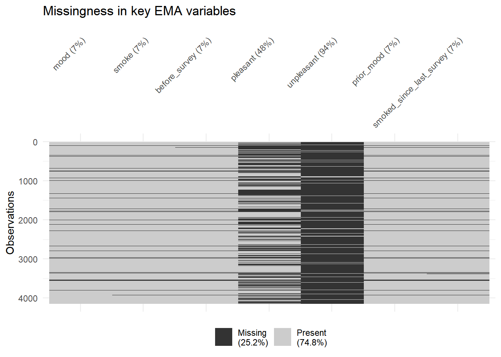

## Beep Timing


<div class='esmtools-container'>
<button class='esmtools-btn' onclick='esmtools_toggleContent(this)'>Supplementary</button>
<p>
<div style='display:none;'>


<style>
.esmtools-container{
  
}
.esmtools-container-open {
  border: 2px solid #2780e3;
  border-radius: 7px;
  margin: 0 -1em;
  padding: .4em 1em;
}
.esmtools-btn{
  display:inline-block;
  padding:0.35em 1.2em;
  border:0.2em solid #2780e3;
  background-color:#2780e3;
  margin:0 0.3em 0.3em 0;
  border-radius:0.12em;
  box-sizing: border-box;
  text-decoration:none;
  font-family:'Roboto',sans-serif;
  font-weight: bold;
  color:#FFFFFF;
  text-align:center;
  transition: all 0.2s;
  margin: 4px 0px 4px 4px;
}
.esmtools-btn:hover{
  color:#000000;
  background-color:#FFFFFF;
}
/* Highligh issue text */
.esm-issue{
    font-weight: bold;
    color:#e61919;
    text-decoration: underline #e61919 2px;
}

/* Highlight data inspection text */
.esm-inspect{
    font-weight: bold;
    text-decoration: underline 2px;
}

/* Highlight data modification text */
.esm-mod{
    font-weight: bold;
    color:#0088a3;
    text-decoration: underline #0088a3 2px;
}
/* Warning message: hidden content */
.warning_hide{
    font-weight: bold;
    margin: -.4em 0em 1em 2px;
    color: #595959;
}
</style>
<script>
function esmtools_toggleContent(button) {
    var parentDiv = button.parentElement;
    var childNodes = parentDiv.childNodes;
    
    // Toggle the 'esmtools-btn-open' class on the parent div
    parentDiv.classList.toggle("esmtools-container-open");

    for (var i = 2; i < childNodes.length; i++) {
      var node = childNodes[i];
      // if (!node.classList.contains("content-container")){
          if (node.nodeType === Node.ELEMENT_NODE) {
              if (node.style.display === "none") {
                  node.style.display = "block";
                  console.log("ok")
              } else {
                  node.style.display = "none";
              }
          }
      // }
    }
}
</script>

``` r
study_sample %>%
  mutate(valid = check_validity(.)) %>%
  filter(valid == 1) %>%
  mutate(time_of_day = hms::as_hms(init_time),
         weekday = ifelse(wday(init_time, week_start = 1) %in% c(6, 7),
                          "weekend", "weekday")) %>%
  ggplot(aes(x = time_of_day)) +
  geom_histogram(bins = 100, fill = "steelblue", color = "white") +
  scale_x_time(breaks = scales::date_breaks("2 hours")) +
  facet_grid(weekday ~ .) +
  labs(
    title = "Time of day beeps were started (valid observations only)",
    x     = "Time of day",
    y     = "Number of beeps"
  ) +
  theme_minimal() +
  theme(axis.text.x = element_text(angle = 45, hjust = 1))
```

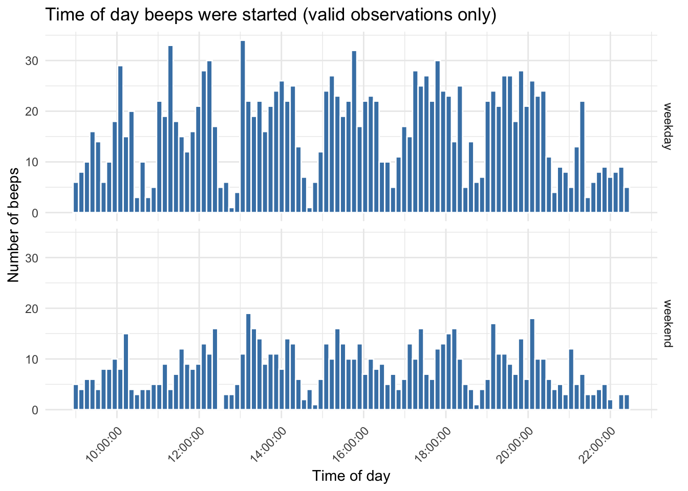

<p>
</div>
</div>
</p>


`<div class="section-summary"><span class="summary-label">Summary</span>Overall compliance was generally good across participants, though variability was present. Compliance trends were examined in relation to baseline participant characteristics to assess whether non-compliance was systematic. A participant-level validity audit identified cases where the branch variable (pleasant/unpleasant) was the limiting factor for observation-level validity — notably, participant 223 had zero valid observations during Part 6 and only 2 during Part 2, rendering them unusable for analyses requiring the full validity criteria. Missingness was concentrated in the branch variables, consistent with the branching structure of the survey. Beep timing followed the expected 2-hour interval sampling scheme across weekdays and weekends.</div>`{=html}

---

# Participant Characteristics and Study Outcomes

`<div class="committee-note"><span class="committee-label">Committee</span>The committee requested examination of how baseline participant characteristics relate to study engagement and key EMA outcomes. Results are organized thematically and are intended to inform covariate selection and interpretation of individual differences in the main analyses.</div>`{=html}

This section examines associations between baseline participant characteristics and two sets of outcomes: (1) study engagement indicators (compliance, attrition, valid observations) and (2) person-level means of key EMA outcomes (craving, mood, pleasant event appraisal ratings, unpleasant event appraisal ratings, and prior mood). All EMA outcome means are computed at the person level from valid observations. For continuous predictors, Pearson correlations with significance stars are reported. For gender, independent samples t-tests are used to compare means between Male and Female participants.

<style>
.esmtools-container{
  
}
.esmtools-container-open {
  border: 2px solid #2780e3;
  border-radius: 7px;
  margin: 0 -1em;
  padding: .4em 1em;
}
.esmtools-btn{
  display:inline-block;
  padding:0.35em 1.2em;
  border:0.2em solid #2780e3;
  background-color:#2780e3;
  margin:0 0.3em 0.3em 0;
  border-radius:0.12em;
  box-sizing: border-box;
  text-decoration:none;
  font-family:'Roboto',sans-serif;
  font-weight: bold;
  color:#FFFFFF;
  text-align:center;
  transition: all 0.2s;
  margin: 4px 0px 4px 4px;
}
.esmtools-btn:hover{
  color:#000000;
  background-color:#FFFFFF;
}
/* Highligh issue text */
.esm-issue{
    font-weight: bold;
    color:#e61919;
    text-decoration: underline #e61919 2px;
}

/* Highlight data inspection text */
.esm-inspect{
    font-weight: bold;
    text-decoration: underline 2px;
}

/* Highlight data modification text */
.esm-mod{
    font-weight: bold;
    color:#0088a3;
    text-decoration: underline #0088a3 2px;
}
/* Warning message: hidden content */
.warning_hide{
    font-weight: bold;
    margin: -.4em 0em 1em 2px;
    color: #595959;
}
</style>
<script>
function esmtools_toggleContent(button) {
    var parentDiv = button.parentElement;
    var childNodes = parentDiv.childNodes;
    
    // Toggle the 'esmtools-btn-open' class on the parent div
    parentDiv.classList.toggle("esmtools-container-open");

    for (var i = 2; i < childNodes.length; i++) {
      var node = childNodes[i];
      // if (!node.classList.contains("content-container")){
          if (node.nodeType === Node.ELEMENT_NODE) {
              if (node.style.display === "none") {
                  node.style.display = "block";
                  console.log("ok")
              } else {
                  node.style.display = "none";
              }
          }
      // }
    }
}
</script>

``` r
# Person-level EMA outcome means (valid observations only)
ema_person_means <- study_sample %>%
  mutate(valid = check_validity(.)) %>%
  filter(valid == 1) %>%
  group_by(participant_id) %>%
  summarise(
    mean_craving    = mean(smoke, na.rm = TRUE),
    mean_mood       = mean(mood, na.rm = TRUE),
    mean_pleasant   = mean(pleasant, na.rm = TRUE),
    mean_unpleasant = mean(unpleasant, na.rm = TRUE),
    mean_prior_mood = mean(prior_mood, na.rm = TRUE),
    n_valid         = sum(!is.na(mood)),
    .groups = "drop"
  )

# Compliance and attrition
engagement <- compliance_df %>%
  select(participant_id, compliance, completion_group) %>%
  mutate(attrition = ifelse(completion_group == "Part 2 Only (3 days)", 1, 0))

# One row per participant with all characteristics
# Gender labeled: 1 = Male, 2 = Female
chars_outcomes <- baseline_chars %>%
  select(participant_id, age, gender, total_household_income, bank_balance,
         ftnd_sum, cigsperday, shaps_sim_sum, panas_pos, panas_neg,
         q23, q24, q25, q71, q80) %>%
  mutate(gender = recode(as.character(gender),
                         "1" = "Male",
                         "2" = "Female")) %>%
  left_join(engagement, by = "participant_id") %>%
  left_join(ema_person_means, by = "participant_id")

# Reusable correlation table function with significance stars
cor_table <- function(data, predictors, outcomes,
                      pred_labels, outcome_labels, caption) {
  
  sig_stars <- function(p) {
    if (is.na(p)) return("")
    if (p < .001) return("***")
    if (p < .01)  return("**")
    if (p < .05)  return("*")
    if (p < .10)  return(".")
    return("")
  }
  
  result <- map_dfr(predictors, function(pred) {
    row <- tibble(Predictor = pred_labels[pred])
    for (i in seq_along(outcomes)) {
      out <- outcomes[i]
      test <- cor.test(data[[pred]], data[[out]], use = "pairwise.complete.obs")
      row[[outcome_labels[i]]] <- paste0(round(test$estimate, 2),
                                          sig_stars(test$p.value))
    }
    row
  })
  
  result %>%
    kable(caption = caption) %>%
    kable_styling(bootstrap_options = c("striped", "hover", "condensed"),
                  full_width = FALSE)
}

# Variable label lookups
engagement_vars   <- c("compliance", "attrition", "n_valid")
engagement_labels <- c("Compliance", "Attrition\n(1=Part2 only)", "N Valid Obs")

outcome_vars   <- c("mean_craving", "mean_mood", "mean_pleasant",
                    "mean_unpleasant", "mean_prior_mood")
outcome_labels <- c("Craving", "Mood", "Pleasant\nRating",
                    "Unpleasant\nRating", "Prior Mood")
```

## Theme 1: Personal Characteristics & Substance Use History

`<div class="committee-note"><span class="committee-label">Committee</span>The committee requested examination of how personal characteristics, smoking history, and substance use relate to study engagement and key EMA outcomes.</div>`{=html}

### Association with Study Engagement

<style>
.esmtools-container{
  
}
.esmtools-container-open {
  border: 2px solid #2780e3;
  border-radius: 7px;
  margin: 0 -1em;
  padding: .4em 1em;
}
.esmtools-btn{
  display:inline-block;
  padding:0.35em 1.2em;
  border:0.2em solid #2780e3;
  background-color:#2780e3;
  margin:0 0.3em 0.3em 0;
  border-radius:0.12em;
  box-sizing: border-box;
  text-decoration:none;
  font-family:'Roboto',sans-serif;
  font-weight: bold;
  color:#FFFFFF;
  text-align:center;
  transition: all 0.2s;
  margin: 4px 0px 4px 4px;
}
.esmtools-btn:hover{
  color:#000000;
  background-color:#FFFFFF;
}
/* Highligh issue text */
.esm-issue{
    font-weight: bold;
    color:#e61919;
    text-decoration: underline #e61919 2px;
}

/* Highlight data inspection text */
.esm-inspect{
    font-weight: bold;
    text-decoration: underline 2px;
}

/* Highlight data modification text */
.esm-mod{
    font-weight: bold;
    color:#0088a3;
    text-decoration: underline #0088a3 2px;
}
/* Warning message: hidden content */
.warning_hide{
    font-weight: bold;
    margin: -.4em 0em 1em 2px;
    color: #595959;
}
</style>
<script>
function esmtools_toggleContent(button) {
    var parentDiv = button.parentElement;
    var childNodes = parentDiv.childNodes;
    
    // Toggle the 'esmtools-btn-open' class on the parent div
    parentDiv.classList.toggle("esmtools-container-open");

    for (var i = 2; i < childNodes.length; i++) {
      var node = childNodes[i];
      // if (!node.classList.contains("content-container")){
          if (node.nodeType === Node.ELEMENT_NODE) {
              if (node.style.display === "none") {
                  node.style.display = "block";
                  console.log("ok")
              } else {
                  node.style.display = "none";
              }
          }
      // }
    }
}
</script>

``` r
pred1 <- c("age", "ftnd_sum", "cigsperday", "q23", "q24", "q25", "q71", "q80")
pred1_labels <- c(
  age         = "Age",
  ftnd_sum    = "Nicotine dependence (FTND)",
  cigsperday  = "Cigarettes per day",
  q23         = "Age at first puff",
  q24         = "Age at first full cigarette",
  q25         = "Age at regular smoking onset",
  q71         = "E-cigarette use (past 30 days)",
  q80         = "Cannabis use (past 30 days)"
)

cor_table(
  data           = chars_outcomes,
  predictors     = pred1,
  outcomes       = engagement_vars,
  pred_labels    = pred1_labels,
  outcome_labels = engagement_labels,
  caption        = "Theme 1: Personal characteristics and substance use history — associations with study engagement. * p < .05, ** p < .01, *** p < .001, . p < .10"
)
```

<table class="table table-striped table-hover table-condensed" style="width: auto !important; margin-left: auto; margin-right: auto;">
<caption>Theme 1: Personal characteristics and substance use history — associations with study engagement. * p &lt; .05, ** p &lt; .01, *** p &lt; .001, . p &lt; .10</caption>
 <thead>
  <tr>
   <th style="text-align:left;"> Predictor </th>
   <th style="text-align:left;"> Compliance </th>
   <th style="text-align:left;"> Attrition
(1=Part2 only) </th>
   <th style="text-align:left;"> |N Valid Obs </th>
  </tr>
 </thead>
<tbody>
  <tr>
   <td style="text-align:left;"> Age </td>
   <td style="text-align:left;"> 0.02 </td>
   <td style="text-align:left;"> -0.1 </td>
   <td style="text-align:left;"> 0.07 </td>
  </tr>
  <tr>
   <td style="text-align:left;"> Nicotine dependence (FTND) </td>
   <td style="text-align:left;"> -0.02 </td>
   <td style="text-align:left;"> -0.06 </td>
   <td style="text-align:left;"> 0.03 </td>
  </tr>
  <tr>
   <td style="text-align:left;"> Cigarettes per day </td>
   <td style="text-align:left;"> -0.06 </td>
   <td style="text-align:left;"> -0.04 </td>
   <td style="text-align:left;"> 0.01 </td>
  </tr>
  <tr>
   <td style="text-align:left;"> Age at first puff </td>
   <td style="text-align:left;"> -0.04 </td>
   <td style="text-align:left;"> -0.12 </td>
   <td style="text-align:left;"> 0.04 </td>
  </tr>
  <tr>
   <td style="text-align:left;"> Age at first full cigarette </td>
   <td style="text-align:left;"> -0.01 </td>
   <td style="text-align:left;"> -0.13 </td>
   <td style="text-align:left;"> 0.08 </td>
  </tr>
  <tr>
   <td style="text-align:left;"> Age at regular smoking onset </td>
   <td style="text-align:left;"> 0.06 </td>
   <td style="text-align:left;"> -0.12 </td>
   <td style="text-align:left;"> 0.15 </td>
  </tr>
  <tr>
   <td style="text-align:left;"> E-cigarette use (past 30 days) </td>
   <td style="text-align:left;"> -0.3** </td>
   <td style="text-align:left;"> 0.13 </td>
   <td style="text-align:left;"> -0.27** </td>
  </tr>
  <tr>
   <td style="text-align:left;"> Cannabis use (past 30 days) </td>
   <td style="text-align:left;"> -0.16 </td>
   <td style="text-align:left;"> 0.17. </td>
   <td style="text-align:left;"> -0.16 </td>
  </tr>
</tbody>
</table>

### Association with Key EMA Outcomes

<style>
.esmtools-container{
  
}
.esmtools-container-open {
  border: 2px solid #2780e3;
  border-radius: 7px;
  margin: 0 -1em;
  padding: .4em 1em;
}
.esmtools-btn{
  display:inline-block;
  padding:0.35em 1.2em;
  border:0.2em solid #2780e3;
  background-color:#2780e3;
  margin:0 0.3em 0.3em 0;
  border-radius:0.12em;
  box-sizing: border-box;
  text-decoration:none;
  font-family:'Roboto',sans-serif;
  font-weight: bold;
  color:#FFFFFF;
  text-align:center;
  transition: all 0.2s;
  margin: 4px 0px 4px 4px;
}
.esmtools-btn:hover{
  color:#000000;
  background-color:#FFFFFF;
}
/* Highligh issue text */
.esm-issue{
    font-weight: bold;
    color:#e61919;
    text-decoration: underline #e61919 2px;
}

/* Highlight data inspection text */
.esm-inspect{
    font-weight: bold;
    text-decoration: underline 2px;
}

/* Highlight data modification text */
.esm-mod{
    font-weight: bold;
    color:#0088a3;
    text-decoration: underline #0088a3 2px;
}
/* Warning message: hidden content */
.warning_hide{
    font-weight: bold;
    margin: -.4em 0em 1em 2px;
    color: #595959;
}
</style>
<script>
function esmtools_toggleContent(button) {
    var parentDiv = button.parentElement;
    var childNodes = parentDiv.childNodes;
    
    // Toggle the 'esmtools-btn-open' class on the parent div
    parentDiv.classList.toggle("esmtools-container-open");

    for (var i = 2; i < childNodes.length; i++) {
      var node = childNodes[i];
      // if (!node.classList.contains("content-container")){
          if (node.nodeType === Node.ELEMENT_NODE) {
              if (node.style.display === "none") {
                  node.style.display = "block";
                  console.log("ok")
              } else {
                  node.style.display = "none";
              }
          }
      // }
    }
}
</script>

``` r
cor_table(
  data           = chars_outcomes,
  predictors     = pred1,
  outcomes       = outcome_vars,
  pred_labels    = pred1_labels,
  outcome_labels = outcome_labels,
  caption        = "Theme 1: Personal characteristics and substance use history — associations with key EMA outcomes. * p < .05, ** p < .01, *** p < .001, . p < .10"
)
```

<table class="table table-striped table-hover table-condensed" style="width: auto !important; margin-left: auto; margin-right: auto;">
<caption>Theme 1: Personal characteristics and substance use history — associations with key EMA outcomes. * p &lt; .05, ** p &lt; .01, *** p &lt; .001, . p &lt; .10</caption>
 <thead>
  <tr>
   <th style="text-align:left;"> Predictor </th>
   <th style="text-align:left;"> Craving </th>
   <th style="text-align:left;"> Mood </th>
   <th style="text-align:left;"> Pleasant
Rating </th>
   <th style="text-align:left;"> |Unpleasant
Ratin </th>
   <th style="text-align:left;"> |Prior Moo </th>
  </tr>
 </thead>
<tbody>
  <tr>
   <td style="text-align:left;"> Age </td>
   <td style="text-align:left;"> -0.11 </td>
   <td style="text-align:left;"> 0.11 </td>
   <td style="text-align:left;"> 0.09 </td>
   <td style="text-align:left;"> 0.01 </td>
   <td style="text-align:left;"> 0.11 </td>
  </tr>
  <tr>
   <td style="text-align:left;"> Nicotine dependence (FTND) </td>
   <td style="text-align:left;"> 0.18. </td>
   <td style="text-align:left;"> -0.1 </td>
   <td style="text-align:left;"> 0.01 </td>
   <td style="text-align:left;"> 0.2. </td>
   <td style="text-align:left;"> 0.1 </td>
  </tr>
  <tr>
   <td style="text-align:left;"> Cigarettes per day </td>
   <td style="text-align:left;"> 0.07 </td>
   <td style="text-align:left;"> -0.09 </td>
   <td style="text-align:left;"> 0.03 </td>
   <td style="text-align:left;"> 0.17 </td>
   <td style="text-align:left;"> 0.12 </td>
  </tr>
  <tr>
   <td style="text-align:left;"> Age at first puff </td>
   <td style="text-align:left;"> -0.11 </td>
   <td style="text-align:left;"> 0.14 </td>
   <td style="text-align:left;"> -0.02 </td>
   <td style="text-align:left;"> 0 </td>
   <td style="text-align:left;"> -0.1 </td>
  </tr>
  <tr>
   <td style="text-align:left;"> Age at first full cigarette </td>
   <td style="text-align:left;"> -0.02 </td>
   <td style="text-align:left;"> -0.04 </td>
   <td style="text-align:left;"> -0.15 </td>
   <td style="text-align:left;"> -0.14 </td>
   <td style="text-align:left;"> -0.13 </td>
  </tr>
  <tr>
   <td style="text-align:left;"> Age at regular smoking onset </td>
   <td style="text-align:left;"> 0.01 </td>
   <td style="text-align:left;"> 0.04 </td>
   <td style="text-align:left;"> -0.02 </td>
   <td style="text-align:left;"> -0.07 </td>
   <td style="text-align:left;"> 0.09 </td>
  </tr>
  <tr>
   <td style="text-align:left;"> E-cigarette use (past 30 days) </td>
   <td style="text-align:left;"> -0.02 </td>
   <td style="text-align:left;"> -0.22* </td>
   <td style="text-align:left;"> -0.1 </td>
   <td style="text-align:left;"> -0.16 </td>
   <td style="text-align:left;"> -0.09 </td>
  </tr>
  <tr>
   <td style="text-align:left;"> Cannabis use (past 30 days) </td>
   <td style="text-align:left;"> 0.24* </td>
   <td style="text-align:left;"> -0.03 </td>
   <td style="text-align:left;"> -0.23* </td>
   <td style="text-align:left;"> -0.26* </td>
   <td style="text-align:left;"> -0.25* </td>
  </tr>
</tbody>
</table>

## Theme 2: Trait Affect & Reward Sensitivity

`<div class="committee-note"><span class="committee-label">Committee</span>The committee requested examination of how trait affect and reward sensitivity relate to study engagement and key EMA outcomes.</div>`{=html}

### Association with Study Engagement

<style>
.esmtools-container{
  
}
.esmtools-container-open {
  border: 2px solid #2780e3;
  border-radius: 7px;
  margin: 0 -1em;
  padding: .4em 1em;
}
.esmtools-btn{
  display:inline-block;
  padding:0.35em 1.2em;
  border:0.2em solid #2780e3;
  background-color:#2780e3;
  margin:0 0.3em 0.3em 0;
  border-radius:0.12em;
  box-sizing: border-box;
  text-decoration:none;
  font-family:'Roboto',sans-serif;
  font-weight: bold;
  color:#FFFFFF;
  text-align:center;
  transition: all 0.2s;
  margin: 4px 0px 4px 4px;
}
.esmtools-btn:hover{
  color:#000000;
  background-color:#FFFFFF;
}
/* Highligh issue text */
.esm-issue{
    font-weight: bold;
    color:#e61919;
    text-decoration: underline #e61919 2px;
}

/* Highlight data inspection text */
.esm-inspect{
    font-weight: bold;
    text-decoration: underline 2px;
}

/* Highlight data modification text */
.esm-mod{
    font-weight: bold;
    color:#0088a3;
    text-decoration: underline #0088a3 2px;
}
/* Warning message: hidden content */
.warning_hide{
    font-weight: bold;
    margin: -.4em 0em 1em 2px;
    color: #595959;
}
</style>
<script>
function esmtools_toggleContent(button) {
    var parentDiv = button.parentElement;
    var childNodes = parentDiv.childNodes;
    
    // Toggle the 'esmtools-btn-open' class on the parent div
    parentDiv.classList.toggle("esmtools-container-open");

    for (var i = 2; i < childNodes.length; i++) {
      var node = childNodes[i];
      // if (!node.classList.contains("content-container")){
          if (node.nodeType === Node.ELEMENT_NODE) {
              if (node.style.display === "none") {
                  node.style.display = "block";
                  console.log("ok")
              } else {
                  node.style.display = "none";
              }
          }
      // }
    }
}
</script>

``` r
pred2 <- c("panas_pos", "panas_neg", "shaps_sim_sum")
pred2_labels <- c(
  panas_pos    = "Trait positive affect (PANAS)",
  panas_neg    = "Trait negative affect (PANAS)",
  shaps_sim_sum = "Anhedonia (SHAPS)"
)

cor_table(
  data           = chars_outcomes,
  predictors     = pred2,
  outcomes       = engagement_vars,
  pred_labels    = pred2_labels,
  outcome_labels = engagement_labels,
  caption        = "Theme 2: Trait affect and reward sensitivity — associations with study engagement. * p < .05, ** p < .01, *** p < .001, . p < .10"
)
```

<table class="table table-striped table-hover table-condensed" style="width: auto !important; margin-left: auto; margin-right: auto;">
<caption>Theme 2: Trait affect and reward sensitivity — associations with study engagement. * p &lt; .05, ** p &lt; .01, *** p &lt; .001, . p &lt; .10</caption>
 <thead>
  <tr>
   <th style="text-align:left;"> Predictor </th>
   <th style="text-align:left;"> Compliance </th>
   <th style="text-align:left;"> Attrition
(1=Part2 only) </th>
   <th style="text-align:left;"> |N Valid Obs </th>
  </tr>
 </thead>
<tbody>
  <tr>
   <td style="text-align:left;"> Trait positive affect (PANAS) </td>
   <td style="text-align:left;"> 0.22* </td>
   <td style="text-align:left;"> -0.02 </td>
   <td style="text-align:left;"> 0.16 </td>
  </tr>
  <tr>
   <td style="text-align:left;"> Trait negative affect (PANAS) </td>
   <td style="text-align:left;"> -0.18. </td>
   <td style="text-align:left;"> 0.16 </td>
   <td style="text-align:left;"> -0.23* </td>
  </tr>
  <tr>
   <td style="text-align:left;"> Anhedonia (SHAPS) </td>
   <td style="text-align:left;"> 0.06 </td>
   <td style="text-align:left;"> 0.21* </td>
   <td style="text-align:left;"> -0.14 </td>
  </tr>
</tbody>
</table>

### Association with Key EMA Outcomes

<style>
.esmtools-container{
  
}
.esmtools-container-open {
  border: 2px solid #2780e3;
  border-radius: 7px;
  margin: 0 -1em;
  padding: .4em 1em;
}
.esmtools-btn{
  display:inline-block;
  padding:0.35em 1.2em;
  border:0.2em solid #2780e3;
  background-color:#2780e3;
  margin:0 0.3em 0.3em 0;
  border-radius:0.12em;
  box-sizing: border-box;
  text-decoration:none;
  font-family:'Roboto',sans-serif;
  font-weight: bold;
  color:#FFFFFF;
  text-align:center;
  transition: all 0.2s;
  margin: 4px 0px 4px 4px;
}
.esmtools-btn:hover{
  color:#000000;
  background-color:#FFFFFF;
}
/* Highligh issue text */
.esm-issue{
    font-weight: bold;
    color:#e61919;
    text-decoration: underline #e61919 2px;
}

/* Highlight data inspection text */
.esm-inspect{
    font-weight: bold;
    text-decoration: underline 2px;
}

/* Highlight data modification text */
.esm-mod{
    font-weight: bold;
    color:#0088a3;
    text-decoration: underline #0088a3 2px;
}
/* Warning message: hidden content */
.warning_hide{
    font-weight: bold;
    margin: -.4em 0em 1em 2px;
    color: #595959;
}
</style>
<script>
function esmtools_toggleContent(button) {
    var parentDiv = button.parentElement;
    var childNodes = parentDiv.childNodes;
    
    // Toggle the 'esmtools-btn-open' class on the parent div
    parentDiv.classList.toggle("esmtools-container-open");

    for (var i = 2; i < childNodes.length; i++) {
      var node = childNodes[i];
      // if (!node.classList.contains("content-container")){
          if (node.nodeType === Node.ELEMENT_NODE) {
              if (node.style.display === "none") {
                  node.style.display = "block";
                  console.log("ok")
              } else {
                  node.style.display = "none";
              }
          }
      // }
    }
}
</script>

``` r
cor_table(
  data           = chars_outcomes,
  predictors     = pred2,
  outcomes       = outcome_vars,
  pred_labels    = pred2_labels,
  outcome_labels = outcome_labels,
  caption        = "Theme 2: Trait affect and reward sensitivity — associations with key EMA outcomes. * p < .05, ** p < .01, *** p < .001, . p < .10"
)
```

<table class="table table-striped table-hover table-condensed" style="width: auto !important; margin-left: auto; margin-right: auto;">
<caption>Theme 2: Trait affect and reward sensitivity — associations with key EMA outcomes. * p &lt; .05, ** p &lt; .01, *** p &lt; .001, . p &lt; .10</caption>
 <thead>
  <tr>
   <th style="text-align:left;"> Predictor </th>
   <th style="text-align:left;"> Craving </th>
   <th style="text-align:left;"> Mood </th>
   <th style="text-align:left;"> Pleasant
Rating </th>
   <th style="text-align:left;"> |Unpleasant
Ratin </th>
   <th style="text-align:left;"> |Prior Moo </th>
  </tr>
 </thead>
<tbody>
  <tr>
   <td style="text-align:left;"> Trait positive affect (PANAS) </td>
   <td style="text-align:left;"> -0.04 </td>
   <td style="text-align:left;"> 0.43*** </td>
   <td style="text-align:left;"> 0.33** </td>
   <td style="text-align:left;"> 0.18 </td>
   <td style="text-align:left;"> 0.31** </td>
  </tr>
  <tr>
   <td style="text-align:left;"> Trait negative affect (PANAS) </td>
   <td style="text-align:left;"> 0.09 </td>
   <td style="text-align:left;"> -0.18. </td>
   <td style="text-align:left;"> -0.17 </td>
   <td style="text-align:left;"> -0.09 </td>
   <td style="text-align:left;"> 0.07 </td>
  </tr>
  <tr>
   <td style="text-align:left;"> Anhedonia (SHAPS) </td>
   <td style="text-align:left;"> 0.21* </td>
   <td style="text-align:left;"> -0.04 </td>
   <td style="text-align:left;"> -0.02 </td>
   <td style="text-align:left;"> 0.07 </td>
   <td style="text-align:left;"> 0.05 </td>
  </tr>
</tbody>
</table>

## Theme 3: Gender

`<div class="committee-note"><span class="committee-label">Committee</span>The committee requested examination of gender differences in study engagement and key EMA outcomes. Independent samples t-tests compare Male and Female participants on each outcome.</div>`{=html}

### Gender Differences in Study Engagement and Key EMA Outcomes

<style>
.esmtools-container{
  
}
.esmtools-container-open {
  border: 2px solid #2780e3;
  border-radius: 7px;
  margin: 0 -1em;
  padding: .4em 1em;
}
.esmtools-btn{
  display:inline-block;
  padding:0.35em 1.2em;
  border:0.2em solid #2780e3;
  background-color:#2780e3;
  margin:0 0.3em 0.3em 0;
  border-radius:0.12em;
  box-sizing: border-box;
  text-decoration:none;
  font-family:'Roboto',sans-serif;
  font-weight: bold;
  color:#FFFFFF;
  text-align:center;
  transition: all 0.2s;
  margin: 4px 0px 4px 4px;
}
.esmtools-btn:hover{
  color:#000000;
  background-color:#FFFFFF;
}
/* Highligh issue text */
.esm-issue{
    font-weight: bold;
    color:#e61919;
    text-decoration: underline #e61919 2px;
}

/* Highlight data inspection text */
.esm-inspect{
    font-weight: bold;
    text-decoration: underline 2px;
}

/* Highlight data modification text */
.esm-mod{
    font-weight: bold;
    color:#0088a3;
    text-decoration: underline #0088a3 2px;
}
/* Warning message: hidden content */
.warning_hide{
    font-weight: bold;
    margin: -.4em 0em 1em 2px;
    color: #595959;
}
</style>
<script>
function esmtools_toggleContent(button) {
    var parentDiv = button.parentElement;
    var childNodes = parentDiv.childNodes;
    
    // Toggle the 'esmtools-btn-open' class on the parent div
    parentDiv.classList.toggle("esmtools-container-open");

    for (var i = 2; i < childNodes.length; i++) {
      var node = childNodes[i];
      // if (!node.classList.contains("content-container")){
          if (node.nodeType === Node.ELEMENT_NODE) {
              if (node.style.display === "none") {
                  node.style.display = "block";
                  console.log("ok")
              } else {
                  node.style.display = "none";
              }
          }
      // }
    }
}
</script>

``` r
# Build a reusable t-test table for gender comparisons
gender_ttest <- function(data, outcomes, outcome_labels) {
  
  sig_stars <- function(p) {
    if (is.na(p)) return("")
    if (p < .001) return("***")
    if (p < .01)  return("**")
    if (p < .05)  return("*")
    if (p < .10)  return(".")
    return("")
  }
  
  map_dfr(seq_along(outcomes), function(i) {
    out   <- outcomes[i]
    label <- outcome_labels[i]
    
    male   <- data %>% filter(gender == "Male")   %>% pull(!!sym(out))
    female <- data %>% filter(gender == "Female") %>% pull(!!sym(out))
    
    male   <- male[!is.na(male)]
    female <- female[!is.na(female)]
    
    ttest <- t.test(male, female)
    
    tibble(
      Outcome         = label,
      `Male M (SD)`   = paste0(round(mean(male), 2),
                                " (", round(sd(male), 2), ")"),
      `Female M (SD)` = paste0(round(mean(female), 2),
                                " (", round(sd(female), 2), ")"),
      `t`             = round(ttest$statistic, 2),
      `df`            = round(ttest$parameter, 1),
      `p`             = paste0(round(ttest$p.value, 3),
                                sig_stars(ttest$p.value))
    )
  })
}

all_outcomes      <- c(engagement_vars, outcome_vars)
all_outcome_labels <- c("Compliance", "Attrition (1=Part2 only)",
                         "N Valid Observations",
                         "Craving", "Mood", "Pleasant Rating",
                         "Unpleasant Rating", "Prior Mood")

gender_ttest(
  data            = chars_outcomes,
  outcomes        = all_outcomes,
  outcome_labels  = all_outcome_labels
) %>%
  kable(caption = "Theme 3: Gender differences in study engagement and key EMA outcomes. Independent samples t-tests (Welch). * p < .05, ** p < .01, *** p < .001, . p < .10") %>%
  kable_styling(bootstrap_options = c("striped", "hover", "condensed"),
                full_width = FALSE)
```

<table class="table table-striped table-hover table-condensed" style="width: auto !important; margin-left: auto; margin-right: auto;">
<caption>Theme 3: Gender differences in study engagement and key EMA outcomes. Independent samples t-tests (Welch). * p &lt; .05, ** p &lt; .01, *** p &lt; .001, . p &lt; .10</caption>
 <thead>
  <tr>
   <th style="text-align:left;"> Outcome </th>
   <th style="text-align:left;"> Male M (SD) </th>
   <th style="text-align:left;"> Female M (SD) </th>
   <th style="text-align:right;"> t </th>
   <th style="text-align:right;"> df </th>
   <th style="text-align:left;"> p </th>
  </tr>
 </thead>
<tbody>
  <tr>
   <td style="text-align:left;"> Compliance </td>
   <td style="text-align:left;"> 0.58 (0.26) </td>
   <td style="text-align:left;"> 0.59 (0.24) </td>
   <td style="text-align:right;"> -0.14 </td>
   <td style="text-align:right;"> 67.2 </td>
   <td style="text-align:left;"> 0.892 </td>
  </tr>
  <tr>
   <td style="text-align:left;"> Attrition (1=Part2 only) </td>
   <td style="text-align:left;"> 0.34 (0.48) </td>
   <td style="text-align:left;"> 0.39 (0.49) </td>
   <td style="text-align:right;"> -0.45 </td>
   <td style="text-align:right;"> 72.8 </td>
   <td style="text-align:left;"> 0.652 </td>
  </tr>
  <tr>
   <td style="text-align:left;"> N Valid Observations </td>
   <td style="text-align:left;"> 26.43 (18.11) </td>
   <td style="text-align:left;"> 25.49 (16.67) </td>
   <td style="text-align:right;"> 0.25 </td>
   <td style="text-align:right;"> 66.9 </td>
   <td style="text-align:left;"> 0.804 </td>
  </tr>
  <tr>
   <td style="text-align:left;"> Craving </td>
   <td style="text-align:left;"> 50.21 (17.79) </td>
   <td style="text-align:left;"> 44.67 (17.37) </td>
   <td style="text-align:right;"> 1.47 </td>
   <td style="text-align:right;"> 70.2 </td>
   <td style="text-align:left;"> 0.145 </td>
  </tr>
  <tr>
   <td style="text-align:left;"> Mood </td>
   <td style="text-align:left;"> 63.49 (13.55) </td>
   <td style="text-align:left;"> 62.61 (13.17) </td>
   <td style="text-align:right;"> 0.31 </td>
   <td style="text-align:right;"> 69.9 </td>
   <td style="text-align:left;"> 0.76 </td>
  </tr>
  <tr>
   <td style="text-align:left;"> Pleasant Rating </td>
   <td style="text-align:left;"> 65.24 (17.52) </td>
   <td style="text-align:left;"> 68.07 (11.64) </td>
   <td style="text-align:right;"> -0.85 </td>
   <td style="text-align:right;"> 52.0 </td>
   <td style="text-align:left;"> 0.398 </td>
  </tr>
  <tr>
   <td style="text-align:left;"> Unpleasant Rating </td>
   <td style="text-align:left;"> 59.48 (21.51) </td>
   <td style="text-align:left;"> 64.23 (19.76) </td>
   <td style="text-align:right;"> -0.90 </td>
   <td style="text-align:right;"> 43.7 </td>
   <td style="text-align:left;"> 0.374 </td>
  </tr>
  <tr>
   <td style="text-align:left;"> Prior Mood </td>
   <td style="text-align:left;"> 67.23 (15.02) </td>
   <td style="text-align:left;"> 69.93 (10.72) </td>
   <td style="text-align:right;"> -0.93 </td>
   <td style="text-align:right;"> 54.7 </td>
   <td style="text-align:left;"> 0.356 </td>
  </tr>
</tbody>
</table>

`<div class="section-summary"><span class="summary-label">Summary</span>Associations between baseline participant characteristics and study engagement and EMA outcomes are examined across three thematic groupings: personal characteristics and substance use history (including age, smoking history, e-cigarette and cannabis use), trait affect and reward sensitivity, and gender. Results are descriptive and intended to inform covariate selection, interpretation of individual differences, and potential confounds in the main analyses.</div>`{=html}

---

# EMA Item Descriptives

This section describes the distributions, variance structure, and temporal patterns of the key EMA variables.

## Distributions


<div class='esmtools-container'>
<button class='esmtools-btn' onclick='esmtools_toggleContent(this)'>Description</button>
<p>
<div style='display:none;'>


<style>
.esmtools-container{
  
}
.esmtools-container-open {
  border: 2px solid #2780e3;
  border-radius: 7px;
  margin: 0 -1em;
  padding: .4em 1em;
}
.esmtools-btn{
  display:inline-block;
  padding:0.35em 1.2em;
  border:0.2em solid #2780e3;
  background-color:#2780e3;
  margin:0 0.3em 0.3em 0;
  border-radius:0.12em;
  box-sizing: border-box;
  text-decoration:none;
  font-family:'Roboto',sans-serif;
  font-weight: bold;
  color:#FFFFFF;
  text-align:center;
  transition: all 0.2s;
  margin: 4px 0px 4px 4px;
}
.esmtools-btn:hover{
  color:#000000;
  background-color:#FFFFFF;
}
/* Highligh issue text */
.esm-issue{
    font-weight: bold;
    color:#e61919;
    text-decoration: underline #e61919 2px;
}

/* Highlight data inspection text */
.esm-inspect{
    font-weight: bold;
    text-decoration: underline 2px;
}

/* Highlight data modification text */
.esm-mod{
    font-weight: bold;
    color:#0088a3;
    text-decoration: underline #0088a3 2px;
}
/* Warning message: hidden content */
.warning_hide{
    font-weight: bold;
    margin: -.4em 0em 1em 2px;
    color: #595959;
}
</style>
<script>
function esmtools_toggleContent(button) {
    var parentDiv = button.parentElement;
    var childNodes = parentDiv.childNodes;
    
    // Toggle the 'esmtools-btn-open' class on the parent div
    parentDiv.classList.toggle("esmtools-container-open");

    for (var i = 2; i < childNodes.length; i++) {
      var node = childNodes[i];
      // if (!node.classList.contains("content-container")){
          if (node.nodeType === Node.ELEMENT_NODE) {
              if (node.style.display === "none") {
                  node.style.display = "block";
                  console.log("ok")
              } else {
                  node.style.display = "none";
              }
          }
      // }
    }
}
</script>

``` r
ema_vars <- c("mood", "smoke", "pleasant", "unpleasant", "prior_mood")

study_sample %>%
  mutate(valid = check_validity(.)) %>%
  filter(valid == 1) %>%
  select(all_of(ema_vars)) %>%
  pivot_longer(everything(), names_to = "variable", values_to = "value") %>%
  filter(!is.na(value)) %>%
  ggplot(aes(x = value)) +
  geom_histogram(bins = 30, fill = "steelblue", color = "white") +
  facet_wrap(~ variable, scales = "free") +
  labs(
    title = "Distributions of key EMA variables (valid observations)",
    x     = "Value",
    y     = "Count"
  ) +
  theme_minimal()
```

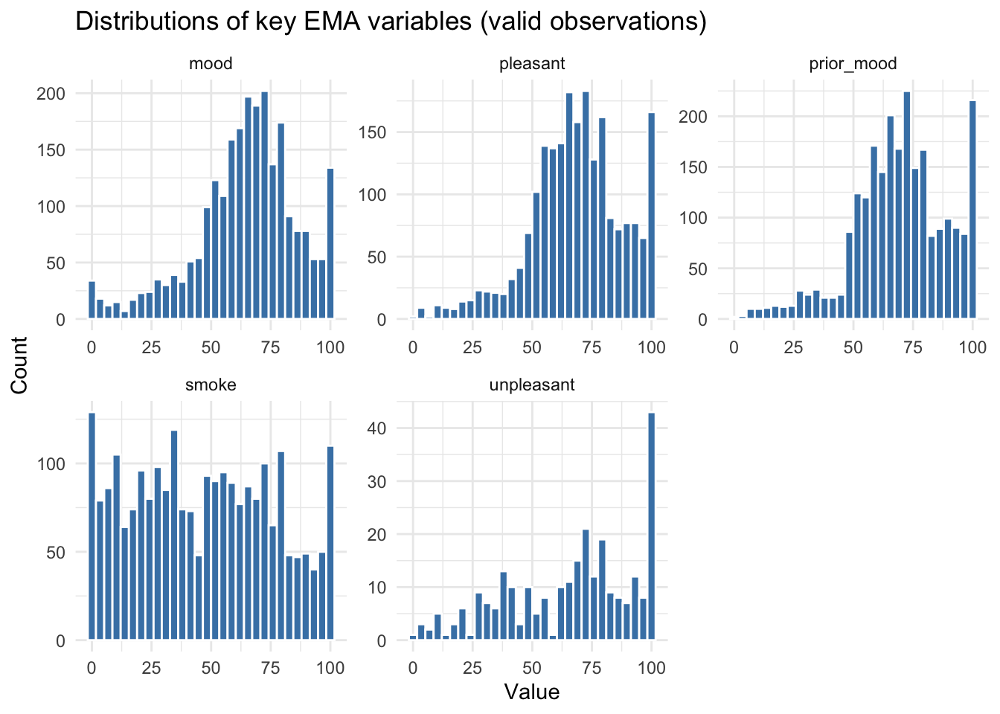

<p>
</div>
</div>
</p>


## Intraclass Correlations (ICCs)

`<div class="committee-note"><span class="committee-label">Committee</span>The committee requested ICCs for key EMA variables to distinguish between- and within-person variance and justify modeling decisions.</div>`{=html}

<style>
.esmtools-container{
  
}
.esmtools-container-open {
  border: 2px solid #2780e3;
  border-radius: 7px;
  margin: 0 -1em;
  padding: .4em 1em;
}
.esmtools-btn{
  display:inline-block;
  padding:0.35em 1.2em;
  border:0.2em solid #2780e3;
  background-color:#2780e3;
  margin:0 0.3em 0.3em 0;
  border-radius:0.12em;
  box-sizing: border-box;
  text-decoration:none;
  font-family:'Roboto',sans-serif;
  font-weight: bold;
  color:#FFFFFF;
  text-align:center;
  transition: all 0.2s;
  margin: 4px 0px 4px 4px;
}
.esmtools-btn:hover{
  color:#000000;
  background-color:#FFFFFF;
}
/* Highligh issue text */
.esm-issue{
    font-weight: bold;
    color:#e61919;
    text-decoration: underline #e61919 2px;
}

/* Highlight data inspection text */
.esm-inspect{
    font-weight: bold;
    text-decoration: underline 2px;
}

/* Highlight data modification text */
.esm-mod{
    font-weight: bold;
    color:#0088a3;
    text-decoration: underline #0088a3 2px;
}
/* Warning message: hidden content */
.warning_hide{
    font-weight: bold;
    margin: -.4em 0em 1em 2px;
    color: #595959;
}
</style>
<script>
function esmtools_toggleContent(button) {
    var parentDiv = button.parentElement;
    var childNodes = parentDiv.childNodes;
    
    // Toggle the 'esmtools-btn-open' class on the parent div
    parentDiv.classList.toggle("esmtools-container-open");

    for (var i = 2; i < childNodes.length; i++) {
      var node = childNodes[i];
      // if (!node.classList.contains("content-container")){
          if (node.nodeType === Node.ELEMENT_NODE) {
              if (node.style.display === "none") {
                  node.style.display = "block";
                  console.log("ok")
              } else {
                  node.style.display = "none";
              }
          }
      // }
    }
}
</script>

``` r
# Fit null models (random intercept only) and extract ICC
# ICC = between-person variance / (between-person variance + within-person variance)

compute_icc_lme4 <- function(df, var, id = "participant_id") {
  
  df_clean <- df %>%
    filter(!is.na(.data[[var]])) %>%
    rename(y = all_of(var), id_var = all_of(id))
  
  # Fit null model: outcome ~ 1 + (1 | participant)
  model <- lmer(y ~ 1 + (1 | id_var), data = df_clean, REML = TRUE)
  
  vc <- as.data.frame(VarCorr(model))
  
  between_var <- vc$vcov[vc$grp == "id_var"]
  within_var  <- vc$vcov[vc$grp == "Residual"]
  total_var   <- between_var + within_var
  icc         <- between_var / total_var
  
  tibble(
    variable    = var,
    icc         = round(icc, 3),
    between_var = round(between_var, 3),
    within_var  = round(within_var, 3),
    total_var   = round(total_var, 3),
    pct_between = round(icc * 100, 1),
    pct_within  = round((1 - icc) * 100, 1)
  )
}

ema_valid <- study_sample %>%
  mutate(valid = check_validity(.)) %>%
  filter(valid == 1)

icc_results <- bind_rows(
  lapply(c("mood", "smoke", "pleasant", "unpleasant", "prior_mood"),
         compute_icc_lme4, df = ema_valid)
)

icc_results %>%
  kable(caption = "Intraclass correlations (ICCs) for key EMA variables. ICCs were estimated using null models (random intercept only) fit with REML via lme4. Between-person variance reflects stable individual differences; within-person variance reflects moment-to-moment fluctuation.") %>%
  kable_styling(bootstrap_options = c("striped", "hover", "condensed"),
                full_width = FALSE)
```

<table class="table table-striped table-hover table-condensed" style="width: auto !important; margin-left: auto; margin-right: auto;">
<caption>Intraclass correlations (ICCs) for key EMA variables. ICCs were estimated using null models (random intercept only) fit with REML via lme4. Between-person variance reflects stable individual differences; within-person variance reflects moment-to-moment fluctuation.</caption>
 <thead>
  <tr>
   <th style="text-align:left;"> variable </th>
   <th style="text-align:right;"> icc </th>
   <th style="text-align:right;"> between_var </th>
   <th style="text-align:right;"> within_var </th>
   <th style="text-align:right;"> total_var </th>
   <th style="text-align:right;"> pct_between </th>
   <th style="text-align:right;"> pct_within </th>
  </tr>
 </thead>
<tbody>
  <tr>
   <td style="text-align:left;"> mood </td>
   <td style="text-align:right;"> 0.320 </td>
   <td style="text-align:right;"> 150.467 </td>
   <td style="text-align:right;"> 319.977 </td>
   <td style="text-align:right;"> 470.444 </td>
   <td style="text-align:right;"> 32.0 </td>
   <td style="text-align:right;"> 68.0 </td>
  </tr>
  <tr>
   <td style="text-align:left;"> smoke </td>
   <td style="text-align:right;"> 0.321 </td>
   <td style="text-align:right;"> 274.991 </td>
   <td style="text-align:right;"> 580.881 </td>
   <td style="text-align:right;"> 855.871 </td>
   <td style="text-align:right;"> 32.1 </td>
   <td style="text-align:right;"> 67.9 </td>
  </tr>
  <tr>
   <td style="text-align:left;"> pleasant </td>
   <td style="text-align:right;"> 0.450 </td>
   <td style="text-align:right;"> 179.375 </td>
   <td style="text-align:right;"> 218.872 </td>
   <td style="text-align:right;"> 398.247 </td>
   <td style="text-align:right;"> 45.0 </td>
   <td style="text-align:right;"> 55.0 </td>
  </tr>
  <tr>
   <td style="text-align:left;"> unpleasant </td>
   <td style="text-align:right;"> 0.331 </td>
   <td style="text-align:right;"> 233.533 </td>
   <td style="text-align:right;"> 471.288 </td>
   <td style="text-align:right;"> 704.821 </td>
   <td style="text-align:right;"> 33.1 </td>
   <td style="text-align:right;"> 66.9 </td>
  </tr>
  <tr>
   <td style="text-align:left;"> prior_mood </td>
   <td style="text-align:right;"> 0.359 </td>
   <td style="text-align:right;"> 137.726 </td>
   <td style="text-align:right;"> 245.867 </td>
   <td style="text-align:right;"> 383.592 </td>
   <td style="text-align:right;"> 35.9 </td>
   <td style="text-align:right;"> 64.1 </td>
  </tr>
</tbody>
</table>

## Temporal Patterns


<div class='esmtools-container'>
<button class='esmtools-btn' onclick='esmtools_toggleContent(this)'>Description</button>
<p>
<div style='display:none;'>


<style>
.esmtools-container{
  
}
.esmtools-container-open {
  border: 2px solid #2780e3;
  border-radius: 7px;
  margin: 0 -1em;
  padding: .4em 1em;
}
.esmtools-btn{
  display:inline-block;
  padding:0.35em 1.2em;
  border:0.2em solid #2780e3;
  background-color:#2780e3;
  margin:0 0.3em 0.3em 0;
  border-radius:0.12em;
  box-sizing: border-box;
  text-decoration:none;
  font-family:'Roboto',sans-serif;
  font-weight: bold;
  color:#FFFFFF;
  text-align:center;
  transition: all 0.2s;
  margin: 4px 0px 4px 4px;
}
.esmtools-btn:hover{
  color:#000000;
  background-color:#FFFFFF;
}
/* Highligh issue text */
.esm-issue{
    font-weight: bold;
    color:#e61919;
    text-decoration: underline #e61919 2px;
}

/* Highlight data inspection text */
.esm-inspect{
    font-weight: bold;
    text-decoration: underline 2px;
}

/* Highlight data modification text */
.esm-mod{
    font-weight: bold;
    color:#0088a3;
    text-decoration: underline #0088a3 2px;
}
/* Warning message: hidden content */
.warning_hide{
    font-weight: bold;
    margin: -.4em 0em 1em 2px;
    color: #595959;
}
</style>
<script>
function esmtools_toggleContent(button) {
    var parentDiv = button.parentElement;
    var childNodes = parentDiv.childNodes;
    
    // Toggle the 'esmtools-btn-open' class on the parent div
    parentDiv.classList.toggle("esmtools-container-open");

    for (var i = 2; i < childNodes.length; i++) {
      var node = childNodes[i];
      // if (!node.classList.contains("content-container")){
          if (node.nodeType === Node.ELEMENT_NODE) {
              if (node.style.display === "none") {
                  node.style.display = "block";
                  console.log("ok")
              } else {
                  node.style.display = "none";
              }
          }
      // }
    }
}
</script>

``` r
# Means by beep number within day
study_sample %>%
  mutate(valid = check_validity(.)) %>%
  filter(valid == 1) %>%
  select(beepno, all_of(c("mood", "smoke", "pleasant", "unpleasant", "prior_mood"))) %>%
  pivot_longer(-beepno, names_to = "variable", values_to = "value") %>%
  filter(!is.na(value)) %>%
  group_by(beepno, variable) %>%
  summarise(mean_value = mean(value, na.rm = TRUE), .groups = "drop") %>%
  ggplot(aes(x = beepno, y = mean_value)) +
  geom_line() +
  geom_point() +
  facet_wrap(~ variable, scales = "free_y") +
  labs(
    title = "Mean EMA variable values by beep number within day",
    x     = "Beep number",
    y     = "Mean value"
  ) +
  theme_minimal()
```

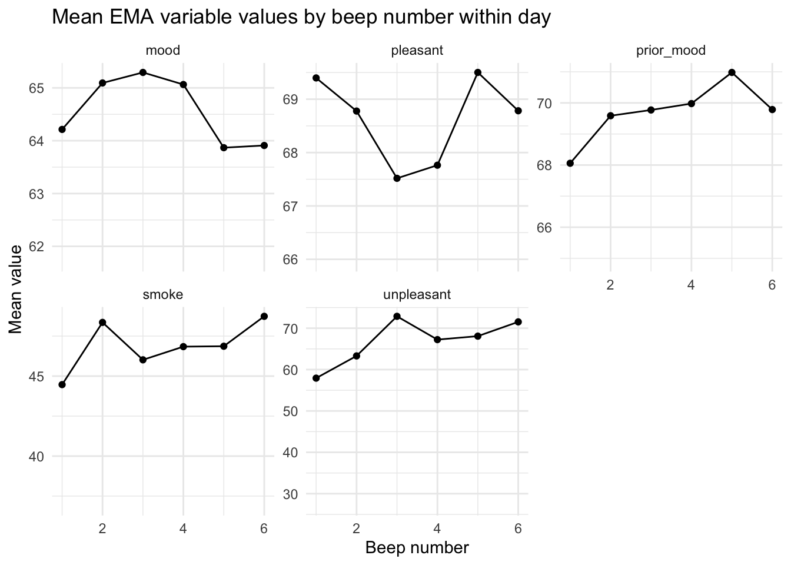

<style>
.esmtools-container{
  
}
.esmtools-container-open {
  border: 2px solid #2780e3;
  border-radius: 7px;
  margin: 0 -1em;
  padding: .4em 1em;
}
.esmtools-btn{
  display:inline-block;
  padding:0.35em 1.2em;
  border:0.2em solid #2780e3;
  background-color:#2780e3;
  margin:0 0.3em 0.3em 0;
  border-radius:0.12em;
  box-sizing: border-box;
  text-decoration:none;
  font-family:'Roboto',sans-serif;
  font-weight: bold;
  color:#FFFFFF;
  text-align:center;
  transition: all 0.2s;
  margin: 4px 0px 4px 4px;
}
.esmtools-btn:hover{
  color:#000000;
  background-color:#FFFFFF;
}
/* Highligh issue text */
.esm-issue{
    font-weight: bold;
    color:#e61919;
    text-decoration: underline #e61919 2px;
}

/* Highlight data inspection text */
.esm-inspect{
    font-weight: bold;
    text-decoration: underline 2px;
}

/* Highlight data modification text */
.esm-mod{
    font-weight: bold;
    color:#0088a3;
    text-decoration: underline #0088a3 2px;
}
/* Warning message: hidden content */
.warning_hide{
    font-weight: bold;
    margin: -.4em 0em 1em 2px;
    color: #595959;
}
</style>
<script>
function esmtools_toggleContent(button) {
    var parentDiv = button.parentElement;
    var childNodes = parentDiv.childNodes;
    
    // Toggle the 'esmtools-btn-open' class on the parent div
    parentDiv.classList.toggle("esmtools-container-open");

    for (var i = 2; i < childNodes.length; i++) {
      var node = childNodes[i];
      // if (!node.classList.contains("content-container")){
          if (node.nodeType === Node.ELEMENT_NODE) {
              if (node.style.display === "none") {
                  node.style.display = "block";
                  console.log("ok")
              } else {
                  node.style.display = "none";
              }
          }
      // }
    }
}
</script>

``` r
# Means by study day — Part 6 completers only
# (change over all 10 days is only meaningful for participants with Part 6 data)
study_sample %>%
  mutate(valid = check_validity(.)) %>%
  filter(valid == 1, participant_id %in% valid_completers) %>%
  select(dayno, all_of(c("mood", "smoke", "pleasant", "unpleasant", "prior_mood"))) %>%
  pivot_longer(-dayno, names_to = "variable", values_to = "value") %>%
  filter(!is.na(value)) %>%
  group_by(dayno, variable) %>%
  summarise(mean_value = mean(value, na.rm = TRUE), .groups = "drop") %>%
  ggplot(aes(x = dayno, y = mean_value)) +
  geom_line() +
  geom_point() +
  geom_vline(xintercept = 3.5, linetype = "dashed", color = "gray50") +
  annotate("text", x = 2, y = Inf, label = "Part 2", vjust = 1.5,
           size = 3, color = "gray40") +
  annotate("text", x = 7, y = Inf, label = "Part 6", vjust = 1.5,
           size = 3, color = "gray40") +
  scale_x_continuous(breaks = 1:10) +
  facet_wrap(~ variable, scales = "free_y") +
  labs(
    title = "Mean EMA variable values by study day (Part 6 completers only)",
    x     = "Study day",
    y     = "Mean value"
  ) +
  theme_minimal()
```

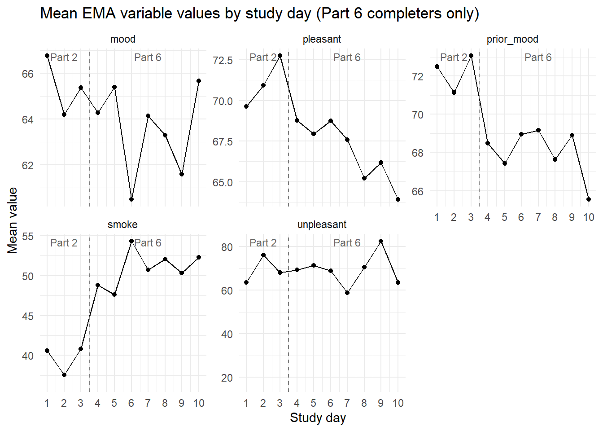

<p>
</div>
</div>
</p>


## Condition-Level Means

`<div class="committee-note"><span class="committee-label">Committee</span>The committee requested means for mood and craving across unpleasant, pleasant, and neutral event appraisal conditions.</div>`{=html}

<style>
.esmtools-container{
  
}
.esmtools-container-open {
  border: 2px solid #2780e3;
  border-radius: 7px;
  margin: 0 -1em;
  padding: .4em 1em;
}
.esmtools-btn{
  display:inline-block;
  padding:0.35em 1.2em;
  border:0.2em solid #2780e3;
  background-color:#2780e3;
  margin:0 0.3em 0.3em 0;
  border-radius:0.12em;
  box-sizing: border-box;
  text-decoration:none;
  font-family:'Roboto',sans-serif;
  font-weight: bold;
  color:#FFFFFF;
  text-align:center;
  transition: all 0.2s;
  margin: 4px 0px 4px 4px;
}
.esmtools-btn:hover{
  color:#000000;
  background-color:#FFFFFF;
}
/* Highligh issue text */
.esm-issue{
    font-weight: bold;
    color:#e61919;
    text-decoration: underline #e61919 2px;
}

/* Highlight data inspection text */
.esm-inspect{
    font-weight: bold;
    text-decoration: underline 2px;
}

/* Highlight data modification text */
.esm-mod{
    font-weight: bold;
    color:#0088a3;
    text-decoration: underline #0088a3 2px;
}
/* Warning message: hidden content */
.warning_hide{
    font-weight: bold;
    margin: -.4em 0em 1em 2px;
    color: #595959;
}
</style>
<script>
function esmtools_toggleContent(button) {
    var parentDiv = button.parentElement;
    var childNodes = parentDiv.childNodes;
    
    // Toggle the 'esmtools-btn-open' class on the parent div
    parentDiv.classList.toggle("esmtools-container-open");

    for (var i = 2; i < childNodes.length; i++) {
      var node = childNodes[i];
      // if (!node.classList.contains("content-container")){
          if (node.nodeType === Node.ELEMENT_NODE) {
              if (node.style.display === "none") {
                  node.style.display = "block";
                  console.log("ok")
              } else {
                  node.style.display = "none";
              }
          }
      // }
    }
}
</script>

``` r
study_sample %>%
  mutate(valid = check_validity(.)) %>%
  filter(valid == 1, !is.na(before_survey)) %>%
  group_by(before_survey) %>%
  summarise(
    n          = n(),
    mean_mood  = round(mean(mood, na.rm = TRUE), 2),
    sd_mood    = round(sd(mood, na.rm = TRUE), 2),
    mean_smoke = round(mean(smoke, na.rm = TRUE), 2),
    sd_smoke   = round(sd(smoke, na.rm = TRUE), 2)
  ) %>%
  kable(caption = "Means and SDs for mood and craving by event appraisal condition") %>%
  kable_styling(bootstrap_options = c("striped", "hover", "condensed"),
                full_width = FALSE)
```

<table class="table table-striped table-hover table-condensed" style="width: auto !important; margin-left: auto; margin-right: auto;">
<caption>Means and SDs for mood and craving by event appraisal condition</caption>
 <thead>
  <tr>
   <th style="text-align:left;"> before_survey </th>
   <th style="text-align:right;"> n </th>
   <th style="text-align:right;"> mean_mood </th>
   <th style="text-align:right;"> sd_mood </th>
   <th style="text-align:right;"> mean_smoke </th>
   <th style="text-align:right;"> sd_smoke </th>
  </tr>
 </thead>
<tbody>
  <tr>
   <td style="text-align:left;"> It was generally pleasant </td>
   <td style="text-align:right;"> 2168 </td>
   <td style="text-align:right;"> 68.60 </td>
   <td style="text-align:right;"> 17.94 </td>
   <td style="text-align:right;"> 44.68 </td>
   <td style="text-align:right;"> 28.99 </td>
  </tr>
  <tr>
   <td style="text-align:left;"> It was generally unpleasant </td>
   <td style="text-align:right;"> 269 </td>
   <td style="text-align:right;"> 31.88 </td>
   <td style="text-align:right;"> 20.48 </td>
   <td style="text-align:right;"> 62.59 </td>
   <td style="text-align:right;"> 28.52 </td>
  </tr>
</tbody>
</table>

`<div class="section-summary"><span class="summary-label">Summary</span>Distributions of key EMA variables (mood, craving, pleasant, unpleasant, prior mood) are described above. ICCs from null models indicate the proportion of variance attributable to stable between-person differences versus moment-to-moment within-person fluctuation — results inform whether multilevel modeling is warranted and how predictors should be centered. Temporal patterns by beep number and study day (Part 6 completers only) are examined to identify potential time-of-day and study-phase effects. Condition-level means show how mood and craving differ across pleasant, unpleasant, and neutral event appraisal contexts, providing a preliminary look at the central contrasts for Aims 1 and 2.</div>`{=html}

## Weekday vs. Weekend Effects

*Following Siepe et al. (2024), we examine whether key EMA outcomes differ between weekdays and weekends.*

<style>
.esmtools-container{
  
}
.esmtools-container-open {
  border: 2px solid #2780e3;
  border-radius: 7px;
  margin: 0 -1em;
  padding: .4em 1em;
}
.esmtools-btn{
  display:inline-block;
  padding:0.35em 1.2em;
  border:0.2em solid #2780e3;
  background-color:#2780e3;
  margin:0 0.3em 0.3em 0;
  border-radius:0.12em;
  box-sizing: border-box;
  text-decoration:none;
  font-family:'Roboto',sans-serif;
  font-weight: bold;
  color:#FFFFFF;
  text-align:center;
  transition: all 0.2s;
  margin: 4px 0px 4px 4px;
}
.esmtools-btn:hover{
  color:#000000;
  background-color:#FFFFFF;
}
/* Highligh issue text */
.esm-issue{
    font-weight: bold;
    color:#e61919;
    text-decoration: underline #e61919 2px;
}

/* Highlight data inspection text */
.esm-inspect{
    font-weight: bold;
    text-decoration: underline 2px;
}

/* Highlight data modification text */
.esm-mod{
    font-weight: bold;
    color:#0088a3;
    text-decoration: underline #0088a3 2px;
}
/* Warning message: hidden content */
.warning_hide{
    font-weight: bold;
    margin: -.4em 0em 1em 2px;
    color: #595959;
}
</style>
<script>
function esmtools_toggleContent(button) {
    var parentDiv = button.parentElement;
    var childNodes = parentDiv.childNodes;
    
    // Toggle the 'esmtools-btn-open' class on the parent div
    parentDiv.classList.toggle("esmtools-container-open");

    for (var i = 2; i < childNodes.length; i++) {
      var node = childNodes[i];
      // if (!node.classList.contains("content-container")){
          if (node.nodeType === Node.ELEMENT_NODE) {
              if (node.style.display === "none") {
                  node.style.display = "block";
                  console.log("ok")
              } else {
                  node.style.display = "none";
              }
          }
      // }
    }
}
</script>

``` r
study_sample %>%
  mutate(valid = check_validity(.)) %>%
  filter(valid == 1) %>%
  mutate(
    day_type  = ifelse(wday(completion_time, week_start = 1) %in% c(6, 7),
                       "Weekend", "Weekday"),
    variable  = "mood"
  ) %>%
  select(participant_id, day_type,
         mood, smoke, pleasant, unpleasant, prior_mood) %>%
  pivot_longer(cols = c(mood, smoke, pleasant, unpleasant, prior_mood),
               names_to = "variable", values_to = "value") %>%
  filter(!is.na(value)) %>%
  group_by(day_type, variable) %>%
  summarise(
    n    = n(),
    Mean = round(mean(value, na.rm = TRUE), 2),
    SD   = round(sd(value, na.rm = TRUE), 2),
    .groups = "drop"
  ) %>%
  mutate(variable = recode(variable,
    mood      = "Mood",
    smoke     = "Craving",
    pleasant  = "Pleasant rating",
    unpleasant = "Unpleasant rating",
    prior_mood = "Prior mood"
  )) %>%
  pivot_wider(names_from = day_type,
              values_from = c(n, Mean, SD),
              names_glue = "{day_type}_{.value}") %>%
  select(variable,
         Weekday_n, Weekday_Mean, Weekday_SD,
         Weekend_n, Weekend_Mean, Weekend_SD) %>%
  kable(caption = "Key EMA outcomes by day type (weekday vs. weekend)") %>%
  kable_styling(bootstrap_options = c("striped", "hover", "condensed"),
                full_width = FALSE)
```

<table class="table table-striped table-hover table-condensed" style="width: auto !important; margin-left: auto; margin-right: auto;">
<caption>Key EMA outcomes by day type (weekday vs. weekend)</caption>
 <thead>
  <tr>
   <th style="text-align:left;"> variable </th>
   <th style="text-align:right;"> Weekday_n </th>
   <th style="text-align:right;"> Weekday_Mean </th>
   <th style="text-align:right;"> Weekday_SD </th>
   <th style="text-align:right;"> Weekend_n </th>
   <th style="text-align:right;"> Weekend_Mean </th>
   <th style="text-align:right;"> Weekend_SD </th>
  </tr>
 </thead>
<tbody>
  <tr>
   <td style="text-align:left;"> Mood </td>
   <td style="text-align:right;"> 1638 </td>
   <td style="text-align:right;"> 64.12 </td>
   <td style="text-align:right;"> 21.60 </td>
   <td style="text-align:right;"> 799 </td>
   <td style="text-align:right;"> 65.43 </td>
   <td style="text-align:right;"> 21.49 </td>
  </tr>
  <tr>
   <td style="text-align:left;"> Pleasant rating </td>
   <td style="text-align:right;"> 1455 </td>
   <td style="text-align:right;"> 67.45 </td>
   <td style="text-align:right;"> 19.77 </td>
   <td style="text-align:right;"> 713 </td>
   <td style="text-align:right;"> 70.86 </td>
   <td style="text-align:right;"> 18.73 </td>
  </tr>
  <tr>
   <td style="text-align:left;"> Prior mood </td>
   <td style="text-align:right;"> 1638 </td>
   <td style="text-align:right;"> 68.79 </td>
   <td style="text-align:right;"> 19.58 </td>
   <td style="text-align:right;"> 799 </td>
   <td style="text-align:right;"> 71.29 </td>
   <td style="text-align:right;"> 19.58 </td>
  </tr>
  <tr>
   <td style="text-align:left;"> Craving </td>
   <td style="text-align:right;"> 1638 </td>
   <td style="text-align:right;"> 47.35 </td>
   <td style="text-align:right;"> 29.18 </td>
   <td style="text-align:right;"> 799 </td>
   <td style="text-align:right;"> 45.23 </td>
   <td style="text-align:right;"> 30.04 </td>
  </tr>
  <tr>
   <td style="text-align:left;"> Unpleasant rating </td>
   <td style="text-align:right;"> 183 </td>
   <td style="text-align:right;"> 65.36 </td>
   <td style="text-align:right;"> 27.26 </td>
   <td style="text-align:right;"> 86 </td>
   <td style="text-align:right;"> 68.12 </td>
   <td style="text-align:right;"> 26.07 </td>
  </tr>
</tbody>
</table>

## EMA Outcomes and Concurrent Smoking

*Pearson correlations between all key EMA outcomes at the beep level (valid observations only). This characterizes how these momentary constructs co-occur across the study.*

<style>
.esmtools-container{
  
}
.esmtools-container-open {
  border: 2px solid #2780e3;
  border-radius: 7px;
  margin: 0 -1em;
  padding: .4em 1em;
}
.esmtools-btn{
  display:inline-block;
  padding:0.35em 1.2em;
  border:0.2em solid #2780e3;
  background-color:#2780e3;
  margin:0 0.3em 0.3em 0;
  border-radius:0.12em;
  box-sizing: border-box;
  text-decoration:none;
  font-family:'Roboto',sans-serif;
  font-weight: bold;
  color:#FFFFFF;
  text-align:center;
  transition: all 0.2s;
  margin: 4px 0px 4px 4px;
}
.esmtools-btn:hover{
  color:#000000;
  background-color:#FFFFFF;
}
/* Highligh issue text */
.esm-issue{
    font-weight: bold;
    color:#e61919;
    text-decoration: underline #e61919 2px;
}

/* Highlight data inspection text */
.esm-inspect{
    font-weight: bold;
    text-decoration: underline 2px;
}

/* Highlight data modification text */
.esm-mod{
    font-weight: bold;
    color:#0088a3;
    text-decoration: underline #0088a3 2px;
}
/* Warning message: hidden content */
.warning_hide{
    font-weight: bold;
    margin: -.4em 0em 1em 2px;
    color: #595959;
}
</style>
<script>
function esmtools_toggleContent(button) {
    var parentDiv = button.parentElement;
    var childNodes = parentDiv.childNodes;
    
    // Toggle the 'esmtools-btn-open' class on the parent div
    parentDiv.classList.toggle("esmtools-container-open");

    for (var i = 2; i < childNodes.length; i++) {
      var node = childNodes[i];
      // if (!node.classList.contains("content-container")){
          if (node.nodeType === Node.ELEMENT_NODE) {
              if (node.style.display === "none") {
                  node.style.display = "block";
                  console.log("ok")
              } else {
                  node.style.display = "none";
              }
          }
      // }
    }
}
</script>

``` r
ema_smoking_cors <- study_sample %>%
  mutate(valid = check_validity(.)) %>%
  filter(valid == 1) %>%
  select(smoke, mood, pleasant, unpleasant, prior_mood,
         smoked_since_last_survey)

# Rename for display
cor_display_vars <- c(
  smoke                   = "Craving",
  mood                    = "Mood",
  pleasant                = "Pleasant rating",
  unpleasant              = "Unpleasant rating",
  prior_mood              = "Prior mood",
  smoked_since_last_survey = "Cigarettes since\nlast survey"
)

# Build full correlation matrix with significance stars
sig_stars_fn <- function(p) {
  if (is.na(p)) return("")
  if (p < .001) return("***")
  if (p < .01)  return("**")
  if (p < .05)  return("*")
  if (p < .10)  return(".")
  return("")
}

var_names <- names(cor_display_vars)
n_v <- length(var_names)
mat <- matrix("—", nrow = n_v, ncol = n_v,
              dimnames = list(unname(cor_display_vars),
                              unname(cor_display_vars)))

for (i in seq_len(n_v)) {
  for (j in seq_len(n_v)) {
    if (i != j) {
      result <- tryCatch({
        test <- cor.test(ema_smoking_cors[[var_names[i]]],
                         ema_smoking_cors[[var_names[j]]],
                         use = "pairwise.complete.obs")
        paste0(round(test$estimate, 2), sig_stars_fn(test$p.value))
      }, error = function(e) "—")
      mat[i, j] <- result
    }
  }
}

as.data.frame(mat) %>%
  kable(caption = "Beep-level correlations among key EMA outcomes and concurrent smoking behavior. Correlations are computed across all valid observations. * p < .05, ** p < .01, *** p < .001, . p < .10") %>%
  kable_styling(bootstrap_options = c("striped", "hover", "condensed"),
                full_width = FALSE)
```

<table class="table table-striped table-hover table-condensed" style="width: auto !important; margin-left: auto; margin-right: auto;">
<caption>Beep-level correlations among key EMA outcomes and concurrent smoking behavior. Correlations are computed across all valid observations. * p &lt; .05, ** p &lt; .01, *** p &lt; .001, . p &lt; .10</caption>
 <thead>
  <tr>
   <th style="text-align:left;">  </th>
   <th style="text-align:left;"> Craving </th>
   <th style="text-align:left;"> Mood </th>
   <th style="text-align:left;"> Pleasant rating </th>
   <th style="text-align:left;"> Unpleasant rating </th>
   <th style="text-align:left;"> Prior mood </th>
   <th style="text-align:left;"> Cigarettes since
last survey </th>
  </tr>
 </thead>
<tbody>
  <tr>
   <td style="text-align:left;"> Craving </td>
   <td style="text-align:left;"> — </td>
   <td style="text-align:left;"> -0.2*** </td>
   <td style="text-align:left;"> -0.07** </td>
   <td style="text-align:left;"> 0.17** </td>
   <td style="text-align:left;"> 0 </td>
   <td style="text-align:left;"> -0.2*** </td>
  </tr>
  <tr>
   <td style="text-align:left;"> Mood </td>
   <td style="text-align:left;"> -0.2*** </td>
   <td style="text-align:left;"> — </td>
   <td style="text-align:left;"> 0.41*** </td>
   <td style="text-align:left;"> -0.43*** </td>
   <td style="text-align:left;"> 0.2*** </td>
   <td style="text-align:left;"> -0.01 </td>
  </tr>
  <tr>
   <td style="text-align:left;"> Pleasant rating </td>
   <td style="text-align:left;"> -0.07** </td>
   <td style="text-align:left;"> 0.41*** </td>
   <td style="text-align:left;"> — </td>
   <td style="text-align:left;"> — </td>
   <td style="text-align:left;"> 0.67*** </td>
   <td style="text-align:left;"> 0 </td>
  </tr>
  <tr>
   <td style="text-align:left;"> Unpleasant rating </td>
   <td style="text-align:left;"> 0.17** </td>
   <td style="text-align:left;"> -0.43*** </td>
   <td style="text-align:left;"> — </td>
   <td style="text-align:left;"> — </td>
   <td style="text-align:left;"> 0.51*** </td>
   <td style="text-align:left;"> 0.05 </td>
  </tr>
  <tr>
   <td style="text-align:left;"> Prior mood </td>
   <td style="text-align:left;"> 0 </td>
   <td style="text-align:left;"> 0.2*** </td>
   <td style="text-align:left;"> 0.67*** </td>
   <td style="text-align:left;"> 0.51*** </td>
   <td style="text-align:left;"> — </td>
   <td style="text-align:left;"> 0.01 </td>
  </tr>
  <tr>
   <td style="text-align:left;"> Cigarettes since
last survey </td>
   <td style="text-align:left;"> |-0.2*** </td>
   <td style="text-align:left;"> |-0.01 </td>
   <td style="text-align:left;"> |0 </td>
   <td style="text-align:left;"> |0.05 </td>
   <td style="text-align:left;"> |0.01 </td>
   <td style="text-align:left;"> |— </td>
  </tr>
</tbody>
</table>

## EMA Outcomes Across Days of Abstinence (Part 6 Completers)

*Following Siepe et al. (2024), this section examines key EMA outcomes as a function of consecutive days without smoking during Part 6. The sample shrinks as participants resume smoking — n at each abstinence day is reported. This analysis covers up to 7 days of abstinence and is restricted to Part 6 completers.*

<style>
.esmtools-container{
  
}
.esmtools-container-open {
  border: 2px solid #2780e3;
  border-radius: 7px;
  margin: 0 -1em;
  padding: .4em 1em;
}
.esmtools-btn{
  display:inline-block;
  padding:0.35em 1.2em;
  border:0.2em solid #2780e3;
  background-color:#2780e3;
  margin:0 0.3em 0.3em 0;
  border-radius:0.12em;
  box-sizing: border-box;
  text-decoration:none;
  font-family:'Roboto',sans-serif;
  font-weight: bold;
  color:#FFFFFF;
  text-align:center;
  transition: all 0.2s;
  margin: 4px 0px 4px 4px;
}
.esmtools-btn:hover{
  color:#000000;
  background-color:#FFFFFF;
}
/* Highligh issue text */
.esm-issue{
    font-weight: bold;
    color:#e61919;
    text-decoration: underline #e61919 2px;
}

/* Highlight data inspection text */
.esm-inspect{
    font-weight: bold;
    text-decoration: underline 2px;
}

/* Highlight data modification text */
.esm-mod{
    font-weight: bold;
    color:#0088a3;
    text-decoration: underline #0088a3 2px;
}
/* Warning message: hidden content */
.warning_hide{
    font-weight: bold;
    margin: -.4em 0em 1em 2px;
    color: #595959;
}
</style>
<script>
function esmtools_toggleContent(button) {
    var parentDiv = button.parentElement;
    var childNodes = parentDiv.childNodes;
    
    // Toggle the 'esmtools-btn-open' class on the parent div
    parentDiv.classList.toggle("esmtools-container-open");

    for (var i = 2; i < childNodes.length; i++) {
      var node = childNodes[i];
      // if (!node.classList.contains("content-container")){
          if (node.nodeType === Node.ELEMENT_NODE) {
              if (node.style.display === "none") {
                  node.style.display = "block";
                  console.log("ok")
              } else {
                  node.style.display = "none";
              }
          }
      // }
    }
}
</script>

``` r
# For each Part 6 completer, identify consecutive abstinence days
# A participant is "abstinent on day X" if smoked_since_last_survey == 0
# for all valid beeps on that day

# Daily smoking indicator per participant per Part 6 day
daily_abstinence <- study_sample %>%
  mutate(valid = check_validity(.)) %>%
  filter(valid == 1, study_part == 6,
         participant_id %in% valid_completers,
         !is.na(smoked_since_last_survey)) %>%
  group_by(participant_id, dayno) %>%
  summarise(
    any_smoking = any(smoked_since_last_survey > 0, na.rm = TRUE),
    .groups = "drop"
  ) %>%
  arrange(participant_id, dayno) %>%
  group_by(participant_id) %>%
  mutate(
    # Consecutive abstinence day: reset counter on any smoking day
    abstinence_streak = {
      streak <- integer(n())
      count  <- 0L
      for (k in seq_len(n())) {
        if (!any_smoking[k]) {
          count <- count + 1L
        } else {
          count <- 0L
        }
        streak[k] <- count
      }
      streak
    }
  ) %>%
  ungroup()

# EMA outcomes on each abstinence streak day
abstinence_ema <- study_sample %>%
  mutate(valid = check_validity(.)) %>%
  filter(valid == 1, study_part == 6,
         participant_id %in% valid_completers) %>%
  left_join(daily_abstinence %>%
              select(participant_id, dayno, abstinence_streak),
            by = c("participant_id", "dayno")) %>%
  filter(abstinence_streak >= 1, abstinence_streak <= 7)

# Summary table by abstinence day
abstinence_ema %>%
  group_by(abstinence_streak) %>%
  summarise(
    n_obs          = n(),
    n_participants = n_distinct(participant_id),
    mean_craving   = round(mean(smoke, na.rm = TRUE), 2),
    sd_craving     = round(sd(smoke, na.rm = TRUE), 2),
    mean_mood      = round(mean(mood, na.rm = TRUE), 2),
    sd_mood        = round(sd(mood, na.rm = TRUE), 2),
    mean_pleasant  = round(mean(pleasant, na.rm = TRUE), 2),
    sd_pleasant    = round(sd(pleasant, na.rm = TRUE), 2),
    mean_unpleasant = round(mean(unpleasant, na.rm = TRUE), 2),
    sd_unpleasant  = round(sd(unpleasant, na.rm = TRUE), 2),
    .groups = "drop"
  ) %>%
  rename(`Abstinence Day` = abstinence_streak,
         `N Obs`          = n_obs,
         `N Participants` = n_participants,
         `Craving M`      = mean_craving,
         `Craving SD`     = sd_craving,
         `Mood M`         = mean_mood,
         `Mood SD`        = sd_mood,
         `Pleasant M`     = mean_pleasant,
         `Pleasant SD`    = sd_pleasant,
         `Unpleasant M`   = mean_unpleasant,
         `Unpleasant SD`  = sd_unpleasant) %>%
  kable(caption = "Key EMA outcomes by consecutive abstinence day during Part 6 (Part 6 completers only). N participants reflects the shrinking cohort remaining abstinent at each day.") %>%
  kable_styling(bootstrap_options = c("striped", "hover", "condensed"),
                full_width = FALSE)
```

<table class="table table-striped table-hover table-condensed" style="width: auto !important; margin-left: auto; margin-right: auto;">
<caption>Key EMA outcomes by consecutive abstinence day during Part 6 (Part 6 completers only). N participants reflects the shrinking cohort remaining abstinent at each day.</caption>
 <thead>
  <tr>
   <th style="text-align:right;"> Abstinence Day </th>
   <th style="text-align:right;"> N Obs </th>
   <th style="text-align:right;"> N Participants </th>
   <th style="text-align:right;"> Craving M </th>
   <th style="text-align:right;"> Craving SD </th>
   <th style="text-align:right;"> Mood M </th>
   <th style="text-align:right;"> Mood SD </th>
   <th style="text-align:right;"> Pleasant M </th>
   <th style="text-align:right;"> Pleasant SD </th>
   <th style="text-align:right;"> Unpleasant M </th>
   <th style="text-align:right;"> Unpleasant SD </th>
  </tr>
 </thead>
<tbody>
  <tr>
   <td style="text-align:right;"> 1 </td>
   <td style="text-align:right;"> 149 </td>
   <td style="text-align:right;"> 37 </td>
   <td style="text-align:right;"> 60.89 </td>
   <td style="text-align:right;"> 26.55 </td>
   <td style="text-align:right;"> 60.04 </td>
   <td style="text-align:right;"> 22.96 </td>
   <td style="text-align:right;"> 67.30 </td>
   <td style="text-align:right;"> 20.81 </td>
   <td style="text-align:right;"> 65.56 </td>
   <td style="text-align:right;"> 18.20 </td>
  </tr>
  <tr>
   <td style="text-align:right;"> 2 </td>
   <td style="text-align:right;"> 110 </td>
   <td style="text-align:right;"> 30 </td>
   <td style="text-align:right;"> 63.68 </td>
   <td style="text-align:right;"> 27.88 </td>
   <td style="text-align:right;"> 60.65 </td>
   <td style="text-align:right;"> 21.83 </td>
   <td style="text-align:right;"> 66.66 </td>
   <td style="text-align:right;"> 19.74 </td>
   <td style="text-align:right;"> 77.25 </td>
   <td style="text-align:right;"> 15.81 </td>
  </tr>
  <tr>
   <td style="text-align:right;"> 3 </td>
   <td style="text-align:right;"> 97 </td>
   <td style="text-align:right;"> 27 </td>
   <td style="text-align:right;"> 61.08 </td>
   <td style="text-align:right;"> 32.28 </td>
   <td style="text-align:right;"> 62.26 </td>
   <td style="text-align:right;"> 22.69 </td>
   <td style="text-align:right;"> 71.90 </td>
   <td style="text-align:right;"> 18.11 </td>
   <td style="text-align:right;"> 52.73 </td>
   <td style="text-align:right;"> 23.64 </td>
  </tr>
  <tr>
   <td style="text-align:right;"> 4 </td>
   <td style="text-align:right;"> 97 </td>
   <td style="text-align:right;"> 23 </td>
   <td style="text-align:right;"> 60.27 </td>
   <td style="text-align:right;"> 31.04 </td>
   <td style="text-align:right;"> 66.69 </td>
   <td style="text-align:right;"> 17.33 </td>
   <td style="text-align:right;"> 67.22 </td>
   <td style="text-align:right;"> 20.48 </td>
   <td style="text-align:right;"> 55.62 </td>
   <td style="text-align:right;"> 33.89 </td>
  </tr>
  <tr>
   <td style="text-align:right;"> 5 </td>
   <td style="text-align:right;"> 78 </td>
   <td style="text-align:right;"> 20 </td>
   <td style="text-align:right;"> 56.05 </td>
   <td style="text-align:right;"> 28.72 </td>
   <td style="text-align:right;"> 64.64 </td>
   <td style="text-align:right;"> 21.10 </td>
   <td style="text-align:right;"> 62.97 </td>
   <td style="text-align:right;"> 20.23 </td>
   <td style="text-align:right;"> 92.33 </td>
   <td style="text-align:right;"> 11.54 </td>
  </tr>
  <tr>
   <td style="text-align:right;"> 6 </td>
   <td style="text-align:right;"> 69 </td>
   <td style="text-align:right;"> 16 </td>
   <td style="text-align:right;"> 56.10 </td>
   <td style="text-align:right;"> 28.55 </td>
   <td style="text-align:right;"> 62.94 </td>
   <td style="text-align:right;"> 23.33 </td>
   <td style="text-align:right;"> 66.65 </td>
   <td style="text-align:right;"> 15.30 </td>
   <td style="text-align:right;"> 80.00 </td>
   <td style="text-align:right;"> 25.61 </td>
  </tr>
  <tr>
   <td style="text-align:right;"> 7 </td>
   <td style="text-align:right;"> 51 </td>
   <td style="text-align:right;"> 14 </td>
   <td style="text-align:right;"> 52.16 </td>
   <td style="text-align:right;"> 31.37 </td>
   <td style="text-align:right;"> 66.84 </td>
   <td style="text-align:right;"> 19.20 </td>
   <td style="text-align:right;"> 66.53 </td>
   <td style="text-align:right;"> 21.78 </td>
   <td style="text-align:right;"> 56.50 </td>
   <td style="text-align:right;"> 0.71 </td>
  </tr>
</tbody>
</table>

``` r
# Plot: craving and mood by abstinence day
abstinence_ema %>%
  group_by(abstinence_streak) %>%
  summarise(
    mean_craving = mean(smoke, na.rm = TRUE),
    se_craving   = sd(smoke, na.rm = TRUE) / sqrt(n()),
    mean_mood    = mean(mood, na.rm = TRUE),
    se_mood      = sd(mood, na.rm = TRUE) / sqrt(n()),
    .groups = "drop"
  ) %>%
  pivot_longer(cols = c(mean_craving, mean_mood),
               names_to = "outcome", values_to = "mean") %>%
  mutate(
    se = ifelse(outcome == "mean_craving", se_craving, se_mood),
    outcome = recode(outcome,
                     mean_craving = "Craving",
                     mean_mood    = "Mood")
  ) %>%
  ggplot(aes(x = abstinence_streak, y = mean, color = outcome, group = outcome)) +
  geom_line(linewidth = 1) +
  geom_point(size = 2) +
  geom_errorbar(aes(ymin = mean - se, ymax = mean + se),
                width = 0.2, alpha = 0.6) +
  scale_x_continuous(breaks = 1:7) +
  labs(
    title    = "Craving and mood across consecutive abstinence days (Part 6)",
    subtitle = "Error bars = SE",
    x        = "Consecutive abstinence day",
    y        = "Mean value",
    color    = "Outcome"
  ) +
  theme_minimal()
```

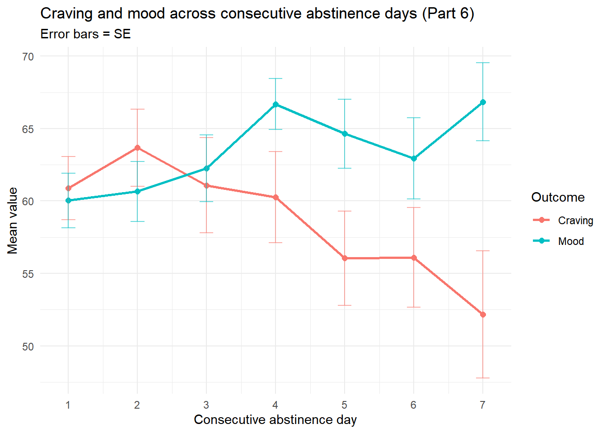

## Lag and Cross-Lag Associations (Inertia)

*Following Siepe et al. (2024), this section examines temporal inertia (autocorrelation) and cross-lagged associations between key EMA variables. Lag-1 correlations are computed at the person level and averaged across participants. These results provide a preliminary picture of temporal dependency in the data and inform decisions about autoregressive model components.*

<style>
.esmtools-container{
  
}
.esmtools-container-open {
  border: 2px solid #2780e3;
  border-radius: 7px;
  margin: 0 -1em;
  padding: .4em 1em;
}
.esmtools-btn{
  display:inline-block;
  padding:0.35em 1.2em;
  border:0.2em solid #2780e3;
  background-color:#2780e3;
  margin:0 0.3em 0.3em 0;
  border-radius:0.12em;
  box-sizing: border-box;
  text-decoration:none;
  font-family:'Roboto',sans-serif;
  font-weight: bold;
  color:#FFFFFF;
  text-align:center;
  transition: all 0.2s;
  margin: 4px 0px 4px 4px;
}
.esmtools-btn:hover{
  color:#000000;
  background-color:#FFFFFF;
}
/* Highligh issue text */
.esm-issue{
    font-weight: bold;
    color:#e61919;
    text-decoration: underline #e61919 2px;
}

/* Highlight data inspection text */
.esm-inspect{
    font-weight: bold;
    text-decoration: underline 2px;
}

/* Highlight data modification text */
.esm-mod{
    font-weight: bold;
    color:#0088a3;
    text-decoration: underline #0088a3 2px;
}
/* Warning message: hidden content */
.warning_hide{
    font-weight: bold;
    margin: -.4em 0em 1em 2px;
    color: #595959;
}
</style>
<script>
function esmtools_toggleContent(button) {
    var parentDiv = button.parentElement;
    var childNodes = parentDiv.childNodes;
    
    // Toggle the 'esmtools-btn-open' class on the parent div
    parentDiv.classList.toggle("esmtools-container-open");

    for (var i = 2; i < childNodes.length; i++) {
      var node = childNodes[i];
      // if (!node.classList.contains("content-container")){
          if (node.nodeType === Node.ELEMENT_NODE) {
              if (node.style.display === "none") {
                  node.style.display = "block";
                  console.log("ok")
              } else {
                  node.style.display = "none";
              }
          }
      // }
    }
}
</script>

``` r
# Compute lag-1 values within person within day
lag_data <- study_sample %>%
  mutate(valid = check_validity(.)) %>%
  filter(valid == 1) %>%
  arrange(participant_id, obsno) %>%
  group_by(participant_id) %>%
  mutate(
    lag_mood      = lag(mood),
    lag_smoke     = lag(smoke),
    lag_pleasant  = lag(pleasant),
    lag_unpleasant = lag(unpleasant),
    lag_prior_mood = lag(prior_mood)
  ) %>%
  ungroup()

# Person-level lag-1 autocorrelations
lag_cors <- lag_data %>%
  filter(!is.na(lag_mood)) %>%
  group_by(participant_id) %>%
  summarise(
    r_mood        = cor(mood, lag_mood, use = "pairwise.complete.obs"),
    r_smoke       = cor(smoke, lag_smoke, use = "pairwise.complete.obs"),
    r_pleasant    = cor(pleasant, lag_pleasant, use = "pairwise.complete.obs"),
    r_unpleasant  = cor(unpleasant, lag_unpleasant, use = "pairwise.complete.obs"),
    r_prior_mood  = cor(prior_mood, lag_prior_mood, use = "pairwise.complete.obs"),
    .groups = "drop"
  )

# Average across participants
lag_cors %>%
  summarise(across(starts_with("r_"),
                   list(mean = ~ round(mean(.x, na.rm = TRUE), 3),
                        sd   = ~ round(sd(.x, na.rm = TRUE), 3)),
                   .names = "{.col}_{.fn}")) %>%
  pivot_longer(everything(),
               names_to  = c("Variable", "Stat"),
               names_pattern = "r_(.+)_(mean|sd)") %>%
  pivot_wider(names_from = Stat, values_from = value) %>%
  mutate(Variable = recode(Variable,
    mood       = "Mood",
    smoke      = "Craving",
    pleasant   = "Pleasant rating",
    unpleasant = "Unpleasant rating",
    prior_mood = "Prior mood"
  )) %>%
  rename(`Mean lag-1 r` = mean, `SD` = sd) %>%
  kable(caption = "Person-level lag-1 autocorrelations for key EMA variables (mean and SD across participants). Higher values indicate greater inertia — less moment-to-moment variability relative to prior state.") %>%
  kable_styling(bootstrap_options = c("striped", "hover", "condensed"),
                full_width = FALSE)
```

<table class="table table-striped table-hover table-condensed" style="width: auto !important; margin-left: auto; margin-right: auto;">
<caption>Person-level lag-1 autocorrelations for key EMA variables (mean and SD across participants). Higher values indicate greater inertia — less moment-to-moment variability relative to prior state.</caption>
 <thead>
  <tr>
   <th style="text-align:left;"> Variable </th>
   <th style="text-align:right;"> Mean lag-1 r </th>
   <th style="text-align:right;"> SD </th>
  </tr>
 </thead>
<tbody>
  <tr>
   <td style="text-align:left;"> Mood </td>
   <td style="text-align:right;"> 0.102 </td>
   <td style="text-align:right;"> 0.331 </td>
  </tr>
  <tr>
   <td style="text-align:left;"> Craving </td>
   <td style="text-align:right;"> 0.067 </td>
   <td style="text-align:right;"> 0.380 </td>
  </tr>
  <tr>
   <td style="text-align:left;"> Pleasant rating </td>
   <td style="text-align:right;"> 0.072 </td>
   <td style="text-align:right;"> 0.398 </td>
  </tr>
  <tr>
   <td style="text-align:left;"> Unpleasant rating </td>
   <td style="text-align:right;"> -0.274 </td>
   <td style="text-align:right;"> 0.650 </td>
  </tr>
  <tr>
   <td style="text-align:left;"> Prior mood </td>
   <td style="text-align:right;"> 0.027 </td>
   <td style="text-align:right;"> 0.341 </td>
  </tr>
</tbody>
</table>

``` r
# Cross-lag: craving predicting mood, mood predicting craving
cross_lag <- lag_data %>%
  filter(!is.na(lag_smoke), !is.na(lag_mood)) %>%
  group_by(participant_id) %>%
  summarise(
    r_smoke_to_mood  = cor(mood,  lag_smoke, use = "pairwise.complete.obs"),
    r_mood_to_smoke  = cor(smoke, lag_mood,  use = "pairwise.complete.obs"),
    r_pleasant_to_smoke = cor(smoke, lag_pleasant, use = "pairwise.complete.obs"),
    r_unpleasant_to_smoke = cor(smoke, lag_unpleasant, use = "pairwise.complete.obs"),
    .groups = "drop"
  )

cross_lag %>%
  summarise(across(everything(),
                   list(mean = ~ round(mean(.x, na.rm = TRUE), 3),
                        sd   = ~ round(sd(.x, na.rm = TRUE), 3)),
                   .names = "{.col}_{.fn}")) %>%
  pivot_longer(everything(),
               names_to  = c("Association", "Stat"),
               names_pattern = "(.+)_(mean|sd)") %>%
  pivot_wider(names_from = Stat, values_from = value) %>%
  mutate(Association = recode(Association,
    r_smoke_to_mood       = "Lag-1 craving → mood",
    r_mood_to_smoke       = "Lag-1 mood → craving",
    r_pleasant_to_smoke   = "Lag-1 pleasant rating → craving",
    r_unpleasant_to_smoke = "Lag-1 unpleasant rating → craving"
  )) %>%
  rename(`Mean cross-lag r` = mean, `SD` = sd) %>%
  kable(caption = "Person-level cross-lag correlations between key EMA variables (mean and SD across participants). These provide a preliminary look at temporal precedence relationships relevant to Aims 1–3.") %>%
  kable_styling(bootstrap_options = c("striped", "hover", "condensed"),
                full_width = FALSE)
```

<table class="table table-striped table-hover table-condensed" style="width: auto !important; margin-left: auto; margin-right: auto;">
<caption>Person-level cross-lag correlations between key EMA variables (mean and SD across participants). These provide a preliminary look at temporal precedence relationships relevant to Aims 1–3.</caption>
 <thead>
  <tr>
   <th style="text-align:left;"> Association </th>
   <th style="text-align:right;"> Mean cross-lag r </th>
   <th style="text-align:right;"> SD </th>
  </tr>
 </thead>
<tbody>
  <tr>
   <td style="text-align:left;"> participant_id </td>
   <td style="text-align:right;"> 252.905 </td>
   <td style="text-align:right;"> 92.765 </td>
  </tr>
  <tr>
   <td style="text-align:left;"> Lag-1 craving → mood </td>
   <td style="text-align:right;"> -0.062 </td>
   <td style="text-align:right;"> 0.321 </td>
  </tr>
  <tr>
   <td style="text-align:left;"> Lag-1 mood → craving </td>
   <td style="text-align:right;"> -0.048 </td>
   <td style="text-align:right;"> 0.311 </td>
  </tr>
  <tr>
   <td style="text-align:left;"> Lag-1 pleasant rating → craving </td>
   <td style="text-align:right;"> -0.022 </td>
   <td style="text-align:right;"> 0.353 </td>
  </tr>
  <tr>
   <td style="text-align:left;"> Lag-1 unpleasant rating → craving </td>
   <td style="text-align:right;"> 0.176 </td>
   <td style="text-align:right;"> 0.627 </td>
  </tr>
</tbody>
</table>

---

# Change over Time

<!-- This section examines potentially meaningful change over time in craving, reward processing,
     and cigarette use among Part 6 completers. Analyses here are descriptive and designed to
     inform the feasibility and scope of Aim 3 analyses prior to formal modeling. -->

*This section examines craving, reward processing, and cigarette use trajectories among Part 6 completers across the 10-day study period. Results are intended to characterize potentially meaningful change over time and assess the feasibility of Aim 3 analyses.*

`<div class="committee-note"><span class="committee-label">Committee</span>This section is intended to assess whether the data support the proposed Aim 3 analyses, including the feasibility of regression-based analyses across change categories (Quitter, Reducer, Stable, Increaser).</div>`{=html}

<style>
.esmtools-container{
  
}
.esmtools-container-open {
  border: 2px solid #2780e3;
  border-radius: 7px;
  margin: 0 -1em;
  padding: .4em 1em;
}
.esmtools-btn{
  display:inline-block;
  padding:0.35em 1.2em;
  border:0.2em solid #2780e3;
  background-color:#2780e3;
  margin:0 0.3em 0.3em 0;
  border-radius:0.12em;
  box-sizing: border-box;
  text-decoration:none;
  font-family:'Roboto',sans-serif;
  font-weight: bold;
  color:#FFFFFF;
  text-align:center;
  transition: all 0.2s;
  margin: 4px 0px 4px 4px;
}
.esmtools-btn:hover{
  color:#000000;
  background-color:#FFFFFF;
}
/* Highligh issue text */
.esm-issue{
    font-weight: bold;
    color:#e61919;
    text-decoration: underline #e61919 2px;
}

/* Highlight data inspection text */
.esm-inspect{
    font-weight: bold;
    text-decoration: underline 2px;
}

/* Highlight data modification text */
.esm-mod{
    font-weight: bold;
    color:#0088a3;
    text-decoration: underline #0088a3 2px;
}
/* Warning message: hidden content */
.warning_hide{
    font-weight: bold;
    margin: -.4em 0em 1em 2px;
    color: #595959;
}
</style>
<script>
function esmtools_toggleContent(button) {
    var parentDiv = button.parentElement;
    var childNodes = parentDiv.childNodes;
    
    // Toggle the 'esmtools-btn-open' class on the parent div
    parentDiv.classList.toggle("esmtools-container-open");

    for (var i = 2; i < childNodes.length; i++) {
      var node = childNodes[i];
      // if (!node.classList.contains("content-container")){
          if (node.nodeType === Node.ELEMENT_NODE) {
              if (node.style.display === "none") {
                  node.style.display = "block";
                  console.log("ok")
              } else {
                  node.style.display = "none";
              }
          }
      // }
    }
}
</script>

``` r
# Ensure person_class and part6_deviation are available
# (recompute here for independence from earlier chunks)

# Smoking completers with daily totals
smoking_completers_aim3 <- study_sample %>%
  mutate(valid = check_validity(.)) %>%
  filter(valid == 1,
         participant_id %in% valid_completers,
         !is.na(smoked_since_last_survey),
         !is.na(dayno)) %>%
  group_by(participant_id, dayno) %>%
  summarise(
    daily_smoked    = sum(smoked_since_last_survey, na.rm = TRUE),
    mean_craving    = mean(smoke, na.rm = TRUE),
    mean_mood       = mean(mood, na.rm = TRUE),
    mean_pleasant   = mean(pleasant, na.rm = TRUE),
    reward_processing = mean(pleasant * mood / 100, na.rm = TRUE),
    .groups = "drop"
  ) %>%
  mutate(part = ifelse(dayno <= 3, "Part 2 (Baseline)", "Part 6 (Incentive)"))

# Baseline means per person
baseline_aim3 <- smoking_completers_aim3 %>%
  filter(dayno <= 3) %>%
  group_by(participant_id) %>%
  summarise(
    baseline_smoked           = mean(daily_smoked, na.rm = TRUE),
    baseline_craving          = mean(mean_craving, na.rm = TRUE),
    baseline_reward           = mean(reward_processing, na.rm = TRUE),
    .groups = "drop"
  )

# Part 6 means per person
part6_aim3 <- smoking_completers_aim3 %>%
  filter(dayno > 3) %>%
  group_by(participant_id) %>%
  summarise(
    part6_smoked   = mean(daily_smoked, na.rm = TRUE),
    part6_craving  = mean(mean_craving, na.rm = TRUE),
    part6_reward   = mean(reward_processing, na.rm = TRUE),
    .groups = "drop"
  )

# Merge and classify
aim3_data <- baseline_aim3 %>%
  left_join(part6_aim3, by = "participant_id") %>%
  mutate(
    change_cat = case_when(
      part6_smoked <= 0.1                            ~ "Quitter",
      part6_smoked < baseline_smoked * 0.80          ~ "Reducer",
      part6_smoked > baseline_smoked * 1.20          ~ "Increaser",
      TRUE                                            ~ "Stable"
    ),
    delta_craving = part6_craving - baseline_craving,
    delta_reward  = part6_reward  - baseline_reward,
    delta_smoked  = part6_smoked  - baseline_smoked
  )

# --- Table: Group sizes and feasibility check ---
aim3_data %>%
  count(change_cat) %>%
  mutate(pct = round(n / sum(n) * 100, 1)) %>%
  rename(`Change Category` = change_cat, N = n, `%` = pct) %>%
  kable(caption = "Sample size by change category — feasibility check for Aim 3 regression analyses") %>%
  kable_styling(bootstrap_options = c("striped", "hover", "condensed"),
                full_width = FALSE)
```

<table class="table table-striped table-hover table-condensed" style="width: auto !important; margin-left: auto; margin-right: auto;">
<caption>Sample size by change category — feasibility check for Aim 3 regression analyses</caption>
 <thead>
  <tr>
   <th style="text-align:left;"> Change Category </th>
   <th style="text-align:right;"> N </th>
   <th style="text-align:right;"> % </th>
  </tr>
 </thead>
<tbody>
  <tr>
   <td style="text-align:left;"> Increaser </td>
   <td style="text-align:right;"> 4 </td>
   <td style="text-align:right;"> 6.9 </td>
  </tr>
  <tr>
   <td style="text-align:left;"> Quitter </td>
   <td style="text-align:right;"> 19 </td>
   <td style="text-align:right;"> 32.8 </td>
  </tr>
  <tr>
   <td style="text-align:left;"> Reducer </td>
   <td style="text-align:right;"> 25 </td>
   <td style="text-align:right;"> 43.1 </td>
  </tr>
  <tr>
   <td style="text-align:left;"> Stable </td>
   <td style="text-align:right;"> 10 </td>
   <td style="text-align:right;"> 17.2 </td>
  </tr>
</tbody>
</table>

``` r
# --- Table: Mean changes in craving and reward by category ---
aim3_data %>%
  group_by(change_cat) %>%
  summarise(
    n                    = n(),
    mean_delta_craving   = round(mean(delta_craving, na.rm = TRUE), 2),
    sd_delta_craving     = round(sd(delta_craving, na.rm = TRUE), 2),
    mean_delta_reward    = round(mean(delta_reward, na.rm = TRUE), 2),
    sd_delta_reward      = round(sd(delta_reward, na.rm = TRUE), 2),
    mean_delta_smoked    = round(mean(delta_smoked, na.rm = TRUE), 2),
    sd_delta_smoked      = round(sd(delta_smoked, na.rm = TRUE), 2),
    .groups = "drop"
  ) %>%
  rename(
    `Change Category`      = change_cat,
    N                      = n,
    `Δ Craving M`          = mean_delta_craving,
    `Δ Craving SD`         = sd_delta_craving,
    `Δ Reward M`           = mean_delta_reward,
    `Δ Reward SD`          = sd_delta_reward,
    `Δ Smoking M`          = mean_delta_smoked,
    `Δ Smoking SD`         = sd_delta_smoked
  ) %>%
  kable(caption = "Mean changes (Part 6 minus Part 2 baseline) in craving, reward processing, and smoking by change category. Δ = Part 6 mean minus Part 2 mean.") %>%
  kable_styling(bootstrap_options = c("striped", "hover", "condensed"),
                full_width = FALSE)
```

<table class="table table-striped table-hover table-condensed" style="width: auto !important; margin-left: auto; margin-right: auto;">
<caption>Mean changes (Part 6 minus Part 2 baseline) in craving, reward processing, and smoking by change category. Δ = Part 6 mean minus Part 2 mean.</caption>
 <thead>
  <tr>
   <th style="text-align:left;"> Change Category </th>
   <th style="text-align:right;"> N </th>
   <th style="text-align:right;"> Δ Craving M </th>
   <th style="text-align:right;"> Δ Craving SD </th>
   <th style="text-align:right;"> Δ Reward M </th>
   <th style="text-align:right;"> Δ Reward SD </th>
   <th style="text-align:right;"> Δ Smoking M </th>
   <th style="text-align:right;"> Δ Smoking SD </th>
  </tr>
 </thead>
<tbody>
  <tr>
   <td style="text-align:left;"> Increaser </td>
   <td style="text-align:right;"> 4 </td>
   <td style="text-align:right;"> -8.70 </td>
   <td style="text-align:right;"> 12.97 </td>
   <td style="text-align:right;"> 4.27 </td>
   <td style="text-align:right;"> 10.10 </td>
   <td style="text-align:right;"> 2.67 </td>
   <td style="text-align:right;"> 1.48 </td>
  </tr>
  <tr>
   <td style="text-align:left;"> Quitter </td>
   <td style="text-align:right;"> 19 </td>
   <td style="text-align:right;"> 13.31 </td>
   <td style="text-align:right;"> 27.91 </td>
   <td style="text-align:right;"> -5.81 </td>
   <td style="text-align:right;"> 11.95 </td>
   <td style="text-align:right;"> -8.45 </td>
   <td style="text-align:right;"> 4.67 </td>
  </tr>
  <tr>
   <td style="text-align:left;"> Reducer </td>
   <td style="text-align:right;"> 25 </td>
   <td style="text-align:right;"> 12.98 </td>
   <td style="text-align:right;"> 17.20 </td>
   <td style="text-align:right;"> -3.38 </td>
   <td style="text-align:right;"> 12.85 </td>
   <td style="text-align:right;"> -6.84 </td>
   <td style="text-align:right;"> 5.43 </td>
  </tr>
  <tr>
   <td style="text-align:left;"> Stable </td>
   <td style="text-align:right;"> 10 </td>
   <td style="text-align:right;"> 6.28 </td>
   <td style="text-align:right;"> 16.54 </td>
   <td style="text-align:right;"> -3.62 </td>
   <td style="text-align:right;"> 15.67 </td>
   <td style="text-align:right;"> 0.13 </td>
   <td style="text-align:right;"> 0.84 </td>
  </tr>
</tbody>
</table>

<style>
.esmtools-container{
  
}
.esmtools-container-open {
  border: 2px solid #2780e3;
  border-radius: 7px;
  margin: 0 -1em;
  padding: .4em 1em;
}
.esmtools-btn{
  display:inline-block;
  padding:0.35em 1.2em;
  border:0.2em solid #2780e3;
  background-color:#2780e3;
  margin:0 0.3em 0.3em 0;
  border-radius:0.12em;
  box-sizing: border-box;
  text-decoration:none;
  font-family:'Roboto',sans-serif;
  font-weight: bold;
  color:#FFFFFF;
  text-align:center;
  transition: all 0.2s;
  margin: 4px 0px 4px 4px;
}
.esmtools-btn:hover{
  color:#000000;
  background-color:#FFFFFF;
}
/* Highligh issue text */
.esm-issue{
    font-weight: bold;
    color:#e61919;
    text-decoration: underline #e61919 2px;
}

/* Highlight data inspection text */
.esm-inspect{
    font-weight: bold;
    text-decoration: underline 2px;
}

/* Highlight data modification text */
.esm-mod{
    font-weight: bold;
    color:#0088a3;
    text-decoration: underline #0088a3 2px;
}
/* Warning message: hidden content */
.warning_hide{
    font-weight: bold;
    margin: -.4em 0em 1em 2px;
    color: #595959;
}
</style>
<script>
function esmtools_toggleContent(button) {
    var parentDiv = button.parentElement;
    var childNodes = parentDiv.childNodes;
    
    // Toggle the 'esmtools-btn-open' class on the parent div
    parentDiv.classList.toggle("esmtools-container-open");

    for (var i = 2; i < childNodes.length; i++) {
      var node = childNodes[i];
      // if (!node.classList.contains("content-container")){
          if (node.nodeType === Node.ELEMENT_NODE) {
              if (node.style.display === "none") {
                  node.style.display = "block";
                  console.log("ok")
              } else {
                  node.style.display = "none";
              }
          }
      // }
    }
}
</script>

``` r
# Build daily data with change category for spaghetti plot
daily_aim3 <- smoking_completers_aim3 %>%
  left_join(aim3_data %>% select(participant_id, change_cat),
            by = "participant_id") %>%
  filter(!is.na(change_cat))

# Group means per day per category
group_means_aim3 <- daily_aim3 %>%
  group_by(dayno, change_cat) %>%
  summarise(
    group_craving = mean(mean_craving, na.rm = TRUE),
    .groups = "drop"
  )

# Spaghetti plot: individual craving trajectories + group mean by change category
ggplot(daily_aim3, aes(x = dayno, y = mean_craving)) +
  geom_line(aes(group = participant_id), alpha = 0.2, color = "gray60") +
  geom_line(data = group_means_aim3,
            aes(y = group_craving, color = change_cat),
            linewidth = 1.5) +
  geom_vline(xintercept = 3.5, linetype = "dashed", color = "gray40") +
  scale_color_manual(
    values = c(
      "Quitter"   = "darkgreen",
      "Reducer"   = "steelblue",
      "Stable"    = "gray40",
      "Increaser" = "tomato"
    )
  ) +
  scale_x_continuous(breaks = 1:10) +
  annotate("text", x = 2, y = Inf, label = "Part 2\n(Baseline)",
           vjust = 1.5, size = 3, color = "gray40") +
  annotate("text", x = 7, y = Inf, label = "Part 6\n(Incentive)",
           vjust = 1.5, size = 3, color = "gray40") +
  labs(
    title    = "Daily craving trajectories by smoking change category (Part 6 completers)",
    subtitle = "Light lines = individual trajectories; bold lines = group means by change category",
    x        = "Study day",
    y        = "Mean daily craving",
    color    = "Change category"
  ) +
  theme_minimal()
```

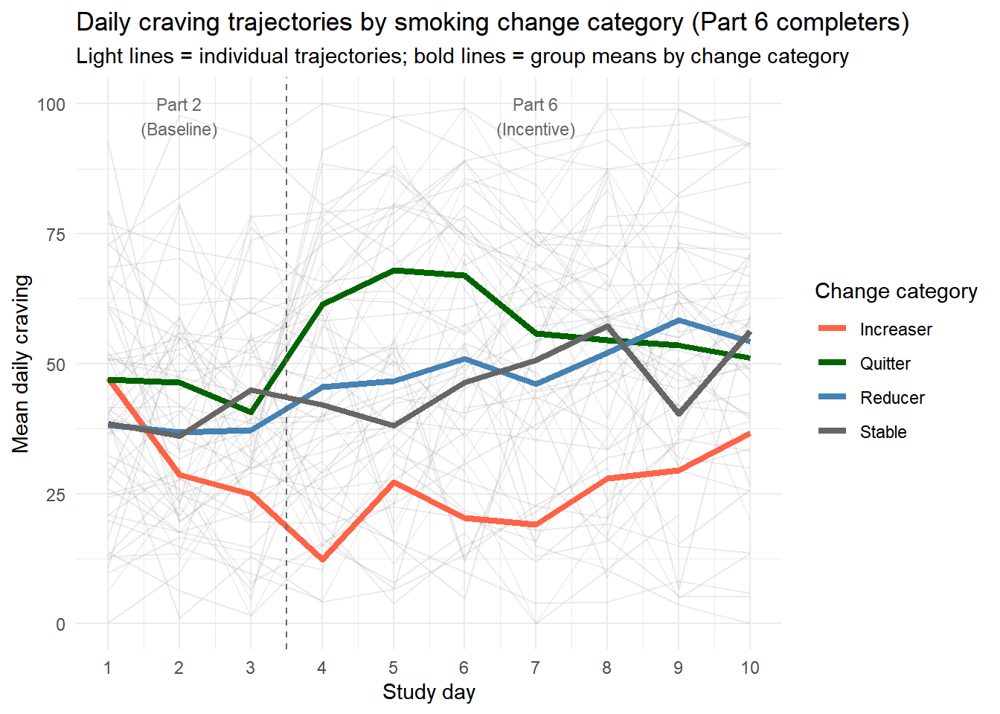

``` r
# Same plot for reward processing
group_means_reward <- daily_aim3 %>%
  group_by(dayno, change_cat) %>%
  summarise(group_reward = mean(reward_processing, na.rm = TRUE), .groups = "drop")

ggplot(daily_aim3, aes(x = dayno, y = reward_processing)) +
  geom_line(aes(group = participant_id), alpha = 0.2, color = "gray60") +
  geom_line(data = group_means_reward,
            aes(y = group_reward, color = change_cat),
            linewidth = 1.5) +
  geom_vline(xintercept = 3.5, linetype = "dashed", color = "gray40") +
  scale_color_manual(
    values = c(
      "Quitter"   = "darkgreen",
      "Reducer"   = "steelblue",
      "Stable"    = "gray40",
      "Increaser" = "tomato"
    )
  ) +
  scale_x_continuous(breaks = 1:10) +
  annotate("text", x = 2, y = Inf, label = "Part 2\n(Baseline)",
           vjust = 1.5, size = 3, color = "gray40") +
  annotate("text", x = 7, y = Inf, label = "Part 6\n(Incentive)",
           vjust = 1.5, size = 3, color = "gray40") +
  labs(
    title    = "Daily reward processing trajectories by smoking change category (Part 6 completers)",
    subtitle = "Reward processing = pleasant × mood / 100. Light lines = individual; bold = group mean",
    x        = "Study day",
    y        = "Mean daily reward processing index",
    color    = "Change category"
  ) +
  theme_minimal()
```

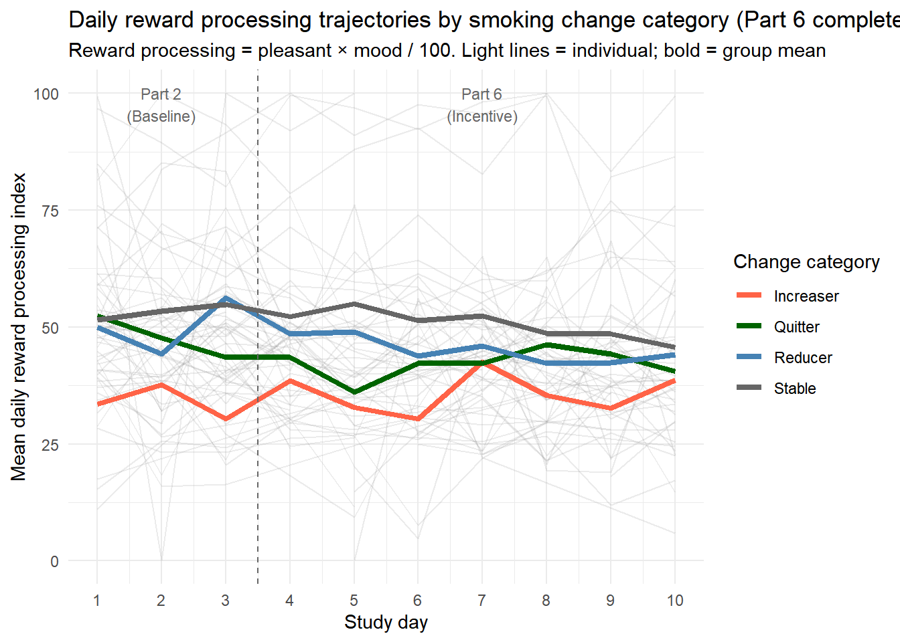

`<div class="section-summary"><span class="summary-label">Summary</span>Preliminary descriptive evidence for Aim 3 is presented above. Craving and reward processing trajectories are plotted by smoking change category across the full 10-day study period. Group sizes by change category are reported to assess whether regression-based analyses are feasible. Mean changes in craving, reward processing, and smoking from Part 2 baseline to Part 6 are summarized by category. These results will inform the analytic approach and scope of Aim 3.</div>`{=html}

---

# Smoking Behavior

`<div class="committee-note"><span class="committee-label">Committee</span>This section addresses several committee questions about cigarette use behavior over the course of the study.</div>`{=html}

## Person-Level Cigarette Use

`<div class="committee-note"><span class="committee-label">Committee</span>The committee requested a description of person-level cigarette use behavior over the course of the study.</div>`{=html}


<div class='esmtools-container'>
<button class='esmtools-btn' onclick='esmtools_toggleContent(this)'>Description</button>
<p>
<div style='display:none;'>


<style>
.esmtools-container{
  
}
.esmtools-container-open {
  border: 2px solid #2780e3;
  border-radius: 7px;
  margin: 0 -1em;
  padding: .4em 1em;
}
.esmtools-btn{
  display:inline-block;
  padding:0.35em 1.2em;
  border:0.2em solid #2780e3;
  background-color:#2780e3;
  margin:0 0.3em 0.3em 0;
  border-radius:0.12em;
  box-sizing: border-box;
  text-decoration:none;
  font-family:'Roboto',sans-serif;
  font-weight: bold;
  color:#FFFFFF;
  text-align:center;
  transition: all 0.2s;
  margin: 4px 0px 4px 4px;
}
.esmtools-btn:hover{
  color:#000000;
  background-color:#FFFFFF;
}
/* Highligh issue text */
.esm-issue{
    font-weight: bold;
    color:#e61919;
    text-decoration: underline #e61919 2px;
}

/* Highlight data inspection text */
.esm-inspect{
    font-weight: bold;
    text-decoration: underline 2px;
}

/* Highlight data modification text */
.esm-mod{
    font-weight: bold;
    color:#0088a3;
    text-decoration: underline #0088a3 2px;
}
/* Warning message: hidden content */
.warning_hide{
    font-weight: bold;
    margin: -.4em 0em 1em 2px;
    color: #595959;
}
</style>
<script>
function esmtools_toggleContent(button) {
    var parentDiv = button.parentElement;
    var childNodes = parentDiv.childNodes;
    
    // Toggle the 'esmtools-btn-open' class on the parent div
    parentDiv.classList.toggle("esmtools-container-open");

    for (var i = 2; i < childNodes.length; i++) {
      var node = childNodes[i];
      // if (!node.classList.contains("content-container")){
          if (node.nodeType === Node.ELEMENT_NODE) {
              if (node.style.display === "none") {
                  node.style.display = "block";
                  console.log("ok")
              } else {
                  node.style.display = "none";
              }
          }
      // }
    }
}
</script>

``` r
# Daily smoking totals per participant per day
smoking_person <- study_sample %>%
  mutate(valid = check_validity(.)) %>%
  filter(valid == 1, !is.na(smoked_since_last_survey), !is.na(dayno)) %>%
  group_by(participant_id, dayno) %>%
  summarise(
    daily_smoked = sum(smoked_since_last_survey, na.rm = TRUE),
    .groups = "drop"
  ) %>%
  mutate(completer = ifelse(participant_id %in% part6_completers,
                            "Part 6 Completer", "Part 2 Only"))

# --- Plot 1: Color-coded spaghetti ---
ggplot(smoking_person, aes(x = dayno, y = daily_smoked,
                            group = participant_id,
                            color = completer,
                            alpha = completer)) +
  geom_line() +
  geom_vline(xintercept = 3.5, linetype = "dashed", color = "gray40") +
  scale_color_manual(values = c("Part 6 Completer" = "steelblue",
                                 "Part 2 Only"      = "tomato")) +
  scale_alpha_manual(values = c("Part 6 Completer" = 0.5,
                                 "Part 2 Only"      = 0.3)) +
  scale_x_continuous(breaks = 1:10) +
  annotate("text", x = 2, y = Inf, label = "Part 2\n(Baseline)",
           vjust = 1.5, size = 3, color = "gray40") +
  annotate("text", x = 7, y = Inf, label = "Part 6\n(Incentive)",
           vjust = 1.5, size = 3, color = "gray40") +
  labs(
    title = "Person-level daily cigarette use over the study",
    x     = "Study day",
    y     = "Cigarettes reported",
    color = "Completion status",
    alpha = "Completion status"
  ) +
  theme_minimal()
```

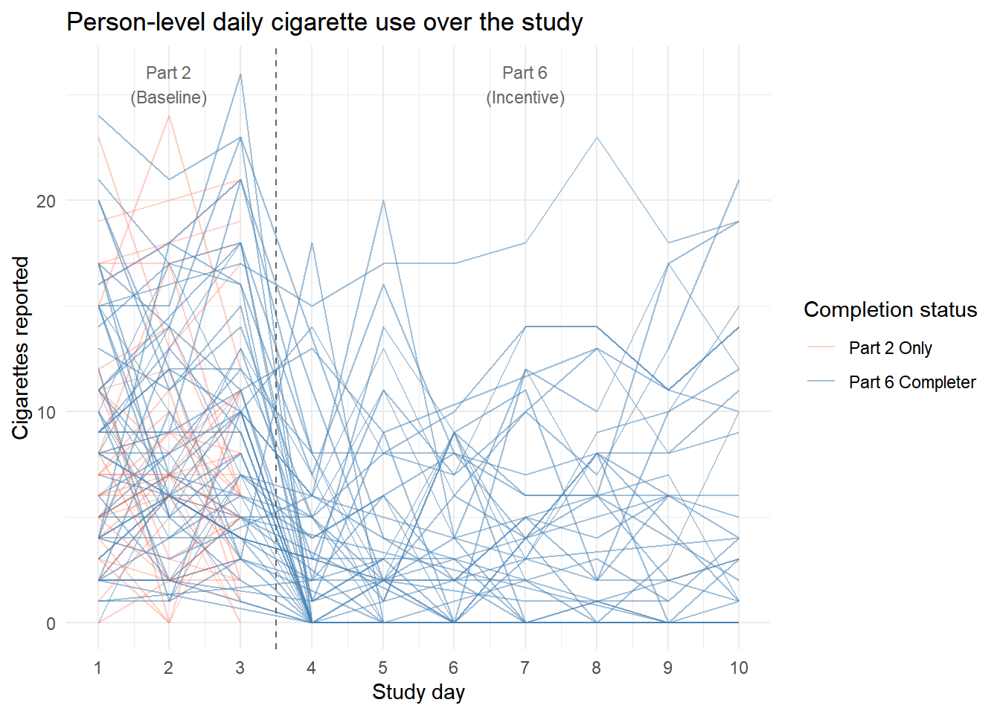

``` r
# --- Plot 2: Part 6 completers, separate smoothers by study part ---
smoking_completers <- smoking_person %>%
  filter(completer == "Part 6 Completer") %>%
  mutate(part = ifelse(dayno <= 3, "Part 2 (Baseline)", "Part 6 (Incentive)"))

ggplot(smoking_completers, aes(x = dayno, y = daily_smoked)) +
  geom_line(aes(group = participant_id), color = "steelblue", alpha = 0.3) +
  geom_smooth(aes(group = part, color = part),
              method = "lm", se = TRUE, linewidth = 1) +
  geom_vline(xintercept = 3.5, linetype = "dashed", color = "gray40") +
  scale_color_manual(values = c("Part 2 (Baseline)"  = "gray40",
                                 "Part 6 (Incentive)" = "darkblue")) +
  scale_x_continuous(breaks = 1:10) +
  annotate("text", x = 2, y = Inf, label = "Part 2\n(Baseline)",
           vjust = 1.5, size = 3, color = "gray40") +
  annotate("text", x = 7, y = Inf, label = "Part 6\n(Incentive)",
           vjust = 1.5, size = 3, color = "gray40") +
  labs(
    title = "Daily cigarette use among Part 6 completers",
    subtitle = "Individual trajectories (light) with separate smoothers by study part",
    x     = "Study day",
    y     = "Cigarettes reported",
    color = "Study part"
  ) +
  theme_minimal()
```

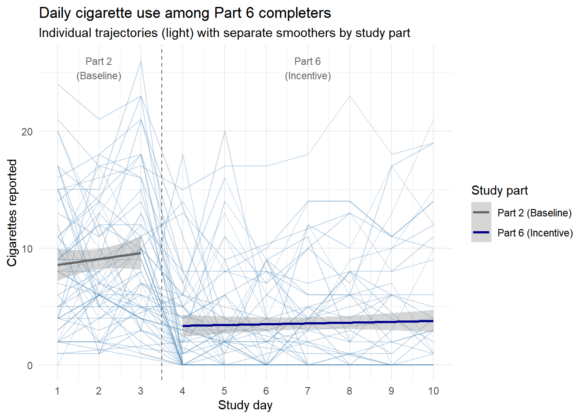

``` r
# --- Plot 3: Deviation from baseline, color-coded by change category ---

# Compute Part 2 baseline mean per person
baseline_ref <- smoking_completers %>%
  filter(dayno <= 3) %>%
  group_by(participant_id) %>%
  summarise(baseline_mean = mean(daily_smoked, na.rm = TRUE),
            .groups = "drop")

# Part 6 data only, with deviation from baseline
part6_deviation <- smoking_completers %>%
  filter(dayno > 3) %>%
  left_join(baseline_ref, by = "participant_id") %>%
  mutate(deviation = daily_smoked - baseline_mean)

# Classify each participant by their mean Part 6 deviation
# Quitter  = Part 6 mean == 0 (or effectively zero, <= 0.1 to handle rounding)
# Reducer  = Part 6 mean < baseline by > 20%
# Stable   = within 20% of baseline in either direction
# Increaser = Part 6 mean > baseline by > 20%
person_class <- part6_deviation %>%
  group_by(participant_id, baseline_mean) %>%
  summarise(part6_mean = mean(daily_smoked, na.rm = TRUE),
            .groups = "drop") %>%
  mutate(
    change_cat = case_when(
      part6_mean <= 0.1                                    ~ "Quitter",
      part6_mean < baseline_mean * 0.80                   ~ "Reducer",
      part6_mean > baseline_mean * 1.20                   ~ "Increaser",
      TRUE                                                 ~ "Stable"
    )
  )

# Print classification counts — useful to verify your hunch
cat("Change category counts:\n")
```

```
## Change category counts:
```

``` r
print(table(person_class$change_cat))
```

```
## 
## Increaser   Quitter   Reducer    Stable 
##         4        19        25        10
```

``` r
# Merge classification back
part6_deviation <- part6_deviation %>%
  left_join(person_class %>% select(participant_id, change_cat),
            by = "participant_id")

# Plot
ggplot(part6_deviation, aes(x = dayno, y = deviation,
                             group = participant_id,
                             color = change_cat)) +
  geom_line(alpha = 0.5) +
  geom_hline(yintercept = 0, linetype = "dashed", color = "gray40", linewidth = 0.8) +
  scale_color_manual(
    values = c(
      "Quitter"   = "darkgreen",
      "Reducer"   = "steelblue",
      "Stable"    = "gray60",
      "Increaser" = "tomato"
    )
  ) +
  scale_x_continuous(breaks = 4:10) +
  annotate("text", x = 6.5, y = Inf,
           label = "Dashed line = individual Part 2 baseline mean",
           vjust = 1.5, size = 2.8, color = "gray40") +
  labs(
    title = "Part 6 smoking deviations from individual Part 2 baselines",
    subtitle = "Quitter = zero Part 6 smoking; Reducer = >20% below baseline;\nStable = within 20%; Increaser = >20% above baseline",
    x     = "Study day",
    y     = "Deviation from baseline (cigarettes reported)",
    color = "Change category"
  ) +
  theme_minimal()
```

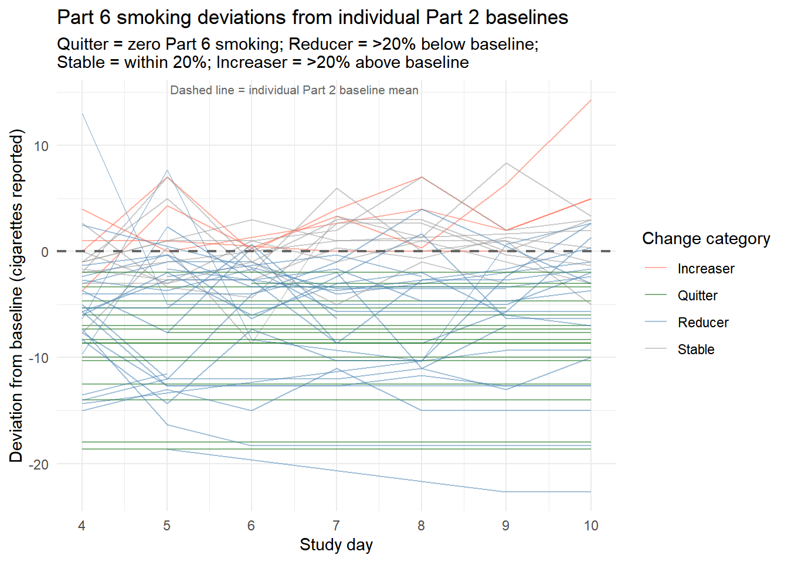

<p>
</div>
</div>
</p>


## 3-Day Baseline Smoking

`<div class="committee-note"><span class="committee-label">Committee</span>The committee requested that 3-day EMA cigarette smoking data be used to calculate each participant's typical smoking behavior as a baseline metric for assessing relative deviations during Part 6.</div>`{=html}

<style>
.esmtools-container{
  
}
.esmtools-container-open {
  border: 2px solid #2780e3;
  border-radius: 7px;
  margin: 0 -1em;
  padding: .4em 1em;
}
.esmtools-btn{
  display:inline-block;
  padding:0.35em 1.2em;
  border:0.2em solid #2780e3;
  background-color:#2780e3;
  margin:0 0.3em 0.3em 0;
  border-radius:0.12em;
  box-sizing: border-box;
  text-decoration:none;
  font-family:'Roboto',sans-serif;
  font-weight: bold;
  color:#FFFFFF;
  text-align:center;
  transition: all 0.2s;
  margin: 4px 0px 4px 4px;
}
.esmtools-btn:hover{
  color:#000000;
  background-color:#FFFFFF;
}
/* Highligh issue text */
.esm-issue{
    font-weight: bold;
    color:#e61919;
    text-decoration: underline #e61919 2px;
}

/* Highlight data inspection text */
.esm-inspect{
    font-weight: bold;
    text-decoration: underline 2px;
}

/* Highlight data modification text */
.esm-mod{
    font-weight: bold;
    color:#0088a3;
    text-decoration: underline #0088a3 2px;
}
/* Warning message: hidden content */
.warning_hide{
    font-weight: bold;
    margin: -.4em 0em 1em 2px;
    color: #595959;
}
</style>
<script>
function esmtools_toggleContent(button) {
    var parentDiv = button.parentElement;
    var childNodes = parentDiv.childNodes;
    
    // Toggle the 'esmtools-btn-open' class on the parent div
    parentDiv.classList.toggle("esmtools-container-open");

    for (var i = 2; i < childNodes.length; i++) {
      var node = childNodes[i];
      // if (!node.classList.contains("content-container")){
          if (node.nodeType === Node.ELEMENT_NODE) {
              if (node.style.display === "none") {
                  node.style.display = "block";
                  console.log("ok")
              } else {
                  node.style.display = "none";
              }
          }
      // }
    }
}
</script>

``` r
# --- Table 1: Smoking summary across three samples ---

# Part 2 non-completers (Part 2 only, did not continue to Part 6)
part2_noncompleters <- study_sample %>%
  mutate(valid = check_validity(.)) %>%
  filter(valid == 1, study_part == 2,
         !is.na(smoked_since_last_survey),
         !participant_id %in% part6_completers) %>%
  group_by(participant_id) %>%
  summarise(
    baseline_total = sum(smoked_since_last_survey, na.rm = TRUE),
    baseline_days  = n_distinct(dayno),
    baseline_daily = round(baseline_total / baseline_days, 2),
    .groups = "drop"
  )

# Part 2 summary — Part 6 completers only
part2_completers <- study_sample %>%
  mutate(valid = check_validity(.)) %>%
  filter(valid == 1, study_part == 2,
         !is.na(smoked_since_last_survey),
         participant_id %in% part6_completers) %>%
  group_by(participant_id) %>%
  summarise(
    baseline_total = sum(smoked_since_last_survey, na.rm = TRUE),
    baseline_days  = n_distinct(dayno),
    baseline_daily = round(baseline_total / baseline_days, 2),
    .groups = "drop"
  )

# Part 6 summary — completers only
part6_summary <- study_sample %>%
  mutate(valid = check_validity(.)) %>%
  filter(valid == 1, study_part == 6, !is.na(smoked_since_last_survey)) %>%
  group_by(participant_id) %>%
  summarise(
    part6_total = sum(smoked_since_last_survey, na.rm = TRUE),
    part6_days  = n_distinct(dayno),
    part6_daily = round(part6_total / part6_days, 2),
    .groups = "drop"
  )

# Build comparison table
tibble(
  Sample     = c("Part 2 non-completers (Part 2 only)",
                 "Part 6 completers — Part 2 (baseline)",
                 "Part 6 completers — Part 6 (incentive)"),
  N          = c(nrow(part2_noncompleters),
                 nrow(part2_completers),
                 nrow(part6_summary)),
  Mean_daily = c(round(mean(part2_noncompleters$baseline_daily, na.rm = TRUE), 2),
                 round(mean(part2_completers$baseline_daily, na.rm = TRUE), 2),
                 round(mean(part6_summary$part6_daily, na.rm = TRUE), 2)),
  SD_daily   = c(round(sd(part2_noncompleters$baseline_daily, na.rm = TRUE), 2),
                 round(sd(part2_completers$baseline_daily, na.rm = TRUE), 2),
                 round(sd(part6_summary$part6_daily, na.rm = TRUE), 2)),
  Min_daily  = c(min(part2_noncompleters$baseline_daily, na.rm = TRUE),
                 min(part2_completers$baseline_daily, na.rm = TRUE),
                 min(part6_summary$part6_daily, na.rm = TRUE)),
  Max_daily  = c(max(part2_noncompleters$baseline_daily, na.rm = TRUE),
                 max(part2_completers$baseline_daily, na.rm = TRUE),
                 max(part6_summary$part6_daily, na.rm = TRUE))
) %>%
  kable(caption = "Daily cigarette use summary by sample and study part") %>%
  kable_styling(bootstrap_options = c("striped", "hover", "condensed"),
                full_width = FALSE)
```

<table class="table table-striped table-hover table-condensed" style="width: auto !important; margin-left: auto; margin-right: auto;">
<caption>Daily cigarette use summary by sample and study part</caption>
 <thead>
  <tr>
   <th style="text-align:left;"> Sample </th>
   <th style="text-align:right;"> N </th>
   <th style="text-align:right;"> Mean_daily </th>
   <th style="text-align:right;"> SD_daily </th>
   <th style="text-align:right;"> Min_daily </th>
   <th style="text-align:right;"> Max_daily </th>
  </tr>
 </thead>
<tbody>
  <tr>
   <td style="text-align:left;"> Part 2 non-completers (Part 2 only) </td>
   <td style="text-align:right;"> 36 </td>
   <td style="text-align:right;"> 7.85 </td>
   <td style="text-align:right;"> 5.06 </td>
   <td style="text-align:right;"> 1.67 </td>
   <td style="text-align:right;"> 20.00 </td>
  </tr>
  <tr>
   <td style="text-align:left;"> Part 6 completers — Part 2 (baseline) </td>
   <td style="text-align:right;"> 59 </td>
   <td style="text-align:right;"> 8.65 </td>
   <td style="text-align:right;"> 4.96 </td>
   <td style="text-align:right;"> 1.00 </td>
   <td style="text-align:right;"> 22.67 </td>
  </tr>
  <tr>
   <td style="text-align:left;"> Part 6 completers — Part 6 (incentive) </td>
   <td style="text-align:right;"> 58 </td>
   <td style="text-align:right;"> 3.35 </td>
   <td style="text-align:right;"> 4.03 </td>
   <td style="text-align:right;"> 0.00 </td>
   <td style="text-align:right;"> 18.14 </td>
  </tr>
</tbody>
</table>

``` r
# --- Table 2: Change category summary ---
# Recompute person_class here in case chunk is run independently
person_class_summary <- part2_completers %>%
  left_join(part6_summary, by = "participant_id") %>%
  mutate(
    change_cat = case_when(
      part6_daily <= 0.1                          ~ "Quitter",
      part6_daily < baseline_daily * 0.80         ~ "Reducer",
      part6_daily > baseline_daily * 1.20         ~ "Increaser",
      TRUE                                         ~ "Stable"
    )
  )

person_class_summary %>%
  group_by(change_cat) %>%
  summarise(
    n                    = n(),
    pct                  = round(n() / nrow(person_class_summary) * 100, 1),
    mean_baseline_daily  = round(mean(baseline_daily, na.rm = TRUE), 2),
    sd_baseline_daily    = round(sd(baseline_daily, na.rm = TRUE), 2),
    mean_part6_daily     = round(mean(part6_daily, na.rm = TRUE), 2),
    sd_part6_daily       = round(sd(part6_daily, na.rm = TRUE), 2),
    .groups = "drop"
  ) %>%
  arrange(desc(n)) %>%
  kable(caption = "Part 6 smoking change categories relative to Part 2 baseline. Quitter = mean Part 6 daily smoking <= 0.1; Reducer = >20% below baseline; Increaser = >20% above baseline; Stable = within 20% of baseline.") %>%
  kable_styling(bootstrap_options = c("striped", "hover", "condensed"),
                full_width = FALSE)
```

<table class="table table-striped table-hover table-condensed" style="width: auto !important; margin-left: auto; margin-right: auto;">
<caption>Part 6 smoking change categories relative to Part 2 baseline. Quitter = mean Part 6 daily smoking &lt;= 0.1; Reducer = &gt;20% below baseline; Increaser = &gt;20% above baseline; Stable = within 20% of baseline.</caption>
 <thead>
  <tr>
   <th style="text-align:left;"> change_cat </th>
   <th style="text-align:right;"> n </th>
   <th style="text-align:right;"> pct </th>
   <th style="text-align:right;"> mean_baseline_daily </th>
   <th style="text-align:right;"> sd_baseline_daily </th>
   <th style="text-align:right;"> mean_part6_daily </th>
   <th style="text-align:right;"> sd_part6_daily </th>
  </tr>
 </thead>
<tbody>
  <tr>
   <td style="text-align:left;"> Reducer </td>
   <td style="text-align:right;"> 25 </td>
   <td style="text-align:right;"> 42.4 </td>
   <td style="text-align:right;"> 10.06 </td>
   <td style="text-align:right;"> 5.40 </td>
   <td style="text-align:right;"> 3.36 </td>
   <td style="text-align:right;"> 2.68 </td>
  </tr>
  <tr>
   <td style="text-align:left;"> Quitter </td>
   <td style="text-align:right;"> 19 </td>
   <td style="text-align:right;"> 32.2 </td>
   <td style="text-align:right;"> 8.45 </td>
   <td style="text-align:right;"> 4.67 </td>
   <td style="text-align:right;"> 0.00 </td>
   <td style="text-align:right;"> 0.00 </td>
  </tr>
  <tr>
   <td style="text-align:left;"> Stable </td>
   <td style="text-align:right;"> 10 </td>
   <td style="text-align:right;"> 16.9 </td>
   <td style="text-align:right;"> 6.90 </td>
   <td style="text-align:right;"> 4.40 </td>
   <td style="text-align:right;"> 7.49 </td>
   <td style="text-align:right;"> 4.69 </td>
  </tr>
  <tr>
   <td style="text-align:left;"> Increaser </td>
   <td style="text-align:right;"> 5 </td>
   <td style="text-align:right;"> 8.5 </td>
   <td style="text-align:right;"> 5.83 </td>
   <td style="text-align:right;"> 3.10 </td>
   <td style="text-align:right;"> 8.61 </td>
   <td style="text-align:right;"> 4.18 </td>
  </tr>
</tbody>
</table>
> **Note:** One participant (ID 223) is excluded from Part 6 smoking summaries due to missing branch variable data (pleasant/unpleasant) across all Part 6 observations, resulting in zero valid observations for that participant during Part 6.

`<div class="section-summary"><span class="summary-label">Summary</span>Person-level cigarette use trajectories are characterized across the full study period, with Part 6 completers distinguished from Part 2-only participants. Among Part 6 completers, within-day smoking patterns (by beep number) and time-of-day effects are examined separately for Part 2 and Part 6. Participants are classified into change categories (Quitter, Reducer, Stable, Increaser) based on their mean Part 6 smoking relative to their individual Part 2 baseline. CO-EMA agreement is examined to assess the validity of self-reported smoking behavior against biochemical verification.</div>`{=html}

## CO and EMA Alignment

`<div class="committee-note"><span class="committee-label">Committee</span>The committee asked whether the CO data align with the EMA data on cigarette smoking for each participant.</div>`{=html}


<div class='esmtools-container'>
<button class='esmtools-btn' onclick='esmtools_toggleContent(this)'>Description</button>
<p>
<div style='display:none;'>


<style>
.esmtools-container{
  
}
.esmtools-container-open {
  border: 2px solid #2780e3;
  border-radius: 7px;
  margin: 0 -1em;
  padding: .4em 1em;
}
.esmtools-btn{
  display:inline-block;
  padding:0.35em 1.2em;
  border:0.2em solid #2780e3;
  background-color:#2780e3;
  margin:0 0.3em 0.3em 0;
  border-radius:0.12em;
  box-sizing: border-box;
  text-decoration:none;
  font-family:'Roboto',sans-serif;
  font-weight: bold;
  color:#FFFFFF;
  text-align:center;
  transition: all 0.2s;
  margin: 4px 0px 4px 4px;
}
.esmtools-btn:hover{
  color:#000000;
  background-color:#FFFFFF;
}
/* Highligh issue text */
.esm-issue{
    font-weight: bold;
    color:#e61919;
    text-decoration: underline #e61919 2px;
}

/* Highlight data inspection text */
.esm-inspect{
    font-weight: bold;
    text-decoration: underline 2px;
}

/* Highlight data modification text */
.esm-mod{
    font-weight: bold;
    color:#0088a3;
    text-decoration: underline #0088a3 2px;
}
/* Warning message: hidden content */
.warning_hide{
    font-weight: bold;
    margin: -.4em 0em 1em 2px;
    color: #595959;
}
</style>
<script>
function esmtools_toggleContent(button) {
    var parentDiv = button.parentElement;
    var childNodes = parentDiv.childNodes;
    
    // Toggle the 'esmtools-btn-open' class on the parent div
    parentDiv.classList.toggle("esmtools-container-open");

    for (var i = 2; i < childNodes.length; i++) {
      var node = childNodes[i];
      // if (!node.classList.contains("content-container")){
          if (node.nodeType === Node.ELEMENT_NODE) {
              if (node.style.display === "none") {
                  node.style.display = "block";
                  console.log("ok")
              } else {
                  node.style.display = "none";
              }
          }
      // }
    }
}
</script>

``` r
# Compare CO-verified smoking status with EMA-reported smoking
co_ema <- study_sample %>%
  filter(!is.na(co_level), !is.na(co_state_smoked)) %>%
  group_by(participant_id, dayno) %>%
  summarise(
    ema_smoked_any  = any(smoked_since_last_survey > 0, na.rm = TRUE),
    co_smoked       = first(co_state_smoked),
    co_level        = first(co_level),
    .groups = "drop"
  ) %>%
  filter(!is.na(co_smoked))

# Agreement table
co_ema %>%
  mutate(
    agreement = case_when(
      ema_smoked_any == TRUE  & co_smoked == TRUE  ~ "Both: smoked",
      ema_smoked_any == FALSE & co_smoked == FALSE ~ "Both: did not smoke",
      ema_smoked_any == TRUE  & co_smoked == FALSE ~ "EMA: smoked, CO: did not",
      ema_smoked_any == FALSE & co_smoked == TRUE  ~ "EMA: did not, CO: smoked",
      TRUE ~ "Indeterminate"
    )
  ) %>%
  count(agreement) %>%
  mutate(pct = round(n / sum(n) * 100, 1)) %>%
  kable(caption = "Agreement between EMA-reported and CO-verified smoking") %>%
  kable_styling(bootstrap_options = c("striped", "hover", "condensed"),
                full_width = FALSE)
```

<table class="table table-striped table-hover table-condensed" style="width: auto !important; margin-left: auto; margin-right: auto;">
<caption>Agreement between EMA-reported and CO-verified smoking</caption>
 <thead>
  <tr>
   <th style="text-align:left;"> agreement </th>
   <th style="text-align:right;"> n </th>
   <th style="text-align:right;"> pct </th>
  </tr>
 </thead>
<tbody>
  <tr>
   <td style="text-align:left;"> Both: did not smoke </td>
   <td style="text-align:right;"> 151 </td>
   <td style="text-align:right;"> 23.4 </td>
  </tr>
  <tr>
   <td style="text-align:left;"> Both: smoked </td>
   <td style="text-align:right;"> 457 </td>
   <td style="text-align:right;"> 71.0 </td>
  </tr>
  <tr>
   <td style="text-align:left;"> EMA: did not, CO: smoked </td>
   <td style="text-align:right;"> 21 </td>
   <td style="text-align:right;"> 3.3 </td>
  </tr>
  <tr>
   <td style="text-align:left;"> EMA: smoked, CO: did not </td>
   <td style="text-align:right;"> 15 </td>
   <td style="text-align:right;"> 2.3 </td>
  </tr>
</tbody>
</table>

<p>
</div>
</div>
</p>


---

# Abstinence Incentive

`<div class="committee-note"><span class="committee-label">Committee</span>This section addresses the committee's question about the effect of the abstinence incentive. Analyses are framed descriptively to inform future modeling decisions.</div>`{=html}

<style>
.esmtools-container{
  
}
.esmtools-container-open {
  border: 2px solid #2780e3;
  border-radius: 7px;
  margin: 0 -1em;
  padding: .4em 1em;
}
.esmtools-btn{
  display:inline-block;
  padding:0.35em 1.2em;
  border:0.2em solid #2780e3;
  background-color:#2780e3;
  margin:0 0.3em 0.3em 0;
  border-radius:0.12em;
  box-sizing: border-box;
  text-decoration:none;
  font-family:'Roboto',sans-serif;
  font-weight: bold;
  color:#FFFFFF;
  text-align:center;
  transition: all 0.2s;
  margin: 4px 0px 4px 4px;
}
.esmtools-btn:hover{
  color:#000000;
  background-color:#FFFFFF;
}
/* Highligh issue text */
.esm-issue{
    font-weight: bold;
    color:#e61919;
    text-decoration: underline #e61919 2px;
}

/* Highlight data inspection text */
.esm-inspect{
    font-weight: bold;
    text-decoration: underline 2px;
}

/* Highlight data modification text */
.esm-mod{
    font-weight: bold;
    color:#0088a3;
    text-decoration: underline #0088a3 2px;
}
/* Warning message: hidden content */
.warning_hide{
    font-weight: bold;
    margin: -.4em 0em 1em 2px;
    color: #595959;
}
</style>
<script>
function esmtools_toggleContent(button) {
    var parentDiv = button.parentElement;
    var childNodes = parentDiv.childNodes;
    
    // Toggle the 'esmtools-btn-open' class on the parent div
    parentDiv.classList.toggle("esmtools-container-open");

    for (var i = 2; i < childNodes.length; i++) {
      var node = childNodes[i];
      // if (!node.classList.contains("content-container")){
          if (node.nodeType === Node.ELEMENT_NODE) {
              if (node.style.display === "none") {
                  node.style.display = "block";
                  console.log("ok")
              } else {
                  node.style.display = "none";
              }
          }
      // }
    }
}
</script>

``` r
# Compare smoking behavior between Part 2 and Part 6
incentive_compare <- study_sample %>%
  mutate(valid = check_validity(.)) %>%
  filter(valid == 1, !is.na(smoked_since_last_survey)) %>%
  group_by(participant_id, study_part) %>%
  summarise(
    mean_smoked = mean(smoked_since_last_survey, na.rm = TRUE),
    .groups = "drop"
  ) %>%
  mutate(study_part = factor(study_part,
                              levels = c(2, 6),
                              labels = c("Part 2 (Baseline)", "Part 6 (Incentive)")))

# Summary
incentive_compare %>%
  group_by(study_part) %>%
  summarise(
    n           = n(),
    mean_smoked = round(mean(mean_smoked, na.rm = TRUE), 2),
    sd_smoked   = round(sd(mean_smoked, na.rm = TRUE), 2)
  ) %>%
  kable(caption = "Mean cigarettes reported per beep by study part") %>%
  kable_styling(bootstrap_options = c("striped", "hover", "condensed"),
                full_width = FALSE)
```

<table class="table table-striped table-hover table-condensed" style="width: auto !important; margin-left: auto; margin-right: auto;">
<caption>Mean cigarettes reported per beep by study part</caption>
 <thead>
  <tr>
   <th style="text-align:left;"> study_part </th>
   <th style="text-align:right;"> n </th>
   <th style="text-align:right;"> mean_smoked </th>
   <th style="text-align:right;"> sd_smoked </th>
  </tr>
 </thead>
<tbody>
  <tr>
   <td style="text-align:left;"> Part 2 (Baseline) </td>
   <td style="text-align:right;"> 95 </td>
   <td style="text-align:right;"> 2.26 </td>
   <td style="text-align:right;"> NA </td>
  </tr>
  <tr>
   <td style="text-align:left;"> Part 6 (Incentive) </td>
   <td style="text-align:right;"> 58 </td>
   <td style="text-align:right;"> 0.95 </td>
   <td style="text-align:right;"> NA </td>
  </tr>
</tbody>
</table>

<style>
.esmtools-container{
  
}
.esmtools-container-open {
  border: 2px solid #2780e3;
  border-radius: 7px;
  margin: 0 -1em;
  padding: .4em 1em;
}
.esmtools-btn{
  display:inline-block;
  padding:0.35em 1.2em;
  border:0.2em solid #2780e3;
  background-color:#2780e3;
  margin:0 0.3em 0.3em 0;
  border-radius:0.12em;
  box-sizing: border-box;
  text-decoration:none;
  font-family:'Roboto',sans-serif;
  font-weight: bold;
  color:#FFFFFF;
  text-align:center;
  transition: all 0.2s;
  margin: 4px 0px 4px 4px;
}
.esmtools-btn:hover{
  color:#000000;
  background-color:#FFFFFF;
}
/* Highligh issue text */
.esm-issue{
    font-weight: bold;
    color:#e61919;
    text-decoration: underline #e61919 2px;
}

/* Highlight data inspection text */
.esm-inspect{
    font-weight: bold;
    text-decoration: underline 2px;
}

/* Highlight data modification text */
.esm-mod{
    font-weight: bold;
    color:#0088a3;
    text-decoration: underline #0088a3 2px;
}
/* Warning message: hidden content */
.warning_hide{
    font-weight: bold;
    margin: -.4em 0em 1em 2px;
    color: #595959;
}
</style>
<script>
function esmtools_toggleContent(button) {
    var parentDiv = button.parentElement;
    var childNodes = parentDiv.childNodes;
    
    // Toggle the 'esmtools-btn-open' class on the parent div
    parentDiv.classList.toggle("esmtools-container-open");

    for (var i = 2; i < childNodes.length; i++) {
      var node = childNodes[i];
      // if (!node.classList.contains("content-container")){
          if (node.nodeType === Node.ELEMENT_NODE) {
              if (node.style.display === "none") {
                  node.style.display = "block";
                  console.log("ok")
              } else {
                  node.style.display = "none";
              }
          }
      // }
    }
}
</script>

``` r
# --- Plot 1: Mean cigarettes by beep number, Part 2 only, full sample ---
plot1_data <- study_sample %>%
  mutate(valid = check_validity(.)) %>%
  filter(valid == 1, study_part == 2, !is.na(smoked_since_last_survey),
         !is.na(beepno)) %>%
  group_by(beepno) %>%
  summarise(
    mean_smoked = mean(smoked_since_last_survey, na.rm = TRUE),
    sd_smoked   = sd(smoked_since_last_survey, na.rm = TRUE),
    n           = n(),
    se_smoked   = sd_smoked / sqrt(n),
    .groups = "drop"
  )

ggplot(plot1_data, aes(x = beepno, y = mean_smoked)) +
  geom_line(color = "steelblue", linewidth = 1) +
  geom_point(color = "steelblue", size = 2) +
  geom_errorbar(aes(ymin = mean_smoked - se_smoked,
                    ymax = mean_smoked + se_smoked),
                width = 0.2, color = "steelblue", alpha = 0.6) +
  scale_x_continuous(breaks = 1:6) +
  labs(
    title    = "Mean cigarettes reported by beep number (Part 2, full sample)",
    subtitle = "Error bars = SE",
    x        = "Beep number",
    y        = "Mean cigarettes reported"
  ) +
  theme_minimal()
```

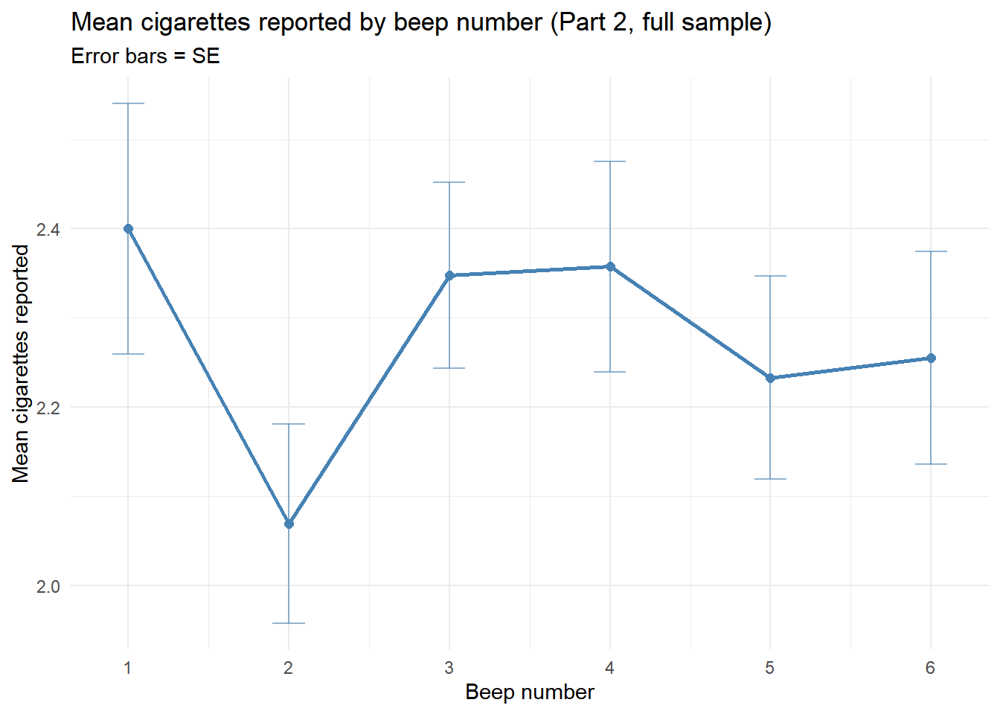

``` r
# --- Plot 2: Mean cigarettes by beep number, Part 6 completers,
#             Part 2 vs Part 6 ---
plot2_data <- study_sample %>%
  mutate(valid = check_validity(.)) %>%
  filter(valid == 1,
         participant_id %in% valid_completers,
         !is.na(smoked_since_last_survey),
         !is.na(beepno)) %>%
  mutate(study_part = factor(study_part,
                              levels = c(2, 6),
                              labels = c("Part 2 (Baseline)",
                                         "Part 6 (Incentive)"))) %>%
  group_by(beepno, study_part) %>%
  summarise(
    mean_smoked = mean(smoked_since_last_survey, na.rm = TRUE),
    sd_smoked   = sd(smoked_since_last_survey, na.rm = TRUE),
    n           = n(),
    se_smoked   = sd_smoked / sqrt(n),
    .groups = "drop"
  )

ggplot(plot2_data, aes(x = beepno, y = mean_smoked,
                        color = study_part, group = study_part)) +
  geom_line(linewidth = 1) +
  geom_point(size = 2) +
  geom_errorbar(aes(ymin = mean_smoked - se_smoked,
                    ymax = mean_smoked + se_smoked),
                width = 0.2, alpha = 0.6) +
  scale_color_manual(values = c("Part 2 (Baseline)"  = "gray40",
                                 "Part 6 (Incentive)" = "darkblue")) +
  scale_x_continuous(breaks = 1:6) +
  labs(
    title    = "Mean cigarettes reported by beep number (Part 6 completers)",
    subtitle = "Error bars = SE",
    x        = "Beep number",
    y        = "Mean cigarettes reported",
    color    = "Study part"
  ) +
  theme_minimal()
```

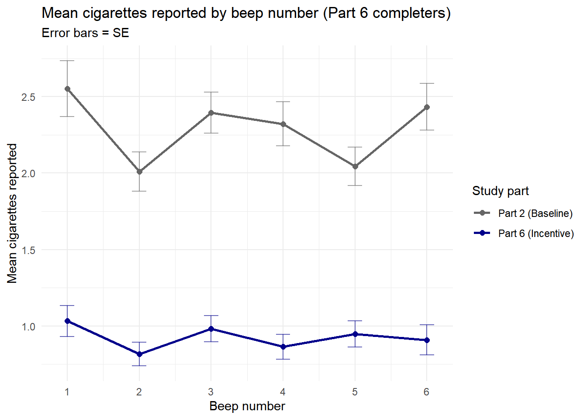

``` r
# --- Plot 3: Time of day effects by study part, Part 6 completers ---
plot3_data <- study_sample %>%
  mutate(valid = check_validity(.)) %>%
  filter(valid == 1,
         participant_id %in% valid_completers,
         !is.na(smoked_since_last_survey),
         !is.na(completion_time)) %>%
  mutate(
    hour       = hour(completion_time),
    study_part = factor(study_part,
                         levels = c(2, 6),
                         labels = c("Part 2 (Baseline)",
                                    "Part 6 (Incentive)"))
  ) %>%
  group_by(hour, study_part) %>%
  summarise(
    mean_smoked = mean(smoked_since_last_survey, na.rm = TRUE),
    sd_smoked   = sd(smoked_since_last_survey, na.rm = TRUE),
    n           = n(),
    se_smoked   = sd_smoked / sqrt(n),
    .groups = "drop"
  )

ggplot(plot3_data, aes(x = hour, y = mean_smoked,
                        color = study_part, group = study_part)) +
  geom_line(linewidth = 1) +
  geom_point(size = 2) +
  geom_errorbar(aes(ymin = mean_smoked - se_smoked,
                    ymax = mean_smoked + se_smoked),
                width = 0.3, alpha = 0.6) +
  scale_color_manual(values = c("Part 2 (Baseline)"  = "gray40",
                                 "Part 6 (Incentive)" = "darkblue")) +
  scale_x_continuous(breaks = seq(6, 22, by = 2)) +
  labs(
    title    = "Mean cigarettes reported by time of day (Part 6 completers)",
    subtitle = "Error bars = SE",
    x        = "Hour of day (completion time)",
    y        = "Mean cigarettes reported",
    color    = "Study part"
  ) +
  theme_minimal()
```

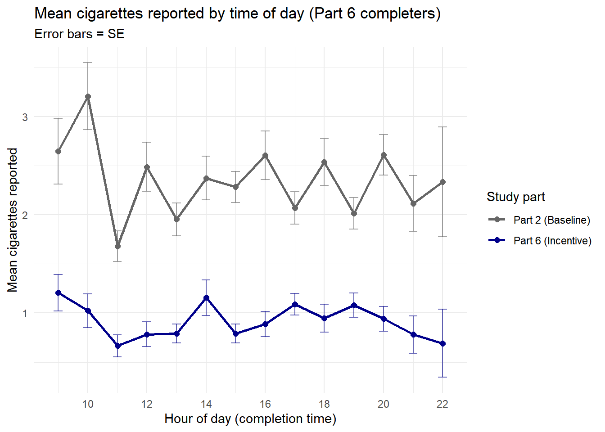

<style>
.esmtools-container{
  
}
.esmtools-container-open {
  border: 2px solid #2780e3;
  border-radius: 7px;
  margin: 0 -1em;
  padding: .4em 1em;
}
.esmtools-btn{
  display:inline-block;
  padding:0.35em 1.2em;
  border:0.2em solid #2780e3;
  background-color:#2780e3;
  margin:0 0.3em 0.3em 0;
  border-radius:0.12em;
  box-sizing: border-box;
  text-decoration:none;
  font-family:'Roboto',sans-serif;
  font-weight: bold;
  color:#FFFFFF;
  text-align:center;
  transition: all 0.2s;
  margin: 4px 0px 4px 4px;
}
.esmtools-btn:hover{
  color:#000000;
  background-color:#FFFFFF;
}
/* Highligh issue text */
.esm-issue{
    font-weight: bold;
    color:#e61919;
    text-decoration: underline #e61919 2px;
}

/* Highlight data inspection text */
.esm-inspect{
    font-weight: bold;
    text-decoration: underline 2px;
}

/* Highlight data modification text */
.esm-mod{
    font-weight: bold;
    color:#0088a3;
    text-decoration: underline #0088a3 2px;
}
/* Warning message: hidden content */
.warning_hide{
    font-weight: bold;
    margin: -.4em 0em 1em 2px;
    color: #595959;
}
</style>
<script>
function esmtools_toggleContent(button) {
    var parentDiv = button.parentElement;
    var childNodes = parentDiv.childNodes;
    
    // Toggle the 'esmtools-btn-open' class on the parent div
    parentDiv.classList.toggle("esmtools-container-open");

    for (var i = 2; i < childNodes.length; i++) {
      var node = childNodes[i];
      // if (!node.classList.contains("content-container")){
          if (node.nodeType === Node.ELEMENT_NODE) {
              if (node.style.display === "none") {
                  node.style.display = "block";
                  console.log("ok")
              } else {
                  node.style.display = "none";
              }
          }
      // }
    }
}
</script>

``` r
ggplot(incentive_compare, aes(x = study_part, y = mean_smoked,
                               fill = study_part)) +
  geom_boxplot(alpha = 0.7) +
  geom_jitter(width = 0.1, alpha = 0.4, size = 1) +
  labs(
    title = "Cigarette use by study part",
    x     = "Study part",
    y     = "Mean cigarettes reported per beep"
  ) +
  theme_minimal() +
  theme(legend.position = "none")
```

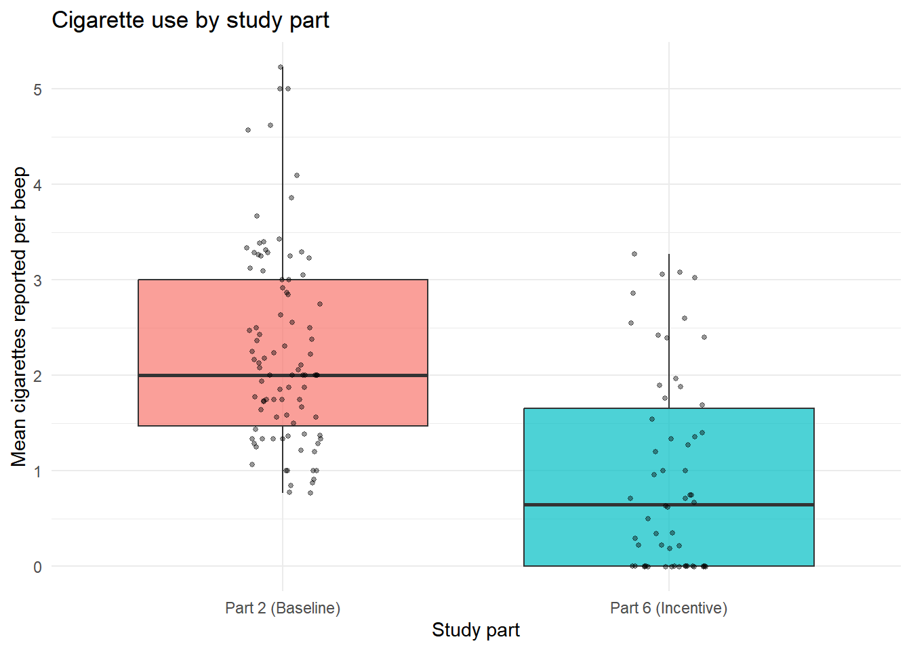

*Note: Formal tests of the incentive effect are reserved for the main analyses. The above is intended to inform whether smoking behavior changed between parts and whether this should be considered in future modeling.*

`<div class="section-summary"><span class="summary-label">Summary</span>Descriptive comparisons of smoking behavior between Part 2 and Part 6 suggest a meaningful reduction in cigarettes reported per beep during the incentivized abstinence period. Individual variability in response to the incentive is substantial, as reflected in the wide distributions. These results are framed descriptively and will inform whether study part or incentive-related variables need to be accounted for in the main analyses.</div>`{=html}

---

# Available Cases


`<div class="committee-note"><span class="committee-label">Committee</span>The committee requested the number of available cases for each Aim, including a CONSORT diagram.</div>`{=html}

Available cases by Aim are summarized in the Validity Audit section above. See Section 3 for the CONSORT diagram.

---

# References

Revol, J., Carlier, C., Lafit, G., Verhees, M., Sels, L., & Ceulemans, E. (2024). Preprocessing ESM data: A step-by-step framework, tutorial website, R package, and reporting templates. *Advances in Methods and Practices in Psychological Science, 7*(4), 1--18. https://doi.org/10.1177/25152459241256609

Siepe, B. S., Rieble, C., Tutunji, R., Rimpler, A., März, J., Proppert, R. K. K., & Fried, E. I. (2024). Understanding EMA data: A tutorial on exploring item performance in ecological momentary assessment data. *PsyArXiv*. https://doi.org/10.31234/osf.io/dvj8g
